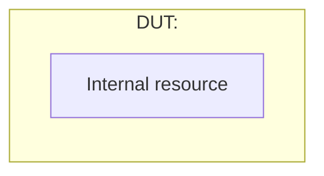

# XiangShan Module Design Document

Generate an evidence-based, human-readable Chinese design and functional-checkpoint document for one XiangShan DUT. Produce both the design document and a quality review. Do not treat an optional spec as authoritative over source code. Optimize the reading order for understanding first and auditability second; preserve complete audit detail in appendices.

## Repository Contract

Resolve all paths from the documentation repository root:

| Asset | Path |
| --- | --- |
| Template | `templates/chip-design-document/chip_design_document_template_zh.md` |
| XiangShan source | `third_party/XiangShan/` |
| Optional module specs | `inputs/<Module>/` |
| Versioned design document | `outputs/<Module>/<Module>_design_document_zh_v<MAJOR.MINOR.PATCH>.md` |
| Versioned quality report | `reports/<Module>/<Module>_document_quality_review_v<MAJOR.MINOR.PATCH>.md` |
| Version history | `outputs/<Module>/VERSION_HISTORY.md` |
| Versioned RTL evidence | `evidence/<Module>/<version>/manifest.json` and `ports.csv` |
| Cross-platform tooling | `tools/preflight.sh`, `tools/generate_rtl.sh`, `tools/validate_document.py` |

Create the module-specific input, output, and report directories when needed. Do not put generated files at repository root. Do not modify XiangShan source merely to make documentation generation easier.

## Document Versioning

Every generated design document and its quality report must have one shared semantic document version. A generated artifact without a version in both its filename and document-control table is invalid.

The template has its own visible `模板结构版本`. Record that value in the generated document as `使用模板版本`. A backward-incompatible template structure change is evidence for a document MAJOR increment; do not infer this from the template modification date alone.

Use `vMAJOR.MINOR.PATCH`, for example `v1.2.3`. This is the documentation version, not the XiangShan RTL version. Record the XiangShan commit and configuration separately.

### Version Selection

Before drafting, inspect:

- `outputs/<Module>/VERSION_HISTORY.md` when present.
- All versioned design documents under `outputs/<Module>/`.
- All versioned quality reports under `reports/<Module>/`.
- Any unversioned legacy output for comparison only.

Choose exactly one next version:

| Increment | Use when |
| --- | --- |
| `MAJOR` | The DUT scope or identity changes incompatibly, or a template/schema change makes the document structure incompatible with prior versions. |
| `MINOR` | Behavior coverage changes: interfaces, parameters, states, FG/FC/CK, scenarios, or supported configurations are added, removed, or semantically changed; a new RTL baseline changes documented behavior. |
| `PATCH` | Facts, evidence, line references, wording, diagrams, OPEN closure, formatting, or quality findings change without changing the documented behavioral contract. Also use PATCH for an intentional regeneration with no semantic change. |

Rules:

- The first versioned document for a module is `v1.0.0`, even when unversioned legacy files exist.
- If the user explicitly requests a valid version greater than all existing versions, use it and record the reason. Reject reuse or downgrade of an existing version unless the user explicitly asks to replace history.
- Every generation creates a new version. Never overwrite an older versioned document or report.
- The design document and quality report must use the same version.
- Compare against the immediately preceding version and summarize actual differences. Do not infer a change category only from timestamps.
- A newer XiangShan commit does not automatically require MAJOR. Classify by the resulting document contract, normally MINOR for behavioral change and PATCH for evidence-only change.

### Required Version Metadata

Add these rows to the design document's `附录 A：文档控制与范围裁定` table:

| Field | Required value |
| --- | --- |
| 文档版本 | `vMAJOR.MINOR.PATCH` |
| 使用模板版本 | Exact `模板结构版本` read from the template |
| 前一版本 | Previous version and relative link, or `None（首次版本）` |
| 版本变更类型 | `Major / Minor / Patch` plus a short reason |
| XiangShan RTL 基线 | Full submodule commit, not an abbreviated hash |
| 适用配置 | Exact selected configuration and feature switches |
| 生成日期 | ISO `YYYY-MM-DD` |

Put the version directly below the H1 as visible text: `> 文档版本：vMAJOR.MINOR.PATCH`.

The quality report must state its own version, the reviewed design-document version/path, the previous version/path, and a version-to-version change summary grouped as added, changed, fixed, removed, and remaining OPEN items.

Maintain `outputs/<Module>/VERSION_HISTORY.md` with newest version first:

| 版本 | 日期 | XiangShan commit | 配置 | 变更类型 | 摘要 | 设计文档 | 质量报告 |
| --- | --- | --- | --- | --- | --- | --- | --- |

Use relative links from `VERSION_HISTORY.md`. Add exactly one row per generated version. Never rewrite an older row except to repair a broken path or an objectively incorrect metadata value, and record such a repair in the new quality report.

## Required Inputs

The user must identify a DUT by Chisel class, desired Verilog module name, or functional module name. If several classes plausibly match, inspect them and ask one focused question only when source evidence cannot disambiguate the intended top.

Always use:

1. The current document template.
2. The checked-out XiangShan submodule source and its exact Git commit.
3. Elaborated Verilog/SystemVerilog from that same commit and the selected configuration when exact Verilog I/O is claimed.

Specs under `inputs/<Module>/` are optional. Use them to discover intent, terminology, expected scenarios, and possible missing behavior. Validate every implementation claim against source.

## Evidence Order

Use this order for implementation facts:

1. Elaborated Verilog/SystemVerilog from the documented commit and configuration: exact module and flattened port names, directions, widths, generated structures.
2. Chisel/Scala source: Bundle classes, object paths, parameter definitions, state machines, register updates, priorities, assertions, feature guards.
3. XiangShan configuration source and build invocation: parameter values and enabled features for the selected target.
4. Existing module spec: design intent and verification suggestions.
5. Inference: only as an explicit `OPEN-*`, never as a FACT.

When sources conflict, report the conflict. Do not silently choose the spec over RTL. A comment is weaker evidence than executable code. A generated port from a different commit or configuration is not valid evidence.

## Document Information Architecture

### Template Directive Semantics

Treat HTML comments in the template as normative generator directives, not prose to copy into the output:

- `MAINTAINER` explains template versioning or parser contracts. Preserve the contract when editing the template; omit the comment from generated documents unless the template is copied verbatim as a starting point.
- `GENERATOR` states mandatory generation behavior. Replace or remove every square-bracket placeholder and never leave instructional examples as DUT facts.
- `CONDITIONAL` states an applicability decision. If applicable, generate the requested content; otherwise keep a concise `不适用` conclusion with evidence instead of silently deleting the topic.

Visible blockquotes explain the document to readers. HTML comments instruct the generator. Do not move audit-only instructions into visible prose, and do not hide reader-critical behavior solely in comments.

Follow the template's three layers and keep their responsibilities distinct:

1. `第一部分：正文` builds the reader's mental model and explains the design. It starts with a one-page summary and contains only evidence IDs needed to understand the current behavior.
2. `第二部分：验证计划` contains verification strategy, one unified Test Plan, Coverage Summary, formal property contracts, scenarios, and current signoff blockers. It references design rules from the main body instead of redefining them.
3. `第三部分：附录` contains complete I/O mapping, evidence locations, parameters and configuration pruning, FACT/OPEN records, document control, traceability, and signoff detail.

The beginning of the main body must answer these questions before detailed implementation is introduced:

1. Who produces each important request, data item, or control event?
2. Who consumes each output or completion, and for what purpose?
3. What do the key concepts and structures mean, and how do easily confused concepts differ?

Then explain the typical end-to-end flow in producer-to-consumer order. Do not introduce resource internals, state transitions, or priority details until the reader can place them in that flow.

### Presentation Grammar

Choose the representation by information type. Do not turn every section into a table.

- Use short prose for purpose, mechanism, design rationale, and verification strategy.
- Use a small Mermaid diagram for topology, data movement, lifecycle, or nontrivial temporal interaction.
- Use formula-like text or pseudocode for selection, priority, next-state, update, and gating rules.
- Use tables only for mappings, capability matrices, Test Plan rows, coverage summaries, and appendix inventories that require comparison across rows.
- Use an explicit `边界与限制` paragraph or bullets for backpressure, priority, races, unsupported behavior, and configuration boundaries.
- Use `[E-<DOMAIN>-<NN>]` references in reader-facing prose. Expand paths and line numbers only in the evidence appendix.

Avoid consecutive tables with substantially overlapping columns such as description, condition, result, and evidence. In particular, do not place an FC table immediately before a CK table in the main reading path. The unified Test Plan is the execution view; complete FC and CK registries are audit-only appendices.

### One-Page Summary

The first main-body section must fit approximately one rendered page and state:

- Module responsibility and explicit non-goals.
- Important inputs and their producers.
- Important outputs and their consumers.
- Differences between key concepts or structures.
- Important latency, throughput, and capacity facts.
- Verification scope.
- Blocking or interpretation-relevant `OPEN-*` items.

Do not put implementation paths, flattened RTL names, full parameter inventories, or detailed channel exceptions in the summary.

### Logical Names in Reader-Facing Content

Use stable logical names such as `producer.data`, `consumer.dataSources[src]`, `ingress.request`, and `recovery.flush` in the main body, diagrams, property formulas, and Test Plan. Define them once in `上下游与逻辑接口` and map each one to Chisel and exact Verilog names in appendix B.

- Do not make readers parse flattened RTL names to understand behavior.
- Do not put three or more complete RTL port names in one prose sentence.
- Exact RTL names are allowed in appendix mapping tables, evidence references, and narrowly scoped implementation notes where the spelling itself matters.
- Mermaid diagrams use logical or human-readable names. They never carry exhaustive port lists.

### Single Authoritative Definition

Assign each behavior contract a stable `P-*` rule ID in a functional-behavior subsection. That subsection is the only complete definition of the fact. Organize rules in data-flow order and express the executable core as formula-like text or pseudocode when practical.

- FCs state the verification objective and reference one or more `P-*` rules; they do not restate the mechanism.
- CKs state one independently checkable property and reference its `P-*`/FC source.
- Coverage items reference `P-*`, FC, and CK IDs.
- Test Plan cases describe actor actions and stage outcomes. Write expectations in the form `预期行为遵循 P2、CK-SRC-FORWARD` or its named-ID equivalent, without repeating the forwarding, arbitration, flush, or update algorithm.
- Appendices map IDs to exact ports, source evidence, configuration, and signoff state. They do not create a second behavioral definition.
- Intentional repetition is allowed only when it changes abstraction level or is necessary to understand the local argument. Prefer a cross-reference when the abstraction level is unchanged.

### Module Rules Versus Instance Capabilities

Separate the common mechanism from channel, bank, pipe, port-group, or entry-class details:

1. Define one module-level function or rule using logical inputs, priority, output, latency, and frame conditions.
2. Create one `实例能力矩阵` for differences such as source availability, forwarding, bypass, caching, immediate data, recovery support, and selected-configuration presence.
3. Refer to matrix categories from the rule's `适用实例`; do not enumerate all instances inside the common rule.
4. Put exact Chisel objects, generated port groups, and per-instance pruning in appendix C.

For example, define operand selection once as `result = select_by_priority(available_sources)`, then use the capability matrix to state which channel categories contribute Forward, Bypass, Cache, Immediate, or other sources. Do not interleave the generic priority rule with a channel-by-channel port inventory.

### Evidence References

Assign stable evidence IDs such as `[E-BEH-01]`, `[E-IO-02]`, and `[E-CONFIG-03]` while analyzing source. Reader-facing sections cite only those IDs. Appendix D expands each ID to exact source/RTL path, line, commit, configuration, and supported `P-*`/`IO-*` items.

- A source location may appear inline only when its exact spelling is itself the subject of the sentence.
- Evidence IDs support a rule; they do not become alternate descriptions of the behavior.
- FACT and OPEN records reference evidence IDs and `P-*` rules without duplicating the algorithm.

## Workflow

### 0. Preflight the Environment

Before source analysis or elaboration, run:

```bash
./tools/preflight.sh --module <Module> --config <Config> --strict --document-tools
```

This workflow supports Linux and macOS. Do not assume Homebrew, GNU `time`, x86-64, a system-wide Java, or a system-wide Mill installation. The project scripts bootstrap Temurin JDK 17 when needed, bootstrap the XiangShan-pinned Mill, and select/build a native Espresso for the host OS and architecture.

If preflight fails, resolve missing Java 17, Git, Curl, Make, C compiler, Python 3, nested submodules, configuration, disk space, or dirty-source issues before elaboration. Do not discover these failures halfway through a full-chip generation.

### 1. Establish the Baseline

- Determine the next document version before writing and identify the immediately preceding version used for comparison.
- Record the XiangShan submodule commit with `git -C third_party/XiangShan rev-parse HEAD`.
- Record dirty status. A dirty submodule requires listing relevant modified files in the document baseline.
- Identify the selected XiangShan configuration and all feature switches affecting the DUT.
- Read the full template before drafting.
- Read every Markdown file under `inputs/<Module>/` if the directory exists.

Do not reuse FACT or OPEN conclusions from an older output without rechecking them against the current baseline. Build a concrete change list against the previous version while reviewing evidence.

### 2. Discover the Complete Source Boundary

Locate the DUT class and recursively inspect:

- Base classes and mixed-in traits.
- Top-level `IO(...)`, named or anonymous Bundle definitions, nested Bundle classes, Vec dimensions, Flipped direction changes, and Decoupled/Valid protocols.
- Instantiated child modules and the source files defining them.
- Parameter/config keys and derived constants.
- Top-level state register and transition logic.
- Arrays, queues, SRAMs, CAMs, counters, arbitration, flush/replay/error handling, assertions, and optional instrumentation.

Search by class name, `Module(new ...)`, Bundle type, parameter name, and interface type across `third_party/XiangShan/src`. Do not assume all relevant definitions are in the DUT file.

For anonymous top-level Bundles, write `anonymous Bundle in <Class>.io` rather than inventing a class such as `<Class>IO`. Record the exact enclosing source location.

### 3. Build the Reader Model and Canonical Vocabulary

Before drafting implementation details:

- Identify all important external producers, consumers, and control peers.
- Define a small logical-name vocabulary for the interfaces and data objects used in prose.
- Identify terms or structures a new reader may confuse and state their differences.
- Trace one normal transaction from producer to consumer, then locate backpressure, replay, flush, cancellation, and recovery branches on that flow.
- Create the `P-*` behavior-rule list and choose one authoritative definition location for each fact.
- Assign evidence IDs before drafting so source paths do not leak into the main narrative.
- Classify facts as module-wide mechanisms or instance capabilities before writing either.

Draft `文档摘要`, the architecture/data-flow explanation, transaction model, and instance-capability matrix before resource details, FSM details, FCs, or CKs. If the design cannot yet be explained without exact port strings, the reader model is incomplete.

### 4. Build the I/O Mapping Appendix

Appendix B must map each main-body logical name and include both implementation levels:

- Logical interface: stable reader-facing name, role, producer, and consumer.
- Chisel: enclosing Bundle class, object path, field path, direction after `Flipped`, Chisel type, dimensions, and Scala `path:line`.
- Verilog: exact elaborated port name, direction, and width.
- Configuration status: whether the Chisel field exists, whether the selected configuration emitted a Verilog leaf, and why it was generated, constant-folded, feature-disabled, or dead-port-eliminated.

Map every externally visible leaf, including each generated Vec element. A summary row may group a regular array only when the exact naming pattern and index range are demonstrated by the generated RTL.

Never derive a Verilog name solely from a Chisel path. Firtool naming, flattening, deduplication, prefixes, and configuration can change it. If matching elaborated RTL is unavailable:

- Put `OPEN-IO-<N>` in every unverified Verilog field.
- State the missing generation command/configuration/artifact.
- Mark I/O signoff blocked.
- Do not use examples such as `io_enq_0_valid` as if they were facts.

Prefer versioned evidence or a matching cache. Generate missing RTL only through:

```bash
./tools/generate_rtl.sh --module <Module> --config <Config> --version <version>
```

The wrapper uses the XiangShan TopMain flow without assuming GNU `time`, caches the full split RTL by commit/config/generator/tool/platform fingerprint for reuse across modules, restores any temporary native Espresso substitution, sets integration paths required by generation, and writes persistent `manifest.json` plus `ports.csv`. Do not hand-roll an equivalent command unless the wrapper itself is broken; if that happens, fix the wrapper and record the failure.

Do not replace existing version evidence during normal generation. `--replace-evidence` is reserved for an explicitly documented repair of objectively incorrect metadata or a broken artifact; it does not permit changing historical RTL evidence silently.

A nonzero full-top exit may still leave a complete split module RTL. Accept it only when the selected module file parses successfully, the manifest marks `generation_status: partial`, the failure occurred after RTL emission, and the quality report explains the downstream failure. Never call the full top generation successful in that case.

### 5. Extract Parameters and Configuration Effects

Keep the complete parameter, instance, and configuration inventory in appendix C. The main body states only latency/capacity facts needed for understanding, with an evidence-ID reference. For each appendix parameter include:

- Name and Scala type.
- Literal/default/configured value or legal range.
- Declaration/config-key `path:line`.
- Important use `path:line` when different.
- Elaboration-time or runtime effect.
- Observable functional consequence.

Separate derived constants and formal harness parameters. Keep harness parameters in the verification plan because they describe the verification model, not the DUT configuration. Do not list queues, registers, state values, or resources as parameters. If a configured value cannot be resolved, preserve the expression and create `OPEN-PARAM-*`.

### 6. Extract Only the Top-Level FSM

The dedicated state subsection contains only the DUT's top-level FSM:

- A short explanation of why the states exist and how they constrain transactions.
- Mermaid state diagram plus concise state-semantics bullets in the same subsection. Use a table only when many states require comparison.
- Reset entry, transition conditions, simultaneous-event priority, and externally visible restrictions.

Do not promote per-entry Boolean combinations, queue occupancy, child-module FSMs, replay flags, or protocol phases into top-level states. Describe those under resource lifecycle or the relevant `P-*` behavior.

### 7. Draw the Architecture Boundary

The Mermaid architecture diagram must contain:



Every edge crossing the `DUT` subgraph boundary must use a logical interface defined in `上下游与逻辑接口` and mapped to a Chisel object and verified Verilog port group in appendix B. Include all external peers, key internal resources, selection/arbitration points, data paths, and control/recovery paths. Use solid edges for transaction/data flow and dashed edges for control/cancel/error flow.

Keep the state diagram with its state-semantics explanation. Add a sequence diagram when a transaction crosses modules or has response/replay/flush races.

Mermaid source must avoid parser-sensitive text in identifiers and edge labels. In particular, do not put `[i]`, `[x]`, wildcard `*`, semicolons, or subgraph IDs used as edge endpoints inside diagrams. Use logical or human-readable labels such as `enqueue requests 0 and 1`; keep exact Chisel/Verilog patterns in appendix B.

After writing or changing any Mermaid fence, render every diagram through the pinned workflow:

```bash
make render MODULE=<Module> VERSION=<version>
```

This must create `evidence/<Module>/<version>/diagrams/manifest.json` and nonblank SVG files. A balanced fence or Mermaid-looking source is not sufficient. Never report diagrams as passed when a real renderer was unavailable.

### 8. Define FG, FC, CK, and Coverage

Follow the current template exactly.

- Render labels visibly with backticks: `` `<FG-NAME>` ``, `` `<FC-NAME>` ``, `` `<CK-NAME>` ``. Bare angle-bracket labels can disappear as HTML.
- Keep FG boundary descriptions short and risk-oriented.
- Put all executable verification work in one Test Plan table. Each row links priority, one FC, one independent CK, Style, `P-*`, mechanism, stimulus, observable result, Coverage/scenario, and closure criterion.
- Put the complete FC registry and CK registry in appendix F for UCAgent and audit. Do not place paired FC and CK tables in the main reading path.
- Define each FC as a verification objective, not another design description.
- Define each CK as one independently implementable property. Put detailed Assume, Assert, and Cover formulas together in `形式化属性契约`.
- Use only `Comb`, `Seq`, `Seq, Symbolic`, `Assume`, or `Cover` styles accepted by the template.
- Keep API checks as environment Assume only. Never assume DUT outputs are correct.
- Keep Coverage checks as Cover only.
- Split a priority chain into independently checkable adjacent-priority properties.
- Add frame conditions for every cross-cycle update, including non-target symbolic stability for multi-entry storage.
- Parameter/feature gating requires both enabled behavior and disabled no-side-effect checks.
- Use reviewed harness parameters for unknown latency. Never write vague timing such as “later” or “after taking effect.”
- Maintain a Coverage Summary that maps each coverage goal to `P-*`, FC, and CK IDs and gives a measurable closure criterion.

Before finalizing, ensure the label tree, Test Plan, FC registry, CK registry, property formulas, Coverage Summary, and scenarios agree.

### 9. Add Test Plan Cases

The verification-plan Test Plan must contain user-story cases covering at least:

1. A normal end-to-end transaction.
2. A resource boundary or backpressure condition.
3. An error, replay, flush, cancellation, or recovery path when the DUT supports one.

Each case includes a goal, actors, preconditions, ordered actor actions, related `P-*`/CK/Coverage IDs, and measurable acceptance criteria. Point exact stimulus mapping to appendix B. Cases explain collaboration across rules but do not replace formal CKs and must not repeat a rule's full mechanism.

### 10. Produce the Quality Report

Create `reports/<Module>/<Module>_document_quality_review_v<MAJOR.MINOR.PATCH>.md` in the same run. Report:

- Document version, previous version, selected increment, and why that increment is correct.
- Added, changed, fixed, removed, and still-open differences from the immediately preceding version.
- Baseline commit, configuration, source files, generated RTL artifact, and optional specs used.
- Host OS/architecture, preflight result, Java/Mill/firtool/Espresso versions, cache fingerprint, generation exit status, RTL hash, evidence manifest, and port counts.
- Mermaid CLI/browser versions, actual render result, diagram count, rendered SVG evidence, and any parser/render failure fixed during the run.
- What spec claims were confirmed, corrected, rejected, or left OPEN.
- I/O mapping completeness, including counts of mapped and open leaf ports.
- Parameter source completeness.
- Top-level FSM and diagram consistency.
- FG/FC/CK counts, duplicate-label result, and Style validity.
- Whether the summary identifies producers, consumers, and distinctions between key concepts before implementation details.
- Whether the summary stays concise and contains responsibility, I/O roles, concept distinctions, latency/capacity, verification scope, and OPEN items.
- Whether prose, diagrams, pseudocode, matrices, Test Plan, boundary notes, and evidence appendix are used for their intended information types.
- Whether every module-level mechanism is separated from instance/channel capability and pruning details.
- Main-body logical-name consistency and any prose sentence containing three or more exact RTL port names.
- Main-body raw `path:line` count and unresolved `[E-*]` references.
- `P-*` uniqueness and whether FC, CK, Coverage, and Test Plan reference authoritative rules instead of duplicating them.
- Normal, boundary, and recovery Test Plan coverage.
- Commands/checkers run and failures or unrun validations.
- Blocking OPEN items and the exact evidence needed to close each one.

When executable RTL contradicts a spec/comment or appears suspicious:

- Record `规格/注释期望` separately from `RTL 实际行为`.
- Create `OPEN-BEHAV-*` or `OPEN-BUG-*`; do not normalize the behavior into an intended requirement.
- Functional CKs describe the observed RTL contract unless the user explicitly requests a proposed/fixed design contract.
- Add a review-only checkpoint or signoff item for design intent; do not encode the suspected bug as an environment Assume.

Do not award a perfect score when exact Verilog I/O, source locations, Markdown rendering, UCAgent parsing, or SVA compilation has not been verified.

## Static Validation

Before completion, run:

```bash
./tools/validate_document.py --module <Module> --version <version> --strict-evidence
make lint MODULE=<Module> VERSION=<version>
```

The checker is the minimum gate. Also check:

- Design filename, report filename, visible header version, document-control version, report version, and history row all match exactly.
- The selected version is greater than every existing module version and no older versioned file was overwritten.
- `VERSION_HISTORY.md` contains one new row with valid relative links to both artifacts.
- Required chapters from the template exist.
- For template v3 and later, the document contains ordered main-body, verification-plan, and appendix layers.
- The one-page summary identifies responsibility, producers, consumers, key-concept differences, latency/capacity, verification scope, and OPEN items before implementation detail.
- Every `P-*` rule has one authoritative functional-behavior subsection with inputs, outputs, latency, rule/pseudocode, applicable instance categories, and boundaries; all referenced `P-*` IDs resolve.
- An instance-capability matrix exists and implementation rules do not mix common mechanisms with exact instance/port inventories.
- Reader-facing prose uses logical names; no main-body prose sentence contains three or more exact RTL port names.
- Reader-facing sections use `[E-*]`; every reference resolves in appendix D and raw source paths stay out of the main body.
- Every FG/FC/CK label is visible and unique.
- Every FC in the tree has one appendix registry row, at least one Test Plan row and CK, and a `P-*` reference.
- Every CK has a legal Style, observation point, and evidence.
- API contains only Assume; Coverage contains only Cover.
- Mermaid fences are balanced and architecture contains the DUT subgraph.
- Every Mermaid fence has current source-hash-matched render evidence, and `make lint` successfully re-renders all diagrams with the pinned CLI.
- State semantics and state diagram use the same top-level states.
- Every cross-boundary architecture edge uses a defined logical name mapped in appendix B.
- Every exact Verilog port cited exists in the matching generated RTL.
- Chisel-present but Verilog-elided fields explicitly state selected-config status and evidence; absence is not silently treated as an I/O omission.
- Every Scala path and line reference exists at the recorded submodule commit.
- Output and report links resolve after writing.

Use parsers or repository search for these checks instead of visual counting. If UCAgent checker or Mermaid renderer is unavailable, state that explicitly in the quality report.

## Completion Standard

The task is complete only when the versioned design document, same-version quality report, updated `VERSION_HISTORY.md`, versioned RTL evidence, current Mermaid SVG/manifest evidence, and checker/lint results are written. Exact Verilog I/O and actual diagram rendering are hard evidence requirements. When elaboration or rendering is unavailable, the document status must remain Draft and the corresponding signoff must remain blocked.
