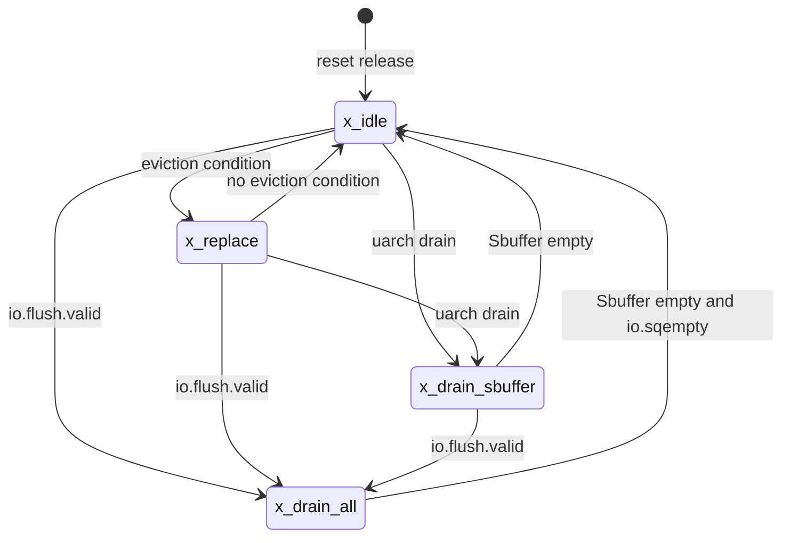
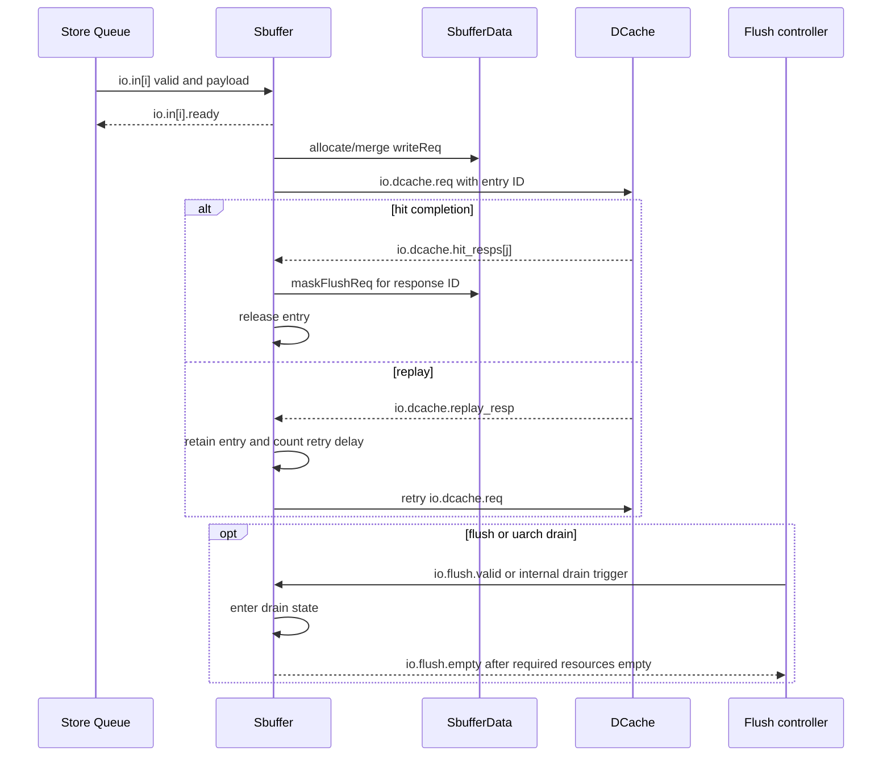

# Sbuffer 设计与功能检测点文档

> 本文依据 `Sbuffer_spec.md`、`SbufferData_spec.md` 和 `chip_design_document_template_zh.md` 重新生成。当前目录没有 Scala 源码、elaborated Verilog 或 RTL，因此 Chisel 顶层 Bundle class、Scala 行号和 Verilog 端口名不能精确核验；相关项均登记为 `OPEN-*`，不得据本草案直接绑定端口。

## 文档范围裁定

| 条件项目 | 裁定 | 理由或对应章节 |
| --- | --- | --- |
| 多模块事务/异常/冲刷 | 已应用 | Store Queue、SbufferData、DCache、Load pipeline 和 flush controller 跨模块交互。 |
| 符号化存储检查 | 已应用 | SbufferData 保存多 entry data/mask；见 `FG-DATA`。 |
| 缓存查找/缺失/重填 | 不适用 | DUT 向 DCache 写回，但不管理 DCache 的 MSHR/refill/replacement。 |
| 异常/恢复/flush | 已应用 | replay、地址匹配异常和 drain；见 `FG-EVICTION`、`FG-FORWARD`、`FG-FLUSH`。 |
| 特性门控 | 已应用 | Difftest 和 store prefetch 由配置控制。 |
| 顶层状态机 | 已应用 | `sbuffer_state` 有四个顶层状态；见“顶层状态机”。 |
| 事务时序图 | 已应用 | enqueue、写回响应、replay 和 flush 均跨模块。 |

## 文档控制与依据

| 项目 | 内容 |
| --- | --- |
| 所属子系统 | XiangShan Core / MemBlock |
| DUT / Chisel 顶层 | `Sbuffer` / 输入规格称源码为 `fm_agent/extracted_functions/Sbuffer-scala/Sbuffer.scala`，当前目录不可核验 |
| Elaborated Verilog 顶层 | `Sbuffer`（module 名待产物确认）/ 未提供文件 |
| 文档状态 | Draft，待 Scala / elaborated Verilog / DV review |
| RTL 基线 | 未提供 |
| 适用配置 | `StoreBufferSize`、`EnbufferWidth`、`LoadPipelineWidth`、`StorePipelineWidth` 等 |
| 最后更新 | 2026-09-01 |

| ID | 结论或待确认项 | 依据 | 置信度 | 状态 |
| --- | --- | --- | --- | --- |
| FACT-001 | Sbuffer 位于 Store Queue 与 L1 DCache 之间，缓冲已提交 store，并向 Load pipeline 提供前递。 | `Sbuffer_spec.md:7-8` | 规格一致 | Open review |
| FACT-002 | SbufferData 保存每个 entry 的整行 data 和 byte mask，支持写入和 mask flush。 | `SbufferData_spec.md:7-8` | 两份规格一致 | Open review |
| FACT-003 | 顶层控制器规格列出 `x_idle`、`x_replace`、`x_drain_all`、`x_drain_sbuffer` 四态。 | `Sbuffer_spec.md:187-189` | 规格描述 | Open review |
| OPEN-IO-001 | 顶层 IO Bundle class 是否名为 `SbufferIO`，以及各子 Bundle 的真实 class 名和定义位置。 | 无 Scala 源码 | 待 Scala 确认 | Open |
| OPEN-IO-002 | 指定配置下所有 elaborated Verilog 端口的精确名称、方向和位宽。 | 无 elaborated Verilog | 阻塞 I/O 签核 | Open |
| OPEN-PARAM-001 | 参数声明、配置键和默认值的精确 Scala 文件及行号。 | 无 Scala 源码 | 待 Scala 确认 | Open |
| OPEN-STATE-001 | 状态编码、迁移组合条件及同周期优先级的精确 Scala 定义。 | 无 Scala 源码 | 待 Scala 确认 | Open |
| OPEN-TIMING-001 | SbufferData 写入/mask flush、enqueue 和事件输出的精确周期延迟。 | 输入规格不可由 RTL 核验 | 待 RTL 确认 | Open |
| OPEN-FEATURE-001 | Difftest/prefetch 的实际生成条件、输出端口与关闭时行为。 | 无 elaboration 配置 | 待配置确认 | Open |

## DUT 整体功能描述

### 职责、边界与性能

Sbuffer 接收 Store Queue 已提交的 store。请求按物理地址标签查找 active entry：命中时按 byte mask 合并，未命中时分配空闲 entry；data 和 mask 存入 SbufferData。Sbuffer 根据 replay timeout、drain、coherence timeout 和 PLRU 候选选择 entry，向 DCache 发出整行写请求，并以 entry ID 关联完成或 replay 响应。

Load pipeline 使用虚拟/物理地址查询 Sbuffer，获得按字节的前递 data/mask。地址匹配不一致会触发微架构 drain。规格目标为每周期最多接收 `EnbufferWidth` 个 store、最多发射一个 DCache 写请求，并服务 `LoadPipelineWidth` 个并行前递查询；精确流水延迟待 `OPEN-TIMING-001` 关闭。

## I/O 定义

### 顶层 IO Bundle

| 层级 | Bundle class | Chisel 对象 | Scala 定义位置 | 说明 |
| --- | --- | --- | --- | --- |
| 顶层 | `OPEN-IO-001`（用户期望示例为 `SbufferIO`，规格未给出） | `io: OPEN-IO-001` | `OPEN-IO-001` | Sbuffer 顶层 IO。 |
| 子 Bundle | `DCacheWordReqWithVaddrAndPfFlag` | `io.in[i]` | `OPEN-IO-001` | `Decoupled` store enqueue，`i in [0, EnbufferWidth)`。 |
| 子 Bundle | `DCacheWriteReq` | `io.dcache.req` | `OPEN-IO-001` | `Decoupled` DCache 整行写请求。 |
| 子 Bundle | `DCacheResp` | `io.dcache.hit_resps[j].bits`、`io.dcache.replay_resp.bits`、`io.dcache.main_pipe_hit_resp.bits` | `OPEN-IO-001` | DCache 完成/replay 响应。 |
| 子 Bundle | `LoadForwardQueryIO` | `io.forward[k]` | `OPEN-IO-001` | Load 前递查询与返回，`k in [0, LoadPipelineWidth)`。 |
| 子 Bundle | `StorePrefetchReq` | `io.store_prefetch[m].bits` | `OPEN-IO-001` | 可选 store prefetch 输出。 |
| 子 Bundle | `CustomCSRCtrlIO` | `io.csrCtrl` | `OPEN-IO-001` | CSR 控制输入；使用字段待确认。 |
| 子 Bundle | `DiffStoreIO` | `io.diffStore` | `OPEN-IO-001` | Difftest 输入信息。 |

### Chisel / Verilog 逐项映射

> 下表的 Verilog 列必须由指定配置的 elaborated Verilog 回填。当前材料不足以保证诸如 `io_in_0_valid` 或 `io_dcache_req_bits_addr` 的命名，因此不写推测值。

| Bundle class | Chisel 对象 / 字段 | 方向 | Chisel 类型 / 位宽 | 精确 Verilog I/O | Verilog 位宽 | 协议 / 传输条件 | 对端 |
| --- | --- | --- | --- | --- | --- | --- | --- |
| 顶层基础信号 | `clock` | I | `Clock` | `OPEN-IO-002` | 1 | 主采样时钟 | Clock source |
| 顶层基础信号 | `reset` | I | `Reset`，规格称同步复位 | `OPEN-IO-002` | 1 | 同步复位 | Reset controller |
| 顶层字段 | `io.hartId` | I | `UInt(hartIdLen.W)` | `OPEN-IO-002` | `hartIdLen` | 周期采样 | Core / Difftest |
| `DCacheWordReqWithVaddrAndPfFlag` | `io.in[i].valid` / `.ready` | I / O | `Bool` | `OPEN-IO-002` | 1 / 1 | `valid && ready` 接收 | Store Queue |
| `DCacheWordReqWithVaddrAndPfFlag` | `io.in[i].bits.{addr,vaddr,data,mask,wline,vecValid,prefetch}` | I | 具体类型/位宽 `OPEN-IO-001` | `OPEN-IO-002` | `OPEN-IO-002` | 未握手时 payload 稳定 | Store Queue |
| `DCacheWriteReq` | `io.dcache.req.{valid,ready}` | O / I | `Bool` | `OPEN-IO-002` | 1 / 1 | `valid && ready` 发射 | L1 DCache |
| `DCacheWriteReq` | `io.dcache.req.bits.{cmd,addr,vaddr,data,mask,id}` | O | 具体类型/位宽 `OPEN-IO-001` | `OPEN-IO-002` | `OPEN-IO-002` | 背压时稳定 | L1 DCache |
| `DCacheResp` | `io.dcache.hit_resps[j].{valid,bits.{id,replay,miss}}` | I | `Valid[DCacheResp]` | `OPEN-IO-002` | `OPEN-IO-002` | `valid` 采样 | L1 DCache |
| `DCacheResp` | `io.dcache.replay_resp.{valid,bits.{id,replay}}` | I | `Valid[DCacheResp]` | `OPEN-IO-002` | `OPEN-IO-002` | `valid` 采样 | L1 DCache |
| `DCacheResp` | `io.dcache.main_pipe_hit_resp` | I | `Valid[DCacheResp]` | `OPEN-IO-002` | `OPEN-IO-002` | `valid` 采样 | L1 DCache |
| `LoadForwardQueryIO` | `io.forward[k].{valid,vaddr,paddr}` | I | 字段位宽 `OPEN-IO-001` | `OPEN-IO-002` | `OPEN-IO-002` | query valid 时地址稳定 | Load pipeline |
| `LoadForwardQueryIO` | `io.forward[k].{dataInvalid,matchInvalid,forwardMask,forwardData,forwardMaskFast}` | O | Bool / byte vectors | `OPEN-IO-002` | `OPEN-IO-002` | 组合返回 | Load pipeline |
| 顶层字段 | `io.sqempty` / `io.sbempty` | I / O | `Bool` | `OPEN-IO-002` | 1 / 1 | 周期采样 | Store Queue / control |
| Flush Bundle（class 待确认） | `io.flush.valid` / `io.flush.empty` | I / O | `Bool` | `OPEN-IO-002` | 1 / 1 | level 请求和排空状态 | Flush controller |
| `StorePrefetchReq` | `io.store_prefetch[m].{valid,ready,bits.*}` | O / I / O | `Decoupled[StorePrefetchReq]` | `OPEN-IO-002` | `OPEN-IO-002` | `valid && ready` | DCache / prefetch |
| `CustomCSRCtrlIO` | `io.csrCtrl.*` | I | `CustomCSRCtrlIO` | `OPEN-IO-002` | `OPEN-IO-002` | 周期采样 | CSR control |
| 顶层字段 | `io.memSetPattenDetected` / `io.force_write` | I | `Bool` | `OPEN-IO-002` | 1 / 1 | 周期采样 | Control |
| `DiffStoreIO` | `io.diffStore.*` | I | `DiffStoreIO` | `OPEN-IO-002` | `OPEN-IO-002` | Difftest 开启时使用 | Difftest |

### 接口字段与响应关联

| Chisel 接口 | Verilog 端口组 | 关键字段 / ID | 请求与响应关联 | payload 稳定性 | 延迟 / 顺序约束 |
| --- | --- | --- | --- | --- | --- |
| `io.in[i]` | `OPEN-IO-002` | ptag/vtag 来源、data、mask、`wline` | 无外部响应；握手后转为 entry 更新 | `valid && !ready` 时稳定 | 更新延迟为 `SB_DATA_WRITE_LATENCY`。 |
| `io.dcache.req` / responses | `OPEN-IO-002` | 整行 data/mask、entry ID | response ID 对应 inflight entry | request 背压时全 payload 稳定 | hit 回收；replay 保留并等待重试。 |
| `io.forward[k]` | `OPEN-IO-002` | vaddr、paddr、byte data/mask | 单次查询，无事务 ID | query valid 时输入地址稳定 | 规格称组合返回。 |
| `io.flush` | `OPEN-IO-002` | valid/empty | `flush.empty` 表示 Sbuffer 与 SQ 达到排空条件 | level 信号 | valid 保持规则由 API 假设定义。 |

## 参数定义

| 参数 | Scala 类型 | 默认值 / 合法范围 | Scala 定义位置 | 主要使用位置 | 生效时机 | 功能影响 |
| --- | --- | --- | --- | --- | --- | --- |
| `StoreBufferSize` | `Int` | 来自 `XSCoreParamsKey` | `OPEN-PARAM-001` | Sbuffer / HasSbufferConst，位置待确认 | elaboration | entry 数、索引宽度和 PLRU 规模。 |
| `EnbufferWidth` | `Int` | 来自 `XSCoreParamsKey` | `OPEN-PARAM-001` | Sbuffer enqueue，位置待确认 | elaboration | 并行 store 输入和写通道数。 |
| `LoadPipelineWidth` | `Int` | 来自 `XSCoreParamsKey` | `OPEN-PARAM-001` | forward IO，位置待确认 | elaboration | 并行前递查询数。 |
| `StorePipelineWidth` | `Int` | 规格称 `>= EnbufferWidth` | `OPEN-PARAM-001` | StorePfWrapper，位置待确认 | elaboration | prefetch 输出通道数。 |
| `EvictCountBits` | `Int` | 规格称 `log2Up((1<<20)+1)` | `OPEN-PARAM-001` | `cohCount`，位置待确认 | elaboration | coherence timeout 周期。 |
| `MissqReplayCountBits` | `Int` | 规格称 `log2Up(16)+1` | `OPEN-PARAM-001` | replay counter，位置待确认 | elaboration | replay retry 延迟。 |
| `EnableStorePrefetchSPB` | `Boolean` | config，默认值未知 | `OPEN-PARAM-001` | StorePfWrapper，位置待确认 | elaboration | enqueue 是否训练 prefetcher。 |
| `EnableStorePrefetchAtCommit` | `Boolean` | config，默认值未知 | `OPEN-PARAM-001` | StorePfWrapper，位置待确认 | elaboration | commit 是否产生 prefetch 请求。 |
| `env.EnableDifftest` | `Boolean` | 环境配置 | `OPEN-PARAM-001` | Difftest generate，位置待确认 | elaboration | 是否生成 trace instrumentation。 |
| `StoreBufferThreshold` | 规格称 5-bit constant | 规格声称默认 7，待核验 | `OPEN-PARAM-001` | eviction threshold，位置待确认 | elaboration / per-hart constant | active entry 触发 eviction 的阈值。 |
| `StoreBufferBase` | 规格称 5-bit constant | 规格声称默认 4，待核验 | `OPEN-PARAM-001` | force-write threshold，位置待确认 | elaboration / per-hart constant | `force_write` 时降低阈值。 |

### 形式化 Harness 参数

| 参数 | 范围 | 来源 / OPEN | 用途 |
| --- | --- | --- | --- |
| `SB_DATA_WRITE_LATENCY` | 正整数 | `OPEN-TIMING-001` | write request 至 SbufferData data/mask 可观察更新。 |
| `SB_MASK_FLUSH_LATENCY` | 正整数 | `OPEN-TIMING-001` | mask flush request 至 mask 全零可观察更新。 |
| `DCACHE_RESPONSE_BOUND` | 项目定义的正整数 | DCache 公平性约束，待 DV 确认 | 防止已接受请求永久无响应。 |

## 顶层状态机

本节只描述顶层 `sbuffer_state`。entry 的 invalid/active/inflight/replay-wait 生命周期不作为顶层 FSM 状态。

| 状态 | 编码 / Scala 定义 | 含义 | 进入条件 | 退出条件 | 输出 / 限制 |
| --- | --- | --- | --- | --- | --- |
| `x_idle` | `OPEN-STATE-001` | 正常接收与候选判断。 | reset；replace/drain 完成。 | eviction、flush 或 uarch drain 条件。 | 正常允许 enqueue。 |
| `x_replace` | `OPEN-STATE-001` | 因阈值或容量进行常规驱逐。 | `x_idle` 中 eviction 条件。 | 条件消失、flush 或 uarch drain。 | 按候选发射写回。 |
| `x_drain_all` | `OPEN-STATE-001` | flush 触发的全路径排空。 | 任意支持状态收到 flush。 | Sbuffer 和 Store Queue 均空。 | 持续驱逐并等待 `sqempty`。 |
| `x_drain_sbuffer` | `OPEN-STATE-001` | 地址不一致等触发的微架构排空。 | uarch drain。 | Sbuffer 空；flush 可升级为 drain-all。 | 禁止新 enqueue。 |



状态图依据规格叙述；同周期 flush、uarch drain 与 eviction 的精确优先级受 `OPEN-STATE-001` 约束。

## 微架构与时序

### 微架构图

```mermaid
flowchart LR
    SQ[Store Queue]
    DC[L1 DCache]
    LOAD[Load pipeline]
    FLUSH[Flush controller]
    CSR[CSR and feature control]
    PREF[Store prefetch consumer]

    subgraph DUT["DUT: Sbuffer"]
        ENQ{Enqueue CAM and allocate/merge}
        TAG[Entry tags and lifecycle]
        DATA[SbufferData]
        ARB{Eviction arbitration}
        OUT[Write request pipeline]
        FWD{Forward match and select}
        FSM[Top-level sbuffer_state]
        PF[StorePfWrapper optional]

        ENQ -->|tag/state update| TAG
        ENQ -->|writeReq: data and byte mask| DATA
        TAG -->|eligible entries| ARB
        ARB -->|selected entry ID| OUT
        DATA -->|cache-line data and mask| OUT
        TAG -->|active/inflight match| FWD
        DATA -->|word data and mask| FWD
        FSM -.->|accept/drain control| ENQ
        FSM -.->|drain selection| ARB
        ENQ -->|training event| PF
    end

    SQ -->|io.in[i] / OPEN-IO-002| ENQ
    OUT -->|io.dcache.req / OPEN-IO-002| DC
    DC -->|io.dcache.*_resp / OPEN-IO-002| TAG
    DC -->|hit response causes maskFlushReq| DATA
    LOAD -->|io.forward[k] query / OPEN-IO-002| FWD
    FWD -->|io.forward[k] result / OPEN-IO-002| LOAD
    FLUSH -->|io.flush.valid, io.sqempty / OPEN-IO-002| FSM
    FSM -->|io.sbempty, io.flush.empty / OPEN-IO-002| FLUSH
    CSR -->|io.csrCtrl, io.force_write, feature inputs / OPEN-IO-002| FSM
    PF -->|io.store_prefetch[m] / OPEN-IO-002| PREF
```

所有跨 `DUT: Sbuffer` 边界的箭头都对应 I/O 表中的 Chisel object；精确 Verilog 端口在 `OPEN-IO-002` 关闭后替换图中占位符。SbufferData 和 StorePfWrapper 位于 DUT 边界内。

### 事务时序图



### 关键资源

| 资源 | 类型 / 规模 | 写入条件 | 读取 / 消费条件 | 冲突与优先级 | 观测点 |
| --- | --- | --- | --- | --- | --- |
| Entry tag/state arrays | `StoreBufferSize` entries | insert、merge、issue、response | CAM、arbitration、forward | 同块 inflight 限制；响应按 ID 更新 | valid、inflight、ptag、vtag、选择向量 |
| SbufferData | 每 entry 一整行 data + byte mask | enqueue write；hit mask flush | eviction 和 forwarding | 同址 write/flush 精确规则待确认 | `fv_idx`、`fv_mon_data`、`fv_mon_mask` |
| `cohCount` | 每 entry counter | active 老化；insert/merge 清零 | coherence-timeout candidate | replay/drain 优先于老化 | counter、candidate mask |
| Replay counter | 每 entry counter | replay 后计数 | retry candidate | retry 具有最高规格优先级 | `w_timeout`、counter、mask |
| Write pipeline | 单项请求流水 | arbitration select | `io.dcache.req.fire` | data write hazard/backpressure 阻塞 | valid、payload、entry ID |

## 形式化建模与属性契约

- 默认属性时钟使用 Sbuffer 主时钟；复位期间禁用时序 assert，复位合法性由 API Assume 约束。
- entry 属性需要 bind 可见 valid/inflight/ptag/vtag、候选向量和 data/mask 镜像。
- SbufferData 使用符号索引 `fv_idx` 及 `fv_mon_data`、`fv_mon_mask`，证明任意目标 entry 和非目标稳定性。
- DCache response 使用 `DCACHE_RESPONSE_BOUND` 表达有界公平性，不假设立即命中。
- `OPEN-TIMING-001` 未关闭前，Seq 属性只能引用受审查的 harness 参数。

| 功能点 | 触发事件 | 预期结果 | 帧条件 | 延迟 / 界限来源 | 观测点 |
| --- | --- | --- | --- | --- | --- |
| `FC-INSERT` | enqueue fire 且无同 ptag active entry | 分配一个 active entry | 未选 entry 不变 | enqueue latency / `OPEN-TIMING-001` | allocation、valid、tags |
| `FC-MERGE` | enqueue fire 且命中 active entry | 目标 byte 合并并刷新计数 | 非目标 entry 不变 | `SB_DATA_WRITE_LATENCY` | merge vector、data/mask、counter |
| `FC-DATA-WRITE` | SbufferData writeReq 选择 `fv_idx` | 目标 data/mask 更新 | 未选中且无 flush 时稳定 | `SB_DATA_WRITE_LATENCY` | `fv_mon_*` |
| `FC-WRITE-REQ` | 候选进入输出流水 | payload 正确且背压时稳定 | 未选 entry 不变 | Decoupled handshake | request、entry state |
| `FC-RESPONSE` | DCache hit/replay valid | 回收或进入 retry wait | 非响应 entry 不变 | response + state latency | response ID、entry state |
| `FC-EMPTY-STATUS` | drain 或 entry 状态变化 | 正确报告 empty | 无相关变化时状态稳定 | `OPEN-TIMING-001` | FSM、entry valid、empty outputs |

## 功能分组与检测点

### 本 DUT 标签树

```text
Sbuffer
|- FG-API
|  |- FC-RESET-ASSUME
|  `- FC-INPUT-ASSUME
|- FG-ENQUEUE
|  |- FC-INSERT
|  |- FC-MERGE
|  `- FC-DUAL-ENQUEUE
|- FG-DATA
|  |- FC-DATA-WRITE
|  `- FC-MASK-FLUSH
|- FG-EVICTION
|  |- FC-ARBITRATION
|  |- FC-WRITE-REQ
|  `- FC-RESPONSE
|- FG-TIMEOUT
|  |- FC-COH-TIMEOUT
|  `- FC-REPLAY-TIMEOUT
|- FG-FORWARD
|  |- FC-FORWARD-ACTIVE
|  `- FC-MISMATCH-DETECT
|- FG-FLUSH
|  `- FC-EMPTY-STATUS
|- FG-DIFFTEST
|  |- FC-DIFF-HIT
|  `- FC-DIFF-STORE
`- FG-COVERAGE
   `- FC-SBUFFER-REACHABILITY
```

### 1. 验证环境约束

`<FG-API>`

本组只定义时钟、复位及外部输入协议的合法环境，不约束 DUT 输出等于预期值，也不以 Assume 屏蔽 replay、backpressure 或 drain。

#### 复位约束

形式化环境需要产生有限的初始复位并最终释放，使复位后正常、边界和恢复路径均可探索。

| FC 标签 | 功能描述 | 触发 / 前置条件 | 预期结果 / 约束 | 边界与例外 |
| --- | --- | --- | --- | --- |
| `<FC-RESET-ASSUME>` | 定义属性采样时钟和合法初始复位。 | formal 初始状态 | reset 有限保持后释放。 | 不允许永久 reset。 |

| CK 标签 | Style | 检查说明 | 主要观测点 | 需求 / 依据 |
| --- | --- | --- | --- | --- |
| `<CK-API-RESET-LEGAL>` | Assume | 初始 reset 合法有效、保持项目要求周期并最终释放。 | `reset` | 时钟复位规格；周期待 DV 配置 |
| `<CK-API-CLOCK-LEGAL>` | Assume | 所有属性使用主时钟采样，并遵守同步复位关系。 | `clock`, `reset` | `Sbuffer_spec.md:64` |

#### 输入协议约束

Store Queue、DCache、Load pipeline 和 flush controller 必须遵守各自协议。约束只保证输入已知、payload 稳定和响应 ID 合法，不假设 DUT 的 ready、request 或结果正确。

| FC 标签 | 功能描述 | 触发 / 前置条件 | 预期结果 / 约束 | 边界与例外 |
| --- | --- | --- | --- | --- |
| `<FC-INPUT-ASSUME>` | 约束 enqueue、response、forward 和 flush 输入。 | 对应 valid 有效或请求在途 | 输入非 X、payload 稳定、response ID 指向已发射事务。 | DCache 最终响应使用有界公平性。 |

| CK 标签 | Style | 检查说明 | 主要观测点 | 需求 / 依据 |
| --- | --- | --- | --- | --- |
| `<CK-API-INPUT-KNOWN>` | Assume | 关键输入 valid/ready、ID、地址和控制字段在采样时非 X。 | 所有输入接口 | `Sbuffer_spec.md:367-372` |
| `<CK-API-ENQUEUE-STABLE>` | Assume | `io.in[i].valid && !ready` 时 bits 保持稳定。 | `io.in[i]` | Decoupled 协议 |
| `<CK-API-RESPONSE-LEGAL>` | Assume | DCache response ID 对应已接受且尚未完成的 write request。 | DCache req/resp ID | `Sbuffer_spec.md:65` |
| `<CK-API-FLUSH-HOLD>` | Assume | flush controller 持有 `io.flush.valid` 直到 DUT 报告排空。 | `io.flush` | `Sbuffer_spec.md:65` |

### 2. Enqueue 与条目更新

`<FG-ENQUEUE>`

本组覆盖新 entry 分配、同 ptag 合并和双通道同周期处理。所有跨周期结果都必须保留未选 entry 的 frame condition。

#### 新 Entry 分配

当合法 enqueue 与所有 active entry 的 ptag 均不匹配时，Sbuffer 选择一个空闲 entry，记录 ptag/vtag，并向 SbufferData 写入 data/mask；满载或 drain 状态会形成背压。

| FC 标签 | 功能描述 | 触发 / 前置条件 | 预期结果 | 帧条件 / 边界 |
| --- | --- | --- | --- | --- |
| `<FC-INSERT>` | 为未命中 ptag 的 store 分配 entry。 | `io.in[i].fire` 且无 merge hit | 一个 entry 变为 active并保存 tags/data/mask。 | 未分配 entry 不变；满载或 drain 不接收。 |

| CK 标签 | Style | 检查说明 | 主要观测点 | 需求 / 依据 |
| --- | --- | --- | --- | --- |
| `<CK-INSERT-VALID>` | Seq | insert 后分配 entry 变为 active，并保存正确 ptag/vtag。 | allocation、entry tags/state | `Sbuffer_spec.md:81-84` |
| `<CK-INSERT-SAMEBLOCK-INFLIGHT>` | Seq | 同 cache block 已有 inflight entry 时，新 entry 记录 same-block-inflight 条件。 | ptag、inflight、flag | `Sbuffer_spec.md:84-85` |
| `<CK-INSERT-FULL>` | Comb | 全部 entry active 且不能 merge 时，输入 ready 为 0。 | active mask、merge mask、ready | `Sbuffer_spec.md:86` |
| `<CK-INSERT-DRAIN-BLOCKED>` | Comb | `x_drain_sbuffer` 时所有 enqueue ready 为 0。 | top FSM、ready | `Sbuffer_spec.md:87` |

#### 同标签合并

当 enqueue ptag 命中 active entry 时，请求合并到该 entry 的目标 word/bytes，并刷新 coherence age。ptag 相同而 vtag 不一致表示地址一致性风险，需要进入微架构 drain。

| FC 标签 | 功能描述 | 触发 / 前置条件 | 预期结果 | 帧条件 / 边界 |
| --- | --- | --- | --- | --- |
| `<FC-MERGE>` | 合并命中 entry 的 data/mask。 | enqueue fire 且唯一 active ptag hit | 目标 byte 更新，`cohCount` 清零。 | 非目标 byte/entry 稳定；vtag mismatch 触发 drain。 |

| CK 标签 | Style | 检查说明 | 主要观测点 | 需求 / 依据 |
| --- | --- | --- | --- | --- |
| `<CK-MERGE-DATA>` | Seq | `SB_DATA_WRITE_LATENCY` 后仅 mask 指定 byte 更新。 | merge vector、data/mask | `Sbuffer_spec.md:93-97` |
| `<CK-MERGE-COH-RESET>` | Seq | merge 后目标 entry 的 `cohCount` 为零。 | counter、merge target | `Sbuffer_spec.md:97` |
| `<CK-MERGE-VTAG-MISMATCH>` | Seq | ptag hit 但 vtag 不同触发 uarch drain，并按 `OPEN-STATE-001` 进入 `x_drain_sbuffer`。 | tag compare、FSM | `Sbuffer_spec.md:98` |
| `<CK-MERGE-NON-TARGET-STABLE>` | Seq, Symbolic | merge 未选择 `fv_idx` 时该 entry data/mask 和 tags 保持稳定。 | `fv_idx`, `fv_mon_*` | 模板 frame-condition 要求 |

#### 双通道同周期 Enqueue

配置允许至少两个 enqueue 通道时，不同 ptag 可归属不同 entry；相同 ptag 必须聚合到已有 entry 或单个新 entry，避免重复分配。

| FC 标签 | 功能描述 | 触发 / 前置条件 | 预期结果 | 帧条件 / 边界 |
| --- | --- | --- | --- | --- |
| `<FC-DUAL-ENQUEUE>` | 处理双通道独立或同标签请求。 | `EnbufferWidth >= 2` 且两个通道 fire | 不同 tag 独立处理；同 tag 共用一个目标 entry。 | 通道优先级和冲突细节待 RTL 确认。 |

| CK 标签 | Style | 检查说明 | 主要观测点 | 需求 / 依据 |
| --- | --- | --- | --- | --- |
| `<CK-DUAL-INDEPENDENT>` | Seq | 不同 ptag 的两个请求不错误覆盖同一新 entry。 | input tags、target vectors | `Sbuffer_spec.md:108` |
| `<CK-DUAL-SAMETAG-MERGE>` | Seq | 同 ptag 且已有 active entry 时，两个请求均合并到该 entry。 | merge target、data/mask | `Sbuffer_spec.md:109` |
| `<CK-DUAL-SAMETAG-INSERT>` | Seq | 同 ptag 且无命中时只分配一个 entry，并保留两个请求的有效 byte 更新。 | allocation、data/mask | `Sbuffer_spec.md:110` |

### 3. SbufferData 数据与 Mask

`<FG-DATA>`

本组以符号 entry 检查 byte-masked write、full-line write、mask flush 和非目标稳定性。精确延迟由审核后的 harness 参数给出。

#### Data 写入

SbufferData 接收 one-hot entry 选择、word offset、data、mask 和 `wline`。普通写仅更新选中字节；`wline` 写覆盖整行并将 mask 置满。

| FC 标签 | 功能描述 | 触发 / 前置条件 | 预期结果 | 帧条件 / 边界 |
| --- | --- | --- | --- | --- |
| `<FC-DATA-WRITE>` | 更新选中 entry 的 data/mask。 | 合法 one-hot writeReq | masked 或 full-line 更新生效。 | 非目标 entry 稳定；同址并发规则待确认。 |

| CK 标签 | Style | 检查说明 | 主要观测点 | 需求 / 依据 |
| --- | --- | --- | --- | --- |
| `<CK-DATA-MASKED-WRITE>` | Seq, Symbolic | 选择 `fv_idx` 且非 `wline` 时，仅 mask byte 更新 data，mask 对应位累积置位。 | `fv_idx`, `fv_mon_data/mask` | `SbufferData_spec.md:68-76` |
| `<CK-DATA-WLINE-WRITE>` | Seq, Symbolic | 选择 `fv_idx` 且 `wline` 时，整行 data 更新且 mask 全 1。 | `fv_mon_data/mask` | `SbufferData_spec.md:80-87` |
| `<CK-DATA-NON-TARGET-STABLE>` | Seq, Symbolic | 无 write/flush 选择 `fv_idx` 时，其 data/mask 保持稳定。 | request vectors、`fv_mon_*` | 符号存储 frame condition |

#### Mask Flush

DCache hit 完成后，Sbuffer 对响应 ID 对应 entry 发起 mask flush。该操作清空所有 mask byte，但不应改变 data。

| FC 标签 | 功能描述 | 触发 / 前置条件 | 预期结果 | 帧条件 / 边界 |
| --- | --- | --- | --- | --- |
| `<FC-MASK-FLUSH>` | 清空已完成 entry 的 mask。 | 合法 one-hot maskFlushReq | 延迟后 mask 全零，data 不变。 | 非目标 entry 不变；同址 write/flush 规则待确认。 |

| CK 标签 | Style | 检查说明 | 主要观测点 | 需求 / 依据 |
| --- | --- | --- | --- | --- |
| `<CK-MASK-FLUSH-CLEAR>` | Seq, Symbolic | `SB_MASK_FLUSH_LATENCY` 后 `fv_mon_mask` 全零且 data 不变。 | flush vector、`fv_mon_*` | `SbufferData_spec.md:99-106` |
| `<CK-MASK-FLUSH-ONE-HOT>` | Comb | 每个有效 mask flush 的 entry 选择为 one-hot。 | maskFlushReq wvec | `SbufferData_spec.md:54` |

### 4. 写回仲裁与 DCache 协议

`<FG-EVICTION>`

本组覆盖候选优先级、同块互斥、请求 payload/backpressure，以及 hit/replay 对 entry 生命周期的不同处理。

#### Eviction 仲裁

每周期最多选择一个 entry。规格给出的优先级为 replay timeout、drain、coherence timeout、PLRU；同 cache block 已有 inflight entry 时禁止新的同块发射。

| FC 标签 | 功能描述 | 触发 / 前置条件 | 预期结果 | 帧条件 / 边界 |
| --- | --- | --- | --- | --- |
| `<FC-ARBITRATION>` | 在合法候选中选择一个 writeback entry。 | 一个或多个候选有效 | 按固定优先级产生至多一个选择。 | same-block inflight 和 data hazard 可阻塞。 |

| CK 标签 | Style | 检查说明 | 主要观测点 | 需求 / 依据 |
| --- | --- | --- | --- | --- |
| `<CK-ARB-REPLAY-OVER-DRAIN>` | Comb | replay-timeout 与 drain 同时有候选时选择 replay。 | candidate masks、select | `Sbuffer_spec.md:124-128` |
| `<CK-ARB-DRAIN-OVER-COH>` | Comb | drain 与 coherence-timeout 同时有候选时选择 drain。 | candidate masks、select | `Sbuffer_spec.md:124-128` |
| `<CK-ARB-COH-OVER-PLRU>` | Comb | coherence-timeout 与 PLRU 同时有候选时选择 coherence-timeout。 | candidate masks、select | `Sbuffer_spec.md:124-128` |
| `<CK-ARB-SAMEBLOCK-BLOCKED>` | Comb | same-block inflight 为真时该候选不得被选择。 | ptag、inflight、select | `Sbuffer_spec.md:128` |

#### DCache Write Request

选中 entry 的 ptag、整行 data/mask 和 entry index 形成 `DCacheWriteReq`。Decoupled 背压期间 valid 和全部 payload 必须稳定。

| FC 标签 | 功能描述 | 触发 / 前置条件 | 预期结果 | 帧条件 / 边界 |
| --- | --- | --- | --- | --- |
| `<FC-WRITE-REQ>` | 形成并保持 DCache 整行写请求。 | 选中 entry 进入输出流水 | cmd/address/data/mask/id 正确。 | `valid && !ready` 时稳定。 |

| CK 标签 | Style | 检查说明 | 主要观测点 | 需求 / 依据 |
| --- | --- | --- | --- | --- |
| `<CK-WRITE-REQ-FORMAT>` | Comb | fire 时 cmd 为 `M_XWR`，addr 由 ptag 重建，id 为 entry index。 | `io.dcache.req`、selected entry | `Sbuffer_spec.md:134-139` |
| `<CK-WRITE-REQ-DATA>` | Comb | 请求 data/mask 等于选中 entry 的整行 SbufferData。 | request payload、dataOut/maskOut | `Sbuffer_spec.md:138` |
| `<CK-WRITE-REQ-BACKPRESSURE>` | Seq | DCache ready 为 0 时 valid 和 payload 保持稳定直到握手。 | req valid/ready/bits | `Sbuffer_spec.md:139` |

#### DCache Response

hit response 完成 entry 并触发 mask flush；replay response 保留 entry，设置 timeout 状态，待计数条件满足后重发。

| FC 标签 | 功能描述 | 触发 / 前置条件 | 预期结果 | 帧条件 / 边界 |
| --- | --- | --- | --- | --- |
| `<FC-RESPONSE>` | 按 response ID 更新 inflight entry。 | 合法 hit 或 replay response | hit 回收；replay 进入等待。 | 非响应 entry 状态稳定。 |

| CK 标签 | Style | 检查说明 | 主要观测点 | 需求 / 依据 |
| --- | --- | --- | --- | --- |
| `<CK-RESP-HIT-INVALIDATE>` | Seq | hit 后目标 entry 的 valid/inflight 清零。 | response ID、entry state | `Sbuffer_spec.md:145-151` |
| `<CK-RESP-HIT-MASKFLUSH>` | Seq, Symbolic | hit 后对相同 entry 发起 one-hot mask flush。 | response ID、flush vector | `Sbuffer_spec.md:149` |
| `<CK-RESP-REPLAY-WAIT>` | Seq | replay 后目标 entry 设置 `w_timeout`，阈值前不重发。 | response ID、timeout state | `Sbuffer_spec.md:150` |
| `<CK-RESP-NON-TARGET-STABLE>` | Seq, Symbolic | response ID 不等于 `fv_idx` 时，该 entry 生命周期状态不因该响应变化。 | response ID、symbolic entry state | frame condition |

### 5. 老化与 Replay 定时

`<FG-TIMEOUT>`

本组检查 active entry 老化和 replay 后重试。参数精确默认值与计数边界须由 Scala/RTL 关闭开放项。

#### Coherence Timeout

active entry 的 `cohCount` 随时间增长；阈值位有效时成为老化候选。insert/merge 会刷新计数，更高优先级候选不得被老化候选抢占。

| FC 标签 | 功能描述 | 触发 / 前置条件 | 预期结果 | 帧条件 / 边界 |
| --- | --- | --- | --- | --- |
| `<FC-COH-TIMEOUT>` | 管理老化候选。 | active entry 计数达到阈值 | 进入 coherence candidate。 | merge/insert 清零；受更高优先级阻塞。 |

| CK 标签 | Style | 检查说明 | 主要观测点 | 需求 / 依据 |
| --- | --- | --- | --- | --- |
| `<CK-COH-TIMEOUT-THRESHOLD>` | Comb | active entry 阈值位有效时进入老化候选。 | `cohCount`、candidate mask | `Sbuffer_spec.md:212-219` |
| `<CK-COH-TIMEOUT-RESET>` | Seq | insert/merge 后目标 `cohCount` 为零。 | update target、counter | `Sbuffer_spec.md:218` |
| `<CK-COH-TIMEOUT-BLOCKED>` | Comb | replay 或 drain 候选存在时老化候选不获选择。 | candidate masks、select | `Sbuffer_spec.md:219` |

#### Replay Timeout

replay response 启动 per-entry 等待计数。达到阈值后 entry 成为最高优先级 retry candidate，重新发射后退出 timeout 条件。

| FC 标签 | 功能描述 | 触发 / 前置条件 | 预期结果 | 帧条件 / 边界 |
| --- | --- | --- | --- | --- |
| `<FC-REPLAY-TIMEOUT>` | 控制 replay 后等待和重试。 | replay response | 计数至阈值后重发。 | 阈值前不得重发；其他 entry 不受影响。 |

| CK 标签 | Style | 检查说明 | 主要观测点 | 需求 / 依据 |
| --- | --- | --- | --- | --- |
| `<CK-REPLAY-TIMEOUT-WAIT>` | Seq | replay 后 `w_timeout` 置位且计数从规定初值增长。 | timeout state、counter | `Sbuffer_spec.md:223-230` |
| `<CK-REPLAY-TIMEOUT-RETRY>` | Comb | 阈值到达时进入最高优先级 retry mask。 | counter、retry mask | `Sbuffer_spec.md:229` |
| `<CK-REPLAY-TIMEOUT-DEASSERT>` | Seq | retry request 发射后 timeout 条件清除。 | req fire、timeout state | `Sbuffer_spec.md:230` |

### 6. Load 前递与地址一致性

`<FG-FORWARD>`

本组覆盖 query 命中时的数据选择、active 对 inflight 的优先级、无命中 mask，以及虚实地址判断不一致触发 drain。

#### Active Entry 前递

Load query 命中 active entry 时返回目标 word 的 byte data/mask；active 和 inflight 同时匹配时 active 优先，无匹配时 mask 为零。

| FC 标签 | 功能描述 | 触发 / 前置条件 | 预期结果 | 帧条件 / 边界 |
| --- | --- | --- | --- | --- |
| `<FC-FORWARD-ACTIVE>` | 组合选择前递来源。 | `io.forward[k].valid` | 返回最高优先级命中 entry 的 data/mask。 | 无命中时 mask 全零。 |

| CK 标签 | Style | 检查说明 | 主要观测点 | 需求 / 依据 |
| --- | --- | --- | --- | --- |
| `<CK-FORWARD-ACTIVE-DATA>` | Comb | 唯一 active hit 时 data/mask 来自对应 word。 | match vectors、forward outputs | `Sbuffer_spec.md:163-170` |
| `<CK-FORWARD-ACTIVE-PRIORITY>` | Comb | active 与 inflight 同时匹配时选择 active。 | active/inflight match、result | `Sbuffer_spec.md:169` |
| `<CK-FORWARD-NO-MATCH>` | Comb | 无匹配 entry 时 forwardMask 全零。 | match vectors、forwardMask | `Sbuffer_spec.md:170` |

#### 地址匹配异常

规格描述 vtag match 与注册 ptag match 不一致时置位 `matchInvalid` 并触发微架构 drain；正常一致时不得误报。

| FC 标签 | 功能描述 | 触发 / 前置条件 | 预期结果 | 帧条件 / 边界 |
| --- | --- | --- | --- | --- |
| `<FC-MISMATCH-DETECT>` | 检测前递虚实地址不一致。 | 有效 query 且 entry 参与匹配 | mismatch 报警并触发 drain。 | 全部一致时不报警。 |

| CK 标签 | Style | 检查说明 | 主要观测点 | 需求 / 依据 |
| --- | --- | --- | --- | --- |
| `<CK-MISMATCH-ASSERT>` | Comb | vtag/ptag match 不一致时 `matchInvalid` 置位。 | match vectors、output | `Sbuffer_spec.md:174-181` |
| `<CK-MISMATCH-DRAIN>` | Seq | mismatch 后按审核界限进入 `x_drain_sbuffer`。 | mismatch、top FSM | `OPEN-STATE-001`, `Sbuffer_spec.md:180` |
| `<CK-MISMATCH-HARMONIOUS>` | Comb | 所有判断一致时 `matchInvalid` 为零。 | match vectors、output | `Sbuffer_spec.md:181` |

### 7. Flush 与排空

`<FG-FLUSH>`

本组检查顶层 FSM 对 flush/uarch drain 的约束以及 `sbempty`、`flush.empty` 的报告。具体寄存延迟需从 RTL 确认。

#### Empty 状态

Sbuffer 无有效 entry 且无待接收输入时报告 `sbempty`；flush 完成还要求 Store Queue 通过 `sqempty` 报告为空。复位后的 empty 值依据规格检查。

| FC 标签 | 功能描述 | 触发 / 前置条件 | 预期结果 | 帧条件 / 边界 |
| --- | --- | --- | --- | --- |
| `<FC-EMPTY-STATUS>` | 产生 Sbuffer 和 flush 排空状态。 | reset、entry/input 状态变化 | `sbempty`/`flush.empty` 与排空条件一致。 | glitch-filter 延迟待 `OPEN-TIMING-001` 确认。 |

| CK 标签 | Style | 检查说明 | 主要观测点 | 需求 / 依据 |
| --- | --- | --- | --- | --- |
| `<CK-EMPTY-SBEMPTY>` | Seq | 审核后的状态延迟内，所有 entry invalid 且无 input valid 对应 `sbempty`。 | entry valid、input valid、sbempty | `Sbuffer_spec.md:193-200` |
| `<CK-EMPTY-FLUSH-EMPTY>` | Comb | `flush.empty` 只能在 `sbempty && sqempty` 时有效。 | empty signals | `Sbuffer_spec.md:199` |
| `<CK-EMPTY-AFTER-RESET>` | Seq | reset 后 `sbempty` 按规格置位；`flush.empty` 的精确资格待 RTL 确认。 | reset、empty outputs | `Sbuffer_spec.md:200`, `OPEN-TIMING-001` |

### 8. Difftest 特性门控

`<FG-DIFFTEST>`

本组覆盖可选 trace instrumentation。enable 时事件内容和数量应符合 store 类型；disable 时不得产生该特性专属事件或影响主数据路径。

#### DCache Hit 事件

启用 Difftest 时，DCache hit completion 产生包含 hart、entry、地址、data 和 mask 的 Sbuffer 事件；事件延迟与实际生成结构待确认。

| FC 标签 | 功能描述 | 触发 / 前置条件 | 预期结果 | 帧条件 / 边界 |
| --- | --- | --- | --- | --- |
| `<FC-DIFF-HIT>` | 生成 hit completion trace。 | Difftest enable 且 hit response | 产生一次内容匹配的事件。 | disable 时无事件；延迟待确认。 |

| CK 标签 | Style | 检查说明 | 主要观测点 | 需求 / 依据 |
| --- | --- | --- | --- | --- |
| `<CK-DIFF-HIT-EMIT>` | Seq | hit response 后按实际延迟恰好产生一个事件。 | enable、response、event valid | `Sbuffer_spec.md:242-248`, `OPEN-TIMING-001` |
| `<CK-DIFF-HIT-DATA>` | Seq | event 地址/data/mask 对应 response entry。 | event payload、entry data | `Sbuffer_spec.md:248` |
| `<CK-DIFF-HIT-DISABLED>` | Seq | Difftest disable 时不产生 DiffSbufferEvent，主写回行为不变。 | feature enable、event、DCache path | 特性门控要求 |

#### Store 事件拆分

启用 Difftest 时，标量、向量和整行 store 按各自规则生成事件；事件数量和地址序列必须与输入 store 类型一致。

| FC 标签 | 功能描述 | 触发 / 前置条件 | 预期结果 | 帧条件 / 边界 |
| --- | --- | --- | --- | --- |
| `<FC-DIFF-STORE>` | 生成标量/向量/整行 store trace。 | Difftest enable 且 enqueue store | 按 store 类型产生规定事件序列。 | 特殊 vector 类型和 NC store 规则待 RTL 核验。 |

| CK 标签 | Style | 检查说明 | 主要观测点 | 需求 / 依据 |
| --- | --- | --- | --- | --- |
| `<CK-DIFF-STORE-SCALAR>` | Seq | 标量 store 产生一个地址/data/mask 正确的事件。 | input、event outputs | `Sbuffer_spec.md:252-259` |
| `<CK-DIFF-STORE-VECTOR-SPLIT>` | Seq | vector unit-stride store 产生 `flow = 16 >> eew` 个有序地址事件。 | vector fields、events | `Sbuffer_spec.md:258` |
| `<CK-DIFF-STORE-WLINE>` | Seq | full-line store 产生 `WlineMaxNumber` 个 full-word-mask 事件。 | wline、events | `Sbuffer_spec.md:259` |
| `<CK-DIFF-STORE-DISABLED>` | Seq | Difftest disable 时不产生 DiffStoreEvent。 | feature enable、events | 特性门控要求 |

### 9. 可达性覆盖

`<FG-COVERAGE>`

本组证明正常 enqueue/forward、容量边界、DCache replay、flush 和 fault-injection 异常路径均可达，用于识别 API 约束过强导致的伪证明。

#### Sbuffer 关键场景

Coverage 将跨 FC 的事务视为场景，不断言功能正确性。uarch drain 若在合法输入下不可自然触发，应通过显式 fault-injection 配置覆盖。

| FC 标签 | 功能描述 | 触发 / 前置条件 | 预期结果 | 边界与例外 |
| --- | --- | --- | --- | --- |
| `<FC-SBUFFER-REACHABILITY>` | 覆盖正常、边界和恢复状态。 | 合法 API 环境 | 关键握手、满载、replay 和 drain 状态可达。 | mismatch 使用受控 fault injection。 |

| CK 标签 | Style | 检查说明 | 主要观测点 | 需求 / 依据 |
| --- | --- | --- | --- | --- |
| `<CK-COVER-ENQUEUE>` | Cover | reset 释放后 enqueue fire 并产生 active entry。 | input handshake、entry state | 正常路径 |
| `<CK-COVER-MERGE>` | Cover | 第二个同 ptag store 合并到已有 active entry。 | merge hit、data update | 正常路径 |
| `<CK-COVER-FULL-BACKPRESSURE>` | Cover | 无空闲且不能 merge 时发生 backpressure。 | active mask、ready | 边界路径 |
| `<CK-COVER-FORWARD-ACTIVE>` | Cover | load query 命中 active entry 并返回非零 mask。 | forward interface | 正常路径 |
| `<CK-COVER-DCACHE-REPLAY>` | Cover | request、replay、等待、retry request 全链路可达。 | DCache interface、counter | 恢复路径 |
| `<CK-COVER-FLUSH-DRAIN>` | Cover | 非空时 flush 并最终到达 flush.empty。 | top FSM、empty outputs | 恢复路径 |
| `<CK-COVER-UARCH-DRAIN>` | Cover | fault-injection mismatch 后进入并完成 uarch drain。 | mismatch、FSM | 错误恢复路径 |

## 检测点追溯与签核

| 检测点组 | 设计需求 / 章节 | 目标属性类型 | 主要 DUT 观测点 | 状态 |
| --- | --- | --- | --- | --- |
| `FG-API` | I/O 定义、环境协议 | assume | 所有外部输入、在途 ID | Planned |
| `FG-ENQUEUE` | Enqueue 与条目更新 | assert | CAM、allocation、tags/state | Planned |
| `FG-DATA` | SbufferData | assert + symbolic | `fv_idx`、data/mask mirrors | Planned |
| `FG-EVICTION` | DCache 请求/响应 | assert | candidate/select、req/resp、entry state | Planned |
| `FG-TIMEOUT` | 老化与 replay | assert | counters、candidate masks | Planned |
| `FG-FORWARD` | Load 前递 | assert | match vectors、forward outputs | Planned |
| `FG-FLUSH` | 顶层状态机与 empty | assert | `sbuffer_state`、empty signals | Planned |
| `FG-DIFFTEST` | 可选 trace | assert | feature enable、event payload | Planned |
| `FG-COVERAGE` | 正常/边界/恢复 | cover | 跨接口和状态观测点 | Planned |

- [ ] 从 Scala 源码回填顶层/子 Bundle class、对象类型和精确 `path:line`，关闭 `OPEN-IO-001`。
- [ ] 用目标配置生成 Verilog，逐端口回填 I/O 映射和微架构图端口前缀，关闭 `OPEN-IO-002`。
- [ ] 回填所有参数的 Scala 声明与配置键位置，关闭 `OPEN-PARAM-001`。
- [ ] 核对顶层 FSM 编码、迁移条件和优先级，关闭 `OPEN-STATE-001`。
- [ ] 将 harness 延迟绑定真实 RTL 时序，关闭 `OPEN-TIMING-001`。
- [ ] 确认 Difftest/prefetch enable 与 disable 行为，关闭 `OPEN-FEATURE-001`。
- [ ] 运行 UCAgent 标签 checker、SVA 编译和 prove/cover 回归。

## 附录 A：场景视角 Case 示例

### CASE-1：Store 首次进入并写回 DCache

**User story**：作为 Store Queue，我希望把一个已提交、尚未在 Sbuffer 中存在的 store 放入缓冲区，从而在 DCache 可接受时以整行写请求完成写回。

| 项目 | 内容 |
| --- | --- |
| 参与者 | Store Queue、Sbuffer、SbufferData、DCache |
| 前置条件 | 顶层为 `x_idle`；至少一个 invalid entry；无同 ptag active entry。 |
| 输入 | `io.in[i]`；DCache `io.dcache.req.ready`；hit response。 |
| 预期输出 | enqueue ready、整行 `io.dcache.req`、最终 entry 回收。 |
| 关联 FC / CK | `FC-INSERT`、`FC-WRITE-REQ`、`FC-RESPONSE`；`CK-INSERT-VALID`、`CK-WRITE-REQ-DATA`、`CK-RESP-HIT-INVALIDATE`。 |

| 步骤 | 参与者动作 | DUT 行为 | 可观察结果 / 检查点 |
| --- | --- | --- | --- |
| 1 | Store Queue 置 `io.in[i].valid` 并提供地址/data/mask。 | CAM 未命中并选择空闲 entry。 | `io.in[i].fire`，对应 `CK-INSERT-VALID`。 |
| 2 | Sbuffer 向 SbufferData 写入。 | entry tags/state 和 data/mask 在规定延迟更新。 | `CK-DATA-MASKED-WRITE`。 |
| 3 | 仲裁选择该 entry。 | 形成整行 DCache write request。 | `CK-WRITE-REQ-FORMAT`、`CK-WRITE-REQ-DATA`。 |
| 4 | DCache 接受并返回 hit。 | Sbuffer 释放 entry 并清空其 mask。 | `CK-RESP-HIT-INVALIDATE`、`CK-MASK-FLUSH-CLEAR`。 |

**异常分支**：DCache `ready=0` 时 request payload 保持稳定；若返回 replay，则转入 CASE-3。

**验收标准**：一次合法 store 不丢失、不写错 entry，写回 payload 与 SbufferData 一致，hit 后资源可重新分配。

### CASE-2：同地址 Store 合并并被 Load 前递

**User story**：作为 Load pipeline，我希望读取尚未写回 DCache 的最新同地址 store byte，从而保持内存相关性语义。

| 项目 | 内容 |
| --- | --- |
| 参与者 | Store Queue、Sbuffer、SbufferData、Load pipeline |
| 前置条件 | 已有一个 active entry；后续 store ptag/vtag 与其匹配。 |
| 输入 | 第二个 `io.in[j]` store；`io.forward[k]` query。 |
| 预期输出 | byte merge 后的 data/mask；active entry 前递结果。 |
| 关联 FC / CK | `FC-MERGE`、`FC-FORWARD-ACTIVE`；`CK-MERGE-DATA`、`CK-FORWARD-ACTIVE-DATA`。 |

| 步骤 | 参与者动作 | DUT 行为 | 可观察结果 / 检查点 |
| --- | --- | --- | --- |
| 1 | Store Queue 发送同 ptag 的第二个 store。 | Sbuffer 选择已有 entry 而不重新分配。 | merge target 唯一。 |
| 2 | 请求 mask 覆盖部分 byte。 | 仅目标 byte 更新，其他 byte 保留。 | `CK-MERGE-DATA`、`CK-MERGE-NON-TARGET-STABLE`。 |
| 3 | Load pipeline 发起匹配 query。 | CAM 选择 active entry 的目标 word。 | `CK-FORWARD-ACTIVE-DATA`。 |

**异常分支**：ptag 相同但 vtag 不一致时，不继续作为普通 merge；置位异常并进入 uarch drain。

**验收标准**：前递 mask 精确标识可用 byte，返回值体现最新被覆盖 byte，同时保留未覆盖 byte。

### CASE-3：DCache Replay 后延迟重试

**User story**：作为 DCache，我希望暂时不能完成的 Sbuffer 写请求可被 replay，并在等待窗口结束后重试，而不丢失原 entry 数据。

| 项目 | 内容 |
| --- | --- |
| 参与者 | Sbuffer、DCache |
| 前置条件 | 一个 write request 已握手，entry 为 inflight。 |
| 输入 | `io.dcache.replay_resp`，随后 DCache 再次 ready。 |
| 预期输出 | entry 保留；阈值前不重发；阈值后重新请求。 |
| 关联 FC / CK | `FC-RESPONSE`、`FC-REPLAY-TIMEOUT`、`FC-ARBITRATION`；`CK-RESP-REPLAY-WAIT`、`CK-REPLAY-TIMEOUT-RETRY`。 |

| 步骤 | 参与者动作 | DUT 行为 | 可观察结果 / 检查点 |
| --- | --- | --- | --- |
| 1 | DCache 返回合法 replay ID。 | 对应 entry 设置 timeout 状态且不释放。 | `CK-RESP-REPLAY-WAIT`。 |
| 2 | 等待计数尚未到阈值。 | entry 不得重新发射。 | timeout state/counter。 |
| 3 | 计数达到阈值。 | entry 进入最高优先级 retry candidate。 | `CK-REPLAY-TIMEOUT-RETRY`。 |
| 4 | DCache ready。 | 原 entry data/mask 重新发射。 | `CK-WRITE-REQ-DATA`、`CK-REPLAY-TIMEOUT-DEASSERT`。 |

**异常分支**：等待期间收到 flush 时，顶层 FSM 进入相应 drain 流程，但不能错误释放未完成 entry。

**验收标准**：replay 不导致数据丢失或提前回收；重试时 payload 与原 entry 一致。

### CASE-4：非空 Sbuffer 的 Flush 排空

**User story**：作为 Flush controller，我希望在发出 flush 后等待 Sbuffer 和 Store Queue 排空，从而安全完成控制流或一致性操作。

| 项目 | 内容 |
| --- | --- |
| 参与者 | Flush controller、Store Queue、Sbuffer、DCache |
| 前置条件 | Sbuffer 至少有一个 active/inflight entry。 |
| 输入 | `io.flush.valid`、`io.sqempty`、DCache responses。 |
| 预期输出 | 顶层进入 `x_drain_all`，最终 `io.flush.empty`。 |
| 关联 FC / CK | `FC-EMPTY-STATUS`、`FC-ARBITRATION`；`CK-EMPTY-FLUSH-EMPTY`、`CK-COVER-FLUSH-DRAIN`。 |

| 步骤 | 参与者动作 | DUT 行为 | 可观察结果 / 检查点 |
| --- | --- | --- | --- |
| 1 | Controller 拉高 `io.flush.valid`。 | FSM 进入 `x_drain_all`。 | 顶层状态转换。 |
| 2 | DCache 逐项接受并完成写回。 | Sbuffer 持续选择可排空 entry。 | entry valid 数下降。 |
| 3 | Store Queue 报告 `io.sqempty=1`。 | Sbuffer 在自身为空后报告 flush empty。 | `CK-EMPTY-FLUSH-EMPTY`。 |

**异常分支**：DCache replay 会延长排空；API 的有界公平性必须允许 replay 路径且保证最终响应。

**验收标准**：`flush.empty` 不早于 Sbuffer 与 SQ 同时为空，且排空过程中不丢弃未完成 writeback。
