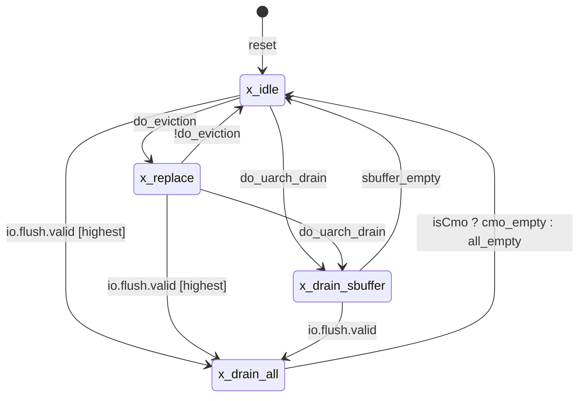

# Sbuffer 设计与功能检测点文档

> 文档版本：v1.0.0
>
> 本文以 XiangShan `DefaultConfig` 的 Chisel 源码和同基线 elaborated SystemVerilog 为实现依据，以 `Sbuffer_spec.md`、`SbufferData_spec.md` 为可选意图输入。规格与实现冲突时以实现为准，尚不能判断设计意图的差异登记为 `OPEN-*`。

## 文档范围裁定

| 条件项目 | 裁定 | 理由或对应章节 |
| --- | --- | --- |
| 多模块事务/异常/冲刷 | 已应用 | Store Queue、Sbuffer、DCache、MSHR、Load pipeline 和 flush controller 跨模块交互。 |
| 符号化存储检查 | 已应用 | SbufferData 含 16 个 data/mask entry；见 `FG-DATA`。 |
| 缓存查找/缺失/重填 | 不适用 | Sbuffer 发起 DCache line write，但不管理 DCache lookup、MSHR 分配或 refill。 |
| 异常/恢复/flush | 已应用 | DCache replay、vtag/ptag mismatch、CMO/fence drain；见 `FG-EVICTION`、`FG-FORWARD`、`FG-FLUSH`。 |
| 特性门控 | 已应用 | Store prefetch 与 Difftest 为 elaboration-time 特性；DefaultConfig 均关闭。 |
| 顶层状态机 | 已应用 | `sbuffer_state` 为四态顶层 FSM。 |
| 事务时序图 | 已应用 | enqueue、writeback、response/replay 与 flush 均跨模块。 |

## 文档控制与依据

| 项目 | 内容 |
| --- | --- |
| 文档版本 | v1.0.0 |
| 使用模板版本 | pre-v2 schema（本版本生成时模板尚未采用独立结构版本） |
| 前一版本 | None（首次版本）；[legacy 文档](./Sbuffer_design_document_zh.md)仅用于差异对比 |
| 版本变更类型 | Major：首次基于真实 Scala 与 elaborated RTL 的正式版本，结构和行为结论与 legacy 不兼容 |
| 所属项目 / 子系统 | XiangShan / MemBlock |
| DUT / Chisel 顶层 | `Sbuffer` / [`Sbuffer.scala:191`](../../third_party/XiangShan/src/main/scala/xiangshan/mem/sbuffer/Sbuffer.scala#L191) |
| Elaborated Verilog 顶层 | `Sbuffer` / [`manifest.json`](../../evidence/Sbuffer/v1.0.0/manifest.json)、[`ports.csv`](../../evidence/Sbuffer/v1.0.0/ports.csv) |
| 文档状态 | Review；Scala 行为与 DefaultConfig I/O 已核验，UCAgent/SVA 尚未回归 |
| XiangShan RTL 基线 | `aee742c92250058644c3166fae54c489161347cc`，submodule clean |
| 适用配置 | `DefaultConfig`；1 core；`--fpga-platform --reset-gen`；SystemVerilog split；Difftest/SPB/commit-prefetch disabled |
| 生成环境 | Darwin arm64；OpenJDK 17.0.20.1；Mill 0.12.17；firtool 1.149.0；native arm64 Espresso |
| RTL 生成状态 | Success：跨平台 wrapper 完整执行 TopMain、split RTL 和后处理，exit code 0；后续调用命中指纹缓存。 |
| 生成命令 | `tools/generate_rtl.sh --module Sbuffer --config DefaultConfig --version v1.0.0` |
| RTL 证据 | [`manifest.json`](../../evidence/Sbuffer/v1.0.0/manifest.json)、[`ports.csv`](../../evidence/Sbuffer/v1.0.0/ports.csv)；SHA-256 `1e1fe1c1fcea11b0e016dfce391dd771c62eff310cdb4702e712d5a9407e027e`；166 ports |
| 作者 / 评审人 | AI 生成 / 待设计与 DV 评审 |
| 生成日期 | 2026-09-01 |

| ID | 结论或待确认项 | 依据 | 置信度 | 状态 |
| --- | --- | --- | --- | --- |
| FACT-001 | 顶层 `io` 是 `Sbuffer` 内匿名 Bundle，不存在 `SbufferIO` class；enqueue 对象为 `io.in.req[i]`。 | [`Sbuffer.scala:195-210`](../../third_party/XiangShan/src/main/scala/xiangshan/mem/sbuffer/Sbuffer.scala#L195)、[`LSQBundle.scala:181-183`](../../third_party/XiangShan/src/main/scala/xiangshan/mem/lsqueue/LSQBundle.scala#L181) | 已确认 | Closed |
| FACT-002 | DefaultConfig 为 16 entries、2 路 enqueue、3 路 forward、2 路 prefetch output。 | [`Parameters.scala:166-178`](../../third_party/XiangShan/src/main/scala/xiangshan/Parameters.scala#L166) | 已确认 | Closed |
| FACT-003 | SbufferData 的 data 不复位；mask 复位为 0。write 与 mask flush 都跨一个寄存边界后更新。 | [`Sbuffer.scala:107-160`](../../third_party/XiangShan/src/main/scala/xiangshan/mem/sbuffer/Sbuffer.scala#L107) | 已确认 | Closed |
| FACT-004 | writeback 仲裁顺序为 replay-timeout、drain、coherence-timeout、replacement。 | [`Sbuffer.scala:632-646`](../../third_party/XiangShan/src/main/scala/xiangshan/mem/sbuffer/Sbuffer.scala#L632) | 已确认 | Closed |
| FACT-005 | forward 是 S0 request、S1 tag/data capture、S2 response 的分级接口，不是同周期组合接口。 | [`Sbuffer.scala:787-860`](../../third_party/XiangShan/src/main/scala/xiangshan/mem/sbuffer/Sbuffer.scala#L787) | 已确认 | Closed |
| FACT-006 | DefaultConfig elaborated `Sbuffer` 有 166 个叶端口：37 input、129 output。 | [`ports.csv`](../../evidence/Sbuffer/v1.0.0/ports.csv)、[`manifest.json`](../../evidence/Sbuffer/v1.0.0/manifest.json) | 已确认 | Closed |
| OPEN-BEHAV-001 | merge 处的 `cohCount := 0` 会被后续 active-entry 自增赋值覆盖；需设计确认这是意图还是连接优先级缺陷。 | [`Sbuffer.scala:452-468`](../../third_party/XiangShan/src/main/scala/xiangshan/mem/sbuffer/Sbuffer.scala#L452)、[`Sbuffer.scala:761-768`](../../third_party/XiangShan/src/main/scala/xiangshan/mem/sbuffer/Sbuffer.scala#L761) | 待设计确认 | Open |
| OPEN-BEHAV-002 | drain/coherence 的 PriorityEncoder 首选项若不是 DCache candidate，本拍不会退选下一项；需确认排空进展意图。 | [`Sbuffer.scala:632-650`](../../third_party/XiangShan/src/main/scala/xiangshan/mem/sbuffer/Sbuffer.scala#L632) | 待设计确认 | Open |
| OPEN-VERIFY-001 | UCAgent 表格标签解析、SVA 编译、formal bind 和 prove/cover 尚未运行。 | 当前仓库无 checker/harness | 待验证 | Open |

## DUT 整体功能描述

### 职责、边界与性能

Sbuffer 接收 Store Queue 已提交的 store 请求，以 cache-line ptag 对 active entry 做 CAM 匹配。命中时将 byte-masked 数据合并到已有 entry；未命中时从偶/奇 bank 的 invalid entry 中分配。每个 entry 的 ptag/vtag、有效/inflight/timeout/同块等待状态位于顶层，整行 data 与 byte mask 位于 SbufferData。

Sbuffer 在 replay timeout、drain、coherence timeout 或 replacement 压力下选择 entry，经 S0/S1 流水向 DCache 发出 512-bit line write。MainPipe completion 释放 entry；replay 保留 inflight entry，等待计数达到阈值后重试。Load pipeline 通过三路 S0/S1/S2 forward 接口查询 16-byte 数据；active entry 按 byte 覆盖 inflight entry。DefaultConfig 每周期最多接受 2 个 store、发射 1 个 DCache line request，并处理 3 个 forward query。

非目标：Sbuffer 不执行 DCache refill，不保持 store miss 的后续 MSHR 生命周期，也不定义架构级 store retirement；accepted miss 释放 Sbuffer entry 后由 DCache MSHR 负责数据与前递。

## I/O 定义

### 顶层 IO Bundle

| 层级 | Bundle class | Chisel 对象 | Scala 定义位置 | 说明 |
| --- | --- | --- | --- | --- |
| 顶层 | `anonymous Bundle in Sbuffer.io` | `io` | [`Sbuffer.scala:195-211`](../../third_party/XiangShan/src/main/scala/xiangshan/mem/sbuffer/Sbuffer.scala#L195) | 不得命名为 `SbufferIO`。 |
| Enqueue | `SbufferWriteIO` | `io.in.req[0..1]` | [`LSQBundle.scala:181-183`](../../third_party/XiangShan/src/main/scala/xiangshan/mem/lsqueue/LSQBundle.scala#L181) | `Flipped(Vec(2, Decoupled[DCacheWordReqWithVaddrAndPfFlag]))`。 |
| DCache | `DCacheToSbufferIO` | `io.dcache` | [`DCacheWrapper.scala:718-729`](../../third_party/XiangShan/src/main/scala/xiangshan/cache/dcache/DCacheWrapper.scala#L718) | line request、MainPipe completion、replay。 |
| Forward | `SbufferForward` | `io.forward[0..2]` | [`Bundles.scala:151-156`](../../third_party/XiangShan/src/main/scala/xiangshan/mem/Bundles.scala#L151) | S0/S1 request，S2 response。 |
| Flush | `SbufferFlushBundle` | `io.flush` | [`Sbuffer.scala:33-37`](../../third_party/XiangShan/src/main/scala/xiangshan/mem/sbuffer/Sbuffer.scala#L33) | top-level `Flipped` 后 valid/isCmo 为输入、empty 为输出。 |
| CSR | `CustomCSRCtrlIO` | `io.csrCtrl` | [`Bundle.scala:647-678`](../../third_party/XiangShan/src/main/scala/xiangshan/Bundle.scala#L647) | 本 DUT 实际读取 `sbuffer_timeout`；threshold 字段当前未使用。 |
| Prefetch | `StorePrefetchReq` | `io.store_prefetch[0..1]` | [`DCacheWrapper.scala:830-833`](../../third_party/XiangShan/src/main/scala/xiangshan/cache/dcache/DCacheWrapper.scala#L830) | DefaultConfig 两种 prefetch 均关闭，端口被优化。 |
| Difftest | `DiffStoreIO` | `io.diffStore` | [`Bundles.scala:450-454`](../../third_party/XiangShan/src/main/scala/xiangshan/mem/Bundles.scala#L450) | `EnableDifftest=false` 时端口被优化。 |
| 性能事件 | `PerfEvent` | `io_perf[0..15]` | [`HardwarePerfMonitor.scala:23-35`](../../third_party/XiangShan/utility/src/main/scala/utility/HardwarePerfMonitor.scala#L23) | `HasPerfEvents` 追加 16 路 6-bit 输出。 |

### Chisel / Verilog 逐项映射

下表中的数组模式已逐项核对 `Sbuffer.sv:46-213`。`i=0..1`、`k=0..2`、`b=0..15`、`p=0..15`；“未生成”表示 Chisel 字段存在，但在本次 DefaultConfig 产物中经配置分支、常量传播或 dead-port elimination 消失。

| Bundle class | Chisel 对象 / 字段 | 方向 | Chisel 类型 / 位宽 | 精确 Verilog I/O | Verilog 位宽 | 条件 / 对端 |
| --- | --- | --- | --- | --- | --- | --- |
| module implicit | `clock` | I | `Clock` | `clock` | 1 | 主时钟 |
| module implicit | `reset` | I | `Reset` | `reset` | 1 | 生成 RTL 为同步寄存器复位 |
| `SbufferWriteIO` | `io.in.req[i].ready` | O | `Bool` | `io_in_req_[i]_ready` | 1 | Store Queue Decoupled |
| `SbufferWriteIO` | `io.in.req[i].valid` | I | `Bool` | `io_in_req_[i]_valid` | 1 | Store Queue Decoupled |
| `DCacheWordReqWithVaddrAndPfFlag` | `io.in.req[i].bits.vaddr` | I | `UInt(50.W)` | `io_in_req_[i]_bits_vaddr` | 50 | CAM vtag |
| 同上 | `.bits.data` / `.bits.mask` | I | `UInt(128.W)` / `UInt(16.W)` | `io_in_req_[i]_bits_data` / `_mask` | 128 / 16 | SbufferData write |
| 同上 | `.bits.addr` / `.bits.wline` | I | `UInt(48.W)` / `Bool` | `io_in_req_[i]_bits_addr` / `_wline` | 48 / 1 | ptag、offset、整行零写 |
| 同上 | `.bits.{cmd,vaddr_dup,id,instrtype,isFirstIssue,replayCarry,lqIdx,debug_robIdx,prefetch,vecValid,sqNeedDeq}` | I | 见 [`DCacheWrapper.scala:421-469`](../../third_party/XiangShan/src/main/scala/xiangshan/cache/dcache/DCacheWrapper.scala#L421) | 未生成 | 0 | 本配置裁剪；不可作为 bind 端口 |
| `DCacheToSbufferIO` | `io.dcache.req.ready` / `.valid` | I / O | `Bool` | `io_dcache_req_ready` / `io_dcache_req_valid` | 1 / 1 | DCache Decoupled |
| `DCacheLineReq` | `io.dcache.req.bits.vaddr` / `.addr` | O | 50 / 48 bits | `io_dcache_req_bits_vaddr` / `_addr` | 50 / 48 | line address |
| 同上 | `.bits.data` / `.mask` / `.id` | O | 512 / 64 / 6 bits | `io_dcache_req_bits_data` / `_mask` / `_id` | 512 / 64 / 6 | line payload + entry ID |
| 同上 | `.bits.cmd` | O | `UInt(5.W)`，恒为 `M_XWR` | 未生成 | 0 | 常量传播 |
| `DCacheLineResp` | `io.dcache.main_pipe_hit_resp.valid` / `.bits.id` | I | 1 / 6 bits | `io_dcache_main_pipe_hit_resp_valid` / `_bits_id` | 1 / 6 | completion |
| 同上 | `io.dcache.replay_resp.valid` / `.bits.id` | I | 1 / 6 bits | `io_dcache_replay_resp_valid` / `_bits_id` | 1 / 6 | replay |
| 同上 | 两响应的 `.bits.{data,miss,replay}` | I | 512 / 1 / 1 bits | 未生成 | 0 | 本配置中仅 ID 参与功能逻辑；assert/difftest 被裁剪 |
| `SbufferForward` | `io.forward[k].s0Req.valid` / `.bits.vaddr` | I | 1 / 50 bits | `io_forward_[k]_s0Req_valid` / `_bits_vaddr` | 1 / 50 | Load S0 |
| 同上 | `.s1Req.paddr` / `.s1Kill` | I | 48 / 1 bits | `io_forward_[k]_s1Req_paddr` / `_s1Kill` | 48 / 1 | Load S1 |
| 同上 | `.s2Resp.valid` | O | `Bool` | `io_forward_[k]_s2Resp_valid` | 1 | Load S2 |
| `SbufferForwardResp` | `.s2Resp.bits.forwardMask[b]` | O | `Vec(16,Bool)` | `io_forward_[k]_s2Resp_bits_forwardMask_[b]` | 每项 1 | byte mask |
| 同上 | `.s2Resp.bits.forwardData[b]` | O | `Vec(16,UInt(8.W))` | `io_forward_[k]_s2Resp_bits_forwardData_[b]` | 每项 8 | byte data |
| 同上 | `.s2Resp.bits.matchInvalid` | O | `Bool` | `io_forward_[k]_s2Resp_bits_matchInvalid` | 1 | vtag/ptag mismatch |
| top scalar | `io.sqempty` / `io.mshr_store_empty` | I | `Bool` | `io_sqempty` / `io_mshr_store_empty` | 1 / 1 | empty qualification |
| top scalar | `io.sbempty` / `io.sbFull` | O | `Bool` | `io_sbempty` / `io_sbFull` | 1 / 1 | registered status |
| `SbufferFlushBundle` | `io.flush.valid` / `.isCmo` / `.empty` | I / I / O | `Bool` | `io_flush_valid` / `io_flush_isCmo` / `io_flush_empty` | 1 each | flush control |
| `CustomCSRCtrlIO` | `io.csrCtrl.sbuffer_timeout` | I | `UInt(22.W)` | `io_csrCtrl_sbuffer_timeout` | 22 | coherence timeout |
| top scalar | `io.force_write` | I | `Bool` | `io_force_write` | 1 | threshold reduction |
| top scalar / optional aggregate | `io.{hartId,physicalStoreQueueFull,memSetPattenDetected,store_prefetch,diffStore}` 与其余 `csrCtrl` | mixed | 见顶层 Bundle | 未生成 | 0 | DefaultConfig/优化裁剪 |
| `PerfEvent` | `io_perf[p].value` | O | `UInt(6.W)` | `io_perf_[p]_value` | 6 | 16 路性能事件 |

### 接口字段与响应关联

| Chisel 接口 | Verilog 端口组 | 关键字段 / ID | 请求与响应关联 | payload 稳定性 | 延迟 / 顺序约束 |
| --- | --- | --- | --- | --- | --- |
| `io.in.req[i]` | `io_in_req_[i]_*` | ptag/vtag、128-bit data、16-bit mask | 无外部 response；fire 后更新 entry | 上游 Decoupled 在 valid 且未 ready 时保持 payload | meta 同拍更新，SbufferData 下一寄存边界更新。 |
| `io.dcache.req` / responses | `io_dcache_*` | 6-bit entry ID | MainPipe completion/replay ID 直接索引 entry | S1 valid 被 block 时内部保持；输出 valid 仅在无 data hazard 时拉高 | S0 选择即置 inflight，早于 req.fire。 |
| `io.forward[k]` | `io_forward_[k]_*` | vaddr、paddr、16-byte result | S0/S1/S2 流水，无事务 ID | s0Req 有效时采样 vaddr；S1 同一 query 提供 paddr/kill | `s0Req` 到 `s2Resp.valid` 跨两个寄存边界。 |
| `io.flush` | `io_flush_*` | valid、isCmo、empty | valid 触发进入 drain；无需保持到完成 | 单周期 pulse 可被 FSM 捕获 | empty 为 `all_empty` 的一拍寄存值。 |

## 参数定义

| 参数 | Scala 类型 | DefaultConfig 值 / 范围 | Scala 定义位置 | 主要使用位置 | 生效时机 | 功能影响 |
| --- | --- | --- | --- | --- | --- | --- |
| `StoreBufferSize` | `Int` | 16 | [`Parameters.scala:176`](../../third_party/XiangShan/src/main/scala/xiangshan/Parameters.scala#L176) | [`Sbuffer.scala:218-226`](../../third_party/XiangShan/src/main/scala/xiangshan/mem/sbuffer/Sbuffer.scala#L218) | elaboration | entry 数、索引、PLRU、mask 深度。 |
| `StoreBufferThreshold` | `Int` | 9；要求 `threshold+1 <= size` | [`Parameters.scala:177`](../../third_party/XiangShan/src/main/scala/xiangshan/Parameters.scala#L177) | [`Sbuffer.scala:543-551`](../../third_party/XiangShan/src/main/scala/xiangshan/mem/sbuffer/Sbuffer.scala#L543) | elaboration | require；运行选择使用 Constantin 初值 9。 |
| `EnsbufferWidth` | `Int` | 2，注意源码拼写 | [`Parameters.scala:178`](../../third_party/XiangShan/src/main/scala/xiangshan/Parameters.scala#L178) | [`Sbuffer.scala:325-379`](../../third_party/XiangShan/src/main/scala/xiangshan/mem/sbuffer/Sbuffer.scala#L325) | elaboration | enqueue/write 端口数；当前算法显式索引 0/1。 |
| `LoadPipelineWidth` | `Int` | 3 | [`Parameters.scala:166`](../../third_party/XiangShan/src/main/scala/xiangshan/Parameters.scala#L166) | [`Sbuffer.scala:199`](../../third_party/XiangShan/src/main/scala/xiangshan/mem/sbuffer/Sbuffer.scala#L199) | elaboration | forward 通道数。 |
| `StorePipelineWidth` | `Int` | 2，且 `>= EnsbufferWidth` | [`Parameters.scala:167`](../../third_party/XiangShan/src/main/scala/xiangshan/Parameters.scala#L167) | [`Sbuffer.scala:207,533`](../../third_party/XiangShan/src/main/scala/xiangshan/mem/sbuffer/Sbuffer.scala#L207) | elaboration | prefetch 输出数。 |
| `EnableStorePrefetchAtCommit` | `Boolean` | false | [`Parameters.scala:199`](../../third_party/XiangShan/src/main/scala/xiangshan/Parameters.scala#L199) | [`Sbuffer.scala:405-421`](../../third_party/XiangShan/src/main/scala/xiangshan/mem/sbuffer/Sbuffer.scala#L405) | elaboration | commit-side prefetch 输出。 |
| `EnableAtCommitMissTrigger` | `Boolean` | true | [`Parameters.scala:200`](../../third_party/XiangShan/src/main/scala/xiangshan/Parameters.scala#L200) | [`Sbuffer.scala:407-410`](../../third_party/XiangShan/src/main/scala/xiangshan/mem/sbuffer/Sbuffer.scala#L407) | elaboration | commit prefetch 是否要求请求 prefetch 标志。 |
| `EnableStorePrefetchSPB` | `Boolean` | false | [`Parameters.scala:202`](../../third_party/XiangShan/src/main/scala/xiangshan/Parameters.scala#L202) | [`Sbuffer.scala:394-403`](../../third_party/XiangShan/src/main/scala/xiangshan/mem/sbuffer/Sbuffer.scala#L394) | elaboration | SPB 训练和请求。 |
| `EnableDifftest` | `Boolean` | false | [`Parameters.scala:611-617`](../../third_party/XiangShan/src/main/scala/xiangshan/Parameters.scala#L611) | [`Sbuffer.scala:770-780`](../../third_party/XiangShan/src/main/scala/xiangshan/mem/sbuffer/Sbuffer.scala#L770) | elaboration | Difftest event 生成。 |
| `EvictCycles` | derived `Int` | `1 << 20` | [`Sbuffer.scala:39-44`](../../third_party/XiangShan/src/main/scala/xiangshan/mem/sbuffer/Sbuffer.scala#L39) | coh counter width | elaboration | `EvictCountBits=21`；实际 timeout 比较由 CSR 给出。 |
| `SbufferReplayDelayCycles` | derived `Int` | 16 | [`Sbuffer.scala:41-44`](../../third_party/XiangShan/src/main/scala/xiangshan/mem/sbuffer/Sbuffer.scala#L41) | replay counter | elaboration | `MissqReplayCountBits=5`。 |
| `NumDcacheWriteResp` | derived `Int` | 1 | [`Sbuffer.scala:46-49`](../../third_party/XiangShan/src/main/scala/xiangshan/mem/sbuffer/Sbuffer.scala#L46) | mask flush Vec | elaboration | 仅 MainPipe completion。 |
| `StoreBufferThreshold_<hart>` / `StoreBufferBase_<hart>` | Constantin 5-bit record | 9 / 1 | [`Sbuffer.scala:543-549`](../../third_party/XiangShan/src/main/scala/xiangshan/mem/sbuffer/Sbuffer.scala#L543) | `forceThreshold` | runtime constant control | `force_write` 时阈值由 9 降到 8。 |
| `io.csrCtrl.sbuffer_timeout` | runtime `UInt` | 22 bits | [`Bundle.scala:659`](../../third_party/XiangShan/src/main/scala/xiangshan/Bundle.scala#L659) | [`Sbuffer.scala:291-294`](../../third_party/XiangShan/src/main/scala/xiangshan/mem/sbuffer/Sbuffer.scala#L291) | runtime | active entry coherence timeout 比较值。 |

### 形式化 Harness 参数

| 参数 | 范围 | 来源 | 用途 |
| --- | --- | --- | --- |
| `DCACHE_RESPONSE_BOUND` | 项目批准的正整数 | DV 环境 | 对已 fire 的 DCache 请求提供有界 completion/replay 公平性。 |
| `DRAIN_BOUND` | 由 entry 数、replay bound、DCache bound 推导 | DV 环境 | cover/有界 liveness，不可取任意宽松值。 |

## 顶层状态机

本节只列 `sbuffer_state`。entry 的 valid/inflight/timeout/same-block bits 是资源生命周期，不是顶层 FSM 状态。

| 状态 | 编码 / Scala 定义 | 含义 | 进入条件与优先级 | 退出条件 | 输出 / 限制 |
| --- | --- | --- | --- | --- | --- |
| `x_idle` | Enum 0；[`Sbuffer.scala:236-239`](../../third_party/XiangShan/src/main/scala/xiangshan/mem/sbuffer/Sbuffer.scala#L236) | 正常接收和按压力驱逐。 | reset；其他状态完成。`flush > uarch_drain > do_eviction`。 | flush、uarch drain、eviction。 | enqueue allowed。 |
| `x_replace` | Enum 1 | 保持 replacement 驱逐。 | idle 的 `do_eviction`。 | `flush > uarch_drain > !do_eviction`。 | enqueue allowed；`need_replace=true`。 |
| `x_drain_all` | Enum 2 | flush 排空。 | idle/replace/drain_sbuffer 收到 flush。 | CMO：`cmo_empty`；非 CMO：`all_empty`。 | enqueue 仍允许，使 SQ 可继续排入。 |
| `x_drain_sbuffer` | Enum 3 | mismatch 触发的仅 Sbuffer 排空。 | idle/replace 的 `do_uarch_drain`。 | flush 升级 drain_all；否则 `sbuffer_empty`。 | 唯一禁止 enqueue 的状态。 |



状态迁移实现见 [`Sbuffer.scala:559-590`](../../third_party/XiangShan/src/main/scala/xiangshan/mem/sbuffer/Sbuffer.scala#L559)。forward mismatch 延迟一拍、merge mismatch 延迟两拍后形成 `do_uarch_drain`（[`Sbuffer.scala:389-392`](../../third_party/XiangShan/src/main/scala/xiangshan/mem/sbuffer/Sbuffer.scala#L389)）。

## 微架构与时序

### 微架构图

```mermaid
flowchart LR
    SQ[Store Queue]
    DC[DCache MainPipe / MSHR]
    LD[Load pipelines]
    FC[Flush controller]
    CSR[CSR / Constantin]
    PMU[Performance monitor]

    subgraph DUT["DUT: Sbuffer"]
        CAM{ptag CAM and even/odd allocation}
        META[16-entry tags and stateVec]
        DATA[SbufferData: 16 x 64-byte data/mask]
        FSM[sbuffer_state]
        ARB{replay / drain / coh / PLRU}
        OUT[S0 select + S1 elastic request]
        FWD[S0/S1/S2 forward pipeline]
        CNT[coh and replay counters]
        CAM -->|insert or merge| META
        CAM -->|DataWriteReq| DATA
        META --> ARB
        CNT --> ARB
        ARB --> OUT
        DATA -->|line data/mask| OUT
        META --> FWD
        DATA --> FWD
        FSM -.-> CAM
        FSM -.-> ARB
    end

    SQ -->|io.in.req[i] / io_in_req_[i]_*| CAM
    OUT -->|io.dcache.req / io_dcache_req_*| DC
    DC -->|io.dcache.main_pipe_hit_resp, replay_resp| META
    DC -.->|completion causes internal maskFlushReq| DATA
    LD -->|io.forward[k].s0Req/s1Req/s1Kill| FWD
    FWD -->|io.forward[k].s2Resp| LD
    FC -->|io.flush.valid/isCmo, io.sqempty, io.mshr_store_empty| FSM
    FSM -->|io.sbempty/sbFull/flush.empty| FC
    CSR -->|io.csrCtrl.sbuffer_timeout, io.force_write| CNT
    DUT -->|io_perf[p].value| PMU
```

图中所有跨边界信号均出现在 I/O 表。DefaultConfig 中 prefetch 与 Difftest 端口被消除，因此未画为有效边界。

### 事务时序图

```mermaid
sequenceDiagram
    participant SQ as Store Queue
    participant SB as Sbuffer
    participant SD as SbufferData
    participant DC as DCache MainPipe/MSHR
    SQ->>SB: io.in.req[i].valid + payload
    SB-->>SQ: io.in.req[i].ready
    SB->>SB: fire: update meta / choose insert or merge
    SB->>SD: writeReq (internal)
    SD->>SD: next edge updates selected bytes
    SB->>SB: S0 selects entry and marks inflight
    SB->>DC: S1 io.dcache.req (may wait for data hazard/ready)
    alt completion, including accepted miss
        DC-->>SB: main_pipe_hit_resp.valid + id
        SB->>SB: invalidate entry
        SB->>SD: maskFlushReq; next edge clears mask
    else replay
        DC-->>SB: replay_resp.valid + id
        SB->>SB: retain inflight, set w_timeout, count upward
        SB->>DC: retry after replay timeout
    end
```

### 关键资源

| 资源 | 类型 / 规模 | 写入条件 | 读取 / 消费条件 | 冲突与优先级 | 观测点 |
| --- | --- | --- | --- | --- | --- |
| `stateVec` | 16 x `SbufferEntryState` | insert、S0 select、completion、replay、same-block release | CAM、arb、forward | completion/replay 按 ID；同块最多一个 inflight | `state_valid/state_inflight/w_timeout/w_sameblock_inflight` |
| `ptag/vtag` | 16 x 42/44 bits | insert；merge 不改 tag | CAM、request、forward | 未 valid 时值不具功能意义 | arrays + symbolic index |
| SbufferData | 16 x 4 x 16 bytes + mask | 2 write channels；1 mask flush channel | writeback、forward | 同字节：后置 write channel胜；write 赋值位于 flush 后 | internal arrays / bind mirrors |
| `cohCount` | 16 x 21 bits | active 自增、insert/merge 赋值 | registered timeout mask | merge 清零与后置自增冲突见 OPEN-BEHAV-001 | counter/mask |
| `missqReplayCount` | 16 x 5 bits | replay 清零，timeout wait 自增 | retry arbitration | MSB 置位后停止增长 | counter/retry mask |
| S1 output register | 1 entry | S0 可前推时加载 | DCache fire | data hazard 屏蔽 output valid；ready/backpressure 保持 | valid/id/tag/data/mask |

## 形式化建模与属性契约

- 默认时钟为 `clock`；时序 assert 在 `reset` 期间禁用。只检查有 `RegInit` 的状态复位值；不得断言 data、ptag、vtag 或 waitInflightMask 复位为零。
- 使用 `fv_idx` 选择任意 entry，并 bind `stateVec`、ptag/vtag、data/mask、counters、candidate masks、S0/S1 ID。
- 由于 Verilog 顶层经过配置特化，优先绑定 `Sbuffer.sv` 中保留端口；被裁剪的 Chisel 字段只能通过父层或不同配置验证。
- DCache response 的最终性使用 `DCACHE_RESPONSE_BOUND` Assume；不得假设每个请求立即 completion，也不得屏蔽 replay。
- X 策略：所有有效输入控制、response ID、forward 地址和状态/选择向量在采样时非 X。

| 功能点 | 触发事件 | 预期结果 | 帧条件 | 延迟 / 界限来源 | 观测点 |
| --- | --- | --- | --- | --- | --- |
| `FC-INSERT` | enqueue fire、vecValid 语义为真、无 active ptag hit | 一个 invalid entry valid，保存 tags，data write 入流水 | 非目标 entry 不变 | meta 同拍；data 下一 edge | allocation/state/tags/data |
| `FC-MERGE` | enqueue fire 且 active ptag hit | 目标 entry byte 合并；vtag mismatch 触发 drain | 非目标 entry/data byte 不变 | data 下一 edge；drain 两 edge | mergeMask/data/FSM |
| `FC-DATA-WRITE` | internal writeReq valid | masked/replicated-line 更新 | 未选 entry 稳定 | 一个寄存边界 | data/mask mirrors |
| `FC-WRITE-REQ` | S0 candidate fire | entry 置 inflight；S1 payload正确并握手 | 非目标 entry 稳定 | S0/S1；ready unbounded by DUT | req/state |
| `FC-RESPONSE` | completion 或 replay valid | invalidate+flush，或 retain+timeout | 非 ID entry 稳定 | state 同 edge；mask 下一 edge | response/state/mask |
| `FC-FORWARD-PIPELINE` | `s0Req.valid` | 两 edge 后 S2 valid 与选中 byte data/mask | 无 query 时 response valid 低 | 固定两 edge | forward ports/internal matches |
| `FC-EMPTY-STATUS` | empty source condition | status 下一 edge反映条件 | source 不变时保持 | `GatedValidRegNext` 一 edge | empty sources/outputs |

## 功能分组与检测点

### 本 DUT 标签树

```text
Sbuffer
|- FG-API
|  |- FC-RESET-ASSUME
|  `- FC-INPUT-ASSUME
|- FG-RESET
|  `- FC-RESET-STATE
|- FG-ENQUEUE
|  |- FC-READY
|  |- FC-INSERT
|  |- FC-MERGE
|  `- FC-DUAL-ENQUEUE
|- FG-DATA
|  |- FC-DATA-WRITE
|  `- FC-MASK-FLUSH
|- FG-EVICTION
|  |- FC-ARBITRATION
|  |- FC-WRITE-REQ
|  `- FC-RESPONSE
|- FG-TIMEOUT
|  |- FC-COH-TIMEOUT
|  `- FC-REPLAY-TIMEOUT
|- FG-FORWARD
|  |- FC-FORWARD-PIPELINE
|  |- FC-FORWARD-SELECT
|  `- FC-MISMATCH-DETECT
|- FG-FLUSH
|  |- FC-FSM-PRIORITY
|  `- FC-EMPTY-STATUS
|- FG-FEATURE
|  |- FC-PREFETCH-GATING
|  `- FC-DIFFTEST-GATING
`- FG-COVERAGE
   `- FC-SBUFFER-REACHABILITY
```

### 1. 验证环境约束

`<FG-API>`

本组只约束外部输入合法性，不假设 DUT 输出或内部设计结论正确。

#### 复位环境

复位必须在 formal 初始阶段有限有效并最终释放，使正常和恢复路径均可探索。

| FC 标签 | 功能描述 | 触发 / 前置条件 | 预期结果 / 约束 | 边界与例外 |
| --- | --- | --- | --- | --- |
| `<FC-RESET-ASSUME>` | 建立同步复位与采样环境。 | formal 初始状态 | reset 有限保持后释放。 | 不约束未初始化 data/tags。 |

| CK 标签 | Style | 检查说明 | 主要观测点 | 需求 / 依据 |
| --- | --- | --- | --- | --- |
| `<CK-API-RESET-LEGAL>` | Assume | 初始 reset 有效且最终释放。 | `reset` | formal harness |

#### 输入协议

Store Queue 遵守 Decoupled 稳定性与 valid-prefix；DCache 只对已发射 ID 返回 completion/replay；forward 的 S0/S1 字段属于同一 query。

| FC 标签 | 功能描述 | 触发 / 前置条件 | 预期结果 / 约束 | 边界与例外 |
| --- | --- | --- | --- | --- |
| `<FC-INPUT-ASSUME>` | 约束 enqueue、DCache response、forward 和 empty inputs。 | 相应 valid/在途条件 | 输入已知、payload 稳定、ID 合法。 | response 允许 replay；flush 可为 pulse。 |

| CK 标签 | Style | 检查说明 | 主要观测点 | 需求 / 依据 |
| --- | --- | --- | --- | --- |
| `<CK-API-INPUT-KNOWN>` | Assume | 有效输入的控制、地址、mask、response ID 非 X。 | top inputs | I/O 定义 |
| `<CK-API-ENQUEUE-STABLE>` | Assume | `valid && !ready` 时保留的 enqueue payload 稳定。 | `io_in_req_[i]_*` | Decoupled |
| `<CK-API-ENQUEUE-PREFIX>` | Assume | channel 1 valid 时 channel 0 valid，匹配上游 EnterSbufferQueue 契约。 | enqueue valids | `NewStoreQueue.scala:732-786` |
| `<CK-API-WLINE-ZERO>` | Assume | 有效 wline store 的 data 为全零，匹配当前 DUT assert。 | enqueue data/wline | `Sbuffer.scala:960` |
| `<CK-API-RESPONSE-LEGAL>` | Assume | response ID 对应尚未完成的 inflight request，completion 与 replay 不同拍冲突。 | dcache ports/state | integration contract |
| `<CK-API-RESPONSE-FAIR>` | Assume | 每个 DCache request fire 在 `DCACHE_RESPONSE_BOUND` 内得到 completion 或 replay。 | dcache ports | formal liveness bound |

### 2. 复位状态

`<FG-RESET>`

本组验证 DUT 自身显式初始化的状态，不对无初始化 data、ptag、vtag 或 waitInflightMask 建立错误断言。

#### 显式初始化资源

reset 使 entry state、coherence/replay counters、顶层 FSM、S1 valid 和 SbufferData mask 回到源码给定初值；data 与 tags 只在 valid/mask 语义下使用。

| FC 标签 | 功能描述 | 触发 / 前置条件 | 预期结果 | 帧条件 / 边界 |
| --- | --- | --- | --- | --- |
| `<FC-RESET-STATE>` | 检查显式 RegInit 资源。 | reset 有效 | state/counters/FSM/mask/S1 valid 为初值。 | 不检查 plain Reg。 |

| CK 标签 | Style | 检查说明 | 主要观测点 | 需求 / 依据 |
| --- | --- | --- | --- | --- |
| `<CK-RESET-INITIALIZED-STATE>` | Seq | reset 后 `stateVec`、两个 counter、FSM 和 S1 valid 为初始化值。 | internal regs | `Sbuffer.scala:224-239,666` |
| `<CK-RESET-MASK-ZERO>` | Seq, Symbolic | reset 后 `fv_idx` 的所有 mask 为 0；不检查 data。 | SbufferData mask/data | `Sbuffer.scala:107-115` |

### 3. Enqueue 与条目更新

`<FG-ENQUEUE>`

本组覆盖双路 ready 依赖、偶奇 bank 分配、active ptag merge 和同拍同 tag 聚合。

#### Ready 与 drain 限制

channel 0 在有空 bank 或可 merge 且不处于 `x_drain_sbuffer` 时 ready；channel 1 还依赖 channel 0 ready。

| FC 标签 | 功能描述 | 触发 / 前置条件 | 预期结果 | 帧条件 / 边界 |
| --- | --- | --- | --- | --- |
| `<FC-READY>` | 产生两路 enqueue ready。 | capacity/merge/FSM 状态 | 按源码组合式输出 ready。 | `x_drain_all` 不禁止 enqueue。 |

| CK 标签 | Style | 检查说明 | 主要观测点 | 需求 / 依据 |
| --- | --- | --- | --- | --- |
| `<CK-READY-CHANNEL0>` | Comb | req0 ready 等于 `(firstCanInsert || canMerge0) && enqAllowed`。 | ready/capacity/merge/FSM | `Sbuffer.scala:377-379` |
| `<CK-READY-CHANNEL1-ORDER>` | Comb | req1 ready 还必须满足 req0 ready。 | both ready | `Sbuffer.scala:379` |
| `<CK-READY-DRAIN-SBUFFER-BLOCK>` | Comb | 仅 `x_drain_sbuffer` 强制两路 ready 为 0。 | FSM/ready | `Sbuffer.scala:377` |

#### 新 Entry 分配

无 active ptag hit 时，port 0 从空项更多的偶/奇 bank 取最低位空项，port 1 取另一 bank；insert 设置 valid/tags 和 same-block wait 信息。

| FC 标签 | 功能描述 | 触发 / 前置条件 | 预期结果 | 帧条件 / 边界 |
| --- | --- | --- | --- | --- |
| `<FC-INSERT>` | 为新 cache line 分配 entry。 | fire、有效 store、无 merge hit | one-hot entry valid，tags 正确，写请求选中同 entry。 | 非目标 state/tags 不变。 |

| CK 标签 | Style | 检查说明 | 主要观测点 | 需求 / 依据 |
| --- | --- | --- | --- | --- |
| `<CK-INSERT-ONE-HOT>` | Seq | insertVec one-hot 且 OHToUInt 与目标一致。 | insertVec/index | `Sbuffer.scala:347-387,435` |
| `<CK-INSERT-META>` | Seq, Symbolic | 选择 `fv_idx` 后 valid、ptag、vtag 与请求一致。 | state/tags/fv_idx | `Sbuffer.scala:438-448` |
| `<CK-INSERT-SAMEBLOCK-WAIT>` | Seq, Symbolic | 同块 inflight 存在时新 entry 记录 wait mask 和阻塞位。 | inflight/ptag/wait mask | `Sbuffer.scala:436-443` |
| `<CK-INSERT-NON-TARGET-STABLE>` | Seq, Symbolic | insert 未选择 `fv_idx` 时其 state/tags 不因该 insert 改变。 | symbolic entry | frame condition |

#### Active Entry 合并

merge 只匹配 active entry；inflight entry 不参与。data/mask 合并进入 SbufferData，vtag 不更新；vtag 不同会延迟触发 uarch drain。

| FC 标签 | 功能描述 | 触发 / 前置条件 | 预期结果 | 帧条件 / 边界 |
| --- | --- | --- | --- | --- |
| `<FC-MERGE>` | 合并同 ptag active entry。 | fire 且唯一 mergeMask hit | 写入目标 entry；mismatch 触发 drain。 | `cohCount` 实际连接优先级见 OPEN-BEHAV-001。 |

| CK 标签 | Style | 检查说明 | 主要观测点 | 需求 / 依据 |
| --- | --- | --- | --- | --- |
| `<CK-MERGE-ACTIVE-ONLY>` | Comb | mergeMask 等于 ptag match 与 activeMask 的交集。 | mergeMask/state/tags | `Sbuffer.scala:319-340` |
| `<CK-MERGE-DATA-TARGET>` | Seq, Symbolic | merge 选择 `fv_idx` 时下一 edge 按 byte 更新目标。 | writeReq/data/mask | `Sbuffer.scala:473-498` |
| `<CK-MERGE-VTAG-DRAIN>` | Seq | vtag 不同后两级 `GatedValidRegNext` 触发 uarch drain。 | mismatch/FSM | `Sbuffer.scala:389-392,465-468` |
| `<CK-MERGE-NON-TARGET-STABLE>` | Seq, Symbolic | 未选 `fv_idx` 的 data/mask/tags 保持。 | symbolic entry | frame condition |

#### 双路同周期处理

两路相同 ptag 且 vecValid 时共享 port 0 的 insert entry；不同 ptag 通常分配到不同 bank。两个 write channel 同字节冲突时，源码后置的 channel 1 赋值优先。

| FC 标签 | 功能描述 | 触发 / 前置条件 | 预期结果 | 帧条件 / 边界 |
| --- | --- | --- | --- | --- |
| `<FC-DUAL-ENQUEUE>` | 处理双路独立与同 tag store。 | 两路 fire | 同 tag 单 entry；不同 tag 独立目标。 | overlapping byte 由 channel 1 覆盖。 |

| CK 标签 | Style | 检查说明 | 主要观测点 | 需求 / 依据 |
| --- | --- | --- | --- | --- |
| `<CK-DUAL-SAMETAG-SHARED>` | Seq | 同 tag 无 hit 时两个 writeReq 的 wvec 指向同一新 entry。 | sameTag/write vectors | `Sbuffer.scala:327,369-375` |
| `<CK-DUAL-DIFFERENT-TARGET>` | Seq | 不同 tag 的两个 insert 不写同一 entry。 | tags/insert vectors | even/odd allocation |
| `<CK-DUAL-OVERLAP-PORT1-WINS>` | Seq, Symbolic | 同 entry 同 byte 双写时最终 byte 等于 channel 1 data。 | writeReq/data | `Sbuffer.scala:133-160` Chisel last-connect |

### 4. SbufferData

`<FG-DATA>`

本组检查 16-entry byte storage、full-line replication、flush 和非目标稳定性。

#### Data write

普通 write 只更新 `vwordOffset` 指定的 16-byte word 中 mask 为 1 的 byte；`wline` 将同一 128-bit data 复制到四个 vword。当前顶层断言 full-line 有效写只能写全零。

| FC 标签 | 功能描述 | 触发 / 前置条件 | 预期结果 | 帧条件 / 边界 |
| --- | --- | --- | --- | --- |
| `<FC-DATA-WRITE>` | 更新目标 entry data/mask。 | one-hot writeReq valid | 下一 edge 完成 masked 或 replicated write。 | data 无 reset；未写 byte 保持。 |

| CK 标签 | Style | 检查说明 | 主要观测点 | 需求 / 依据 |
| --- | --- | --- | --- | --- |
| `<CK-DATA-MASKED-WRITE>` | Seq, Symbolic | 非 wline 时仅目标 vword/mask byte 更新，mask 置 1。 | fv_idx/data/mask | `Sbuffer.scala:132-160` |
| `<CK-DATA-WLINE-REPLICATE>` | Seq, Symbolic | wline 时四个 vword 均等于同一 128-bit input，mask 全 1。 | fv_idx/data/mask | `Sbuffer.scala:148-157` |
| `<CK-DATA-NON-TARGET-STABLE>` | Seq, Symbolic | 无 write/flush 选择 `fv_idx` 时 data/mask 稳定。 | fv_idx/write/flush | frame condition |

#### Mask flush

MainPipe completion 产生 one-hot maskFlushReq；下一 edge 整行 mask 清零，data 不变。同 edge flush 与 write 冲突时 write 连接在后，写中 byte 最终为有效。

| FC 标签 | 功能描述 | 触发 / 前置条件 | 预期结果 | 帧条件 / 边界 |
| --- | --- | --- | --- | --- |
| `<FC-MASK-FLUSH>` | 清理完成 entry 的 mask。 | completion valid + ID | 下一 edge目标 mask 清零。 | 同 byte write 优先于 clear；data 不变。 |

| CK 标签 | Style | 检查说明 | 主要观测点 | 需求 / 依据 |
| --- | --- | --- | --- | --- |
| `<CK-MASK-FLUSH-ONE-HOT>` | Comb | flush wvec 等于 response ID 的 UIntToOH。 | response/flush vector | `Sbuffer.scala:745-748` |
| `<CK-MASK-FLUSH-CLEAR>` | Seq, Symbolic | flush 选择 `fv_idx` 且无同 byte write 时下一 edge mask 全 0、data 稳定。 | fv_idx/data/mask | `Sbuffer.scala:117-130` |
| `<CK-MASK-FLUSH-WRITE-PRIORITY>` | Seq, Symbolic | flush 与 write 同 entry/byte 生效时该 byte mask 为 1 且 data 为 write data。 | internal writes/flush | source assignment order |

### 5. Eviction 与 DCache

`<FG-EVICTION>`

本组覆盖候选选择、S0/S1 request 流水、data hazard、completion 与 replay。

#### 仲裁

选择索引按 replay-timeout、drain lowest active、coherence-timeout lowest、PLRU 顺序。普通路径要求选中 entry 是 DCache candidate；replay retry 保持 inflight 并绕过该条件。

| FC 标签 | 功能描述 | 触发 / 前置条件 | 预期结果 | 帧条件 / 边界 |
| --- | --- | --- | --- | --- |
| `<FC-ARBITRATION>` | 产生单一 S0 eviction index。 | 一个或多个 source active | 按优先级选择；满足 candidate 条件才 valid。 | 首选阻塞不退选见 OPEN-BEHAV-002。 |

| CK 标签 | Style | 检查说明 | 主要观测点 | 需求 / 依据 |
| --- | --- | --- | --- | --- |
| `<CK-ARB-REPLAY-OVER-DRAIN>` | Comb | replay timeout 有效时 index 来自 replay register。 | source/index | `Sbuffer.scala:634-639` |
| `<CK-ARB-DRAIN-OVER-COH>` | Comb | 无 replay 且 drain 时 index 为最低 active。 | source/index | 同上 |
| `<CK-ARB-COH-OVER-PLRU>` | Comb | 无 replay/drain 且 coh timeout 时选择最低 timeout。 | source/index | 同上 |
| `<CK-ARB-CANDIDATE-LEGAL>` | Comb | 普通 S0 valid 必须选 `valid && !inflight && !sameblock_wait` entry。 | selected state | `Sbuffer.scala:644-650` |

#### DCache request

S0 fire 立即设置 entry inflight，并将 ID/tags捕获到 S1。S1 形成 line request；若与前一 edge 的 SbufferData write 同 entry，`blockDcacheWrite` 暂时拉低输出 valid。

| FC 标签 | 功能描述 | 触发 / 前置条件 | 预期结果 | 帧条件 / 边界 |
| --- | --- | --- | --- | --- |
| `<FC-WRITE-REQ>` | 经 S0/S1 发出 DCache line write。 | S0 valid 且 S1 可接收 | state inflight；payload 与 entry 一致。 | backpressure/data hazard 时 S1 保持。 |

| CK 标签 | Style | 检查说明 | 主要观测点 | 需求 / 依据 |
| --- | --- | --- | --- | --- |
| `<CK-WRITE-S0-INFLIGHT>` | Seq, Symbolic | S0 fire 后目标 entry inflight=1、w_timeout=0。 | S0 ID/state | `Sbuffer.scala:678-681` |
| `<CK-WRITE-REQ-PAYLOAD>` | Comb | valid 时 addr/vaddr/data/mask/id 来自捕获 entry，cmd 语义为 M_XWR。 | DCache req/S1 mirrors | `Sbuffer.scala:698-705` |
| `<CK-WRITE-DATA-HAZARD-BLOCK>` | Seq | S0 entry 与 writeReq 同 entry 时下一 edge request valid 被屏蔽。 | write vectors/S0 ID/req valid | `Sbuffer.scala:658-668` |
| `<CK-WRITE-BACKPRESSURE-STABLE>` | Seq | S1 持有且 DCache 不 ready 时 ID/tags 和 data/mask source 不改变。 | S1/request | Decoupled frame condition |

#### Response

MainPipe completion（包括被 MSHR 接受的 miss）清 valid/inflight 并 flush mask；replay 保持 inflight，设置 timeout 并清 replay counter。

| FC 标签 | 功能描述 | 触发 / 前置条件 | 预期结果 | 帧条件 / 边界 |
| --- | --- | --- | --- | --- |
| `<FC-RESPONSE>` | 按 6-bit ID 完成或重试 entry。 | 合法 response | completion 回收；replay 等待。 | 非 ID entry 稳定。 |

| CK 标签 | Style | 检查说明 | 主要观测点 | 需求 / 依据 |
| --- | --- | --- | --- | --- |
| `<CK-RESP-COMPLETE-INVALIDATE>` | Seq, Symbolic | completion ID 为 `fv_idx` 时 valid/inflight 清零。 | completion/state | `Sbuffer.scala:718-726` |
| `<CK-RESP-REPLAY-RETAIN>` | Seq, Symbolic | replay ID 为 `fv_idx` 时 inflight 保留、w_timeout=1、counter=0。 | replay/state/counter | `Sbuffer.scala:750-758` |
| `<CK-RESP-SAMEBLOCK-RELEASE>` | Seq, Symbolic | 所等待旧 ID completion 后一 edge 清 sameblock wait。 | wait mask/response/state | `Sbuffer.scala:728-741` |
| `<CK-RESP-NON-TARGET-STABLE>` | Seq, Symbolic | response ID 不等于 `fv_idx` 时该 entry 不因 response 被回收。 | response/symbolic state | frame condition |

### 6. Timeout

`<FG-TIMEOUT>`

本组区分 CSR coherence timeout 与固定 16-cycle replay wait；二者的 mask/选择还包含寄存边界。

#### Coherence timeout

active entry 的 counter 与 `io.csrCtrl.sbuffer_timeout` 比较，比较结果寄存为 `cohTimeOutMask`。active 且旧 mask 未置位时 counter 自增。

| FC 标签 | 功能描述 | 触发 / 前置条件 | 预期结果 | 帧条件 / 边界 |
| --- | --- | --- | --- | --- |
| `<FC-COH-TIMEOUT>` | 产生老化 eviction source。 | active 且 counter 达 CSR 阈值 | 下一 edge timeout mask 置位。 | 不是 counter MSB 判定。 |

| CK 标签 | Style | 检查说明 | 主要观测点 | 需求 / 依据 |
| --- | --- | --- | --- | --- |
| `<CK-COH-COMPARE-CSR>` | Seq, Symbolic | `counter >= sbuffer_timeout && active` 的结果下一 edge进入 mask。 | counter/CSR/mask | `Sbuffer.scala:287-295` |
| `<CK-COH-ACTIVE-INCREMENT>` | Seq, Symbolic | active 且旧 timeout mask=0 时按最后连接规则自增。 | state/counter/mask | `Sbuffer.scala:765-767` |
| `<CK-COH-INACTIVE-FRAME>` | Seq, Symbolic | 非 active 且无 insert/response 等目标更新时 counter 稳定。 | symbolic entry | frame condition |

#### Replay timeout

replay 将 5-bit counter 清零并置 `w_timeout`。inflight+timeout 状态每 edge递增，直到 MSB 为 1；检测结果再寄存后以最高优先级重试。

| FC 标签 | 功能描述 | 触发 / 前置条件 | 预期结果 | 帧条件 / 边界 |
| --- | --- | --- | --- | --- |
| `<FC-REPLAY-TIMEOUT>` | 管理 replay wait 和 retry。 | replay response | counter 向上计数并最终触发 retry。 | retry entry 保持 inflight。 |

| CK 标签 | Style | 检查说明 | 主要观测点 | 需求 / 依据 |
| --- | --- | --- | --- | --- |
| `<CK-REPLAY-COUNTER-UP>` | Seq, Symbolic | w_timeout && inflight && !MSB 时 counter 加一。 | state/counter | `Sbuffer.scala:761-764` |
| `<CK-REPLAY-TIMEOUT-SOURCE>` | Seq, Symbolic | MSB 与 w_timeout 共同产生 retry source，经寄存选择目标。 | counter/source/index | `Sbuffer.scala:296-299` |
| `<CK-REPLAY-RETRY-CLEARS-TIMEOUT>` | Seq, Symbolic | retry S0 fire 后目标 w_timeout 清零。 | S0/state | `Sbuffer.scala:678-681` |

### 7. Load forwarding

`<FG-FORWARD>`

本组覆盖固定流水、active/inflight byte priority 和 vtag/ptag mismatch drain。

#### Forward pipeline

S0 valid 时寄存 vaddr；S1 使用 vaddr 和同时到达的 paddr 做匹配并捕获候选 data/mask；S2 输出 valid/data/mask/matchInvalid。

| FC 标签 | 功能描述 | 触发 / 前置条件 | 预期结果 | 帧条件 / 边界 |
| --- | --- | --- | --- | --- |
| `<FC-FORWARD-PIPELINE>` | 将 S0/S1 query 关联到 S2 response。 | s0Req.valid | 两 edge 后 s2Resp.valid。 | s1Kill 只抑制 mismatch，不抑制 data capture。 |

| CK 标签 | Style | 检查说明 | 主要观测点 | 需求 / 依据 |
| --- | --- | --- | --- | --- |
| `<CK-FORWARD-VALID-LATENCY>` | Seq | s2Resp.valid 等于 s0Req.valid 延迟两个 edge。 | forward valid pipeline | `Sbuffer.scala:788-791,859` |
| `<CK-FORWARD-QUERY-ASSOCIATION>` | Seq | S2 data 使用对应 S0 vaddr 与 S1 paddr 选择的 vword。 | pipeline regs/addresses | `Sbuffer.scala:796-827` |

#### Byte selection

每个 byte 先赋 inflight 命中值，再由 active 命中覆盖；无 mask 命中时 forwardMask 为 0。相同类别依赖 one-hot match，不提供年龄仲裁。

| FC 标签 | 功能描述 | 触发 / 前置条件 | 预期结果 | 帧条件 / 边界 |
| --- | --- | --- | --- | --- |
| `<FC-FORWARD-SELECT>` | 按 byte 选择 active/inflight data。 | S2 response | active 优先；无命中 mask=0。 | 同类别多命中是非法/未定义环境。 |

| CK 标签 | Style | 检查说明 | 主要观测点 | 需求 / 依据 |
| --- | --- | --- | --- | --- |
| `<CK-FORWARD-ACTIVE-DATA>` | Comb | 唯一 active match 的有效 byte 来自该 entry。 | match/data/mask/S2 | `Sbuffer.scala:815-856` |
| `<CK-FORWARD-ACTIVE-OVER-INFLIGHT>` | Comb | 同 byte active 和 inflight 均提供 mask 时 active data 覆盖。 | selected masks/data | `Sbuffer.scala:849-857` |
| `<CK-FORWARD-NO-MATCH>` | Comb | 无有效 byte mask 时对应 forwardMask=0。 | S2 mask | `Sbuffer.scala:845-857` |

#### Tag mismatch

S1 vtag match 集合与寄存 ptag match 集合不一致，且 entry 当时 active/inflight、query 未 kill 时，S2 `matchInvalid` 置位并在后续触发 drain。

| FC 标签 | 功能描述 | 触发 / 前置条件 | 预期结果 | 帧条件 / 边界 |
| --- | --- | --- | --- | --- |
| `<FC-MISMATCH-DETECT>` | 检测虚实 tag 集合不一致。 | 有效 query、参与 entry、未 kill | S2 mismatch 并触发 uarch drain。 | kill 时不报 mismatch。 |

| CK 标签 | Style | 检查说明 | 主要观测点 | 需求 / 依据 |
| --- | --- | --- | --- | --- |
| `<CK-MISMATCH-ASSERT>` | Seq | 集合不一致且未 kill 时 matchInvalid=1。 | vtag/ptag matches/S2 | `Sbuffer.scala:796-805` |
| `<CK-MISMATCH-KILL-SUPPRESS>` | Seq | 对应 query 的 s1Kill 为 1 时 mismatch 为 0。 | kill/mismatch | `Sbuffer.scala:800-803` |
| `<CK-MISMATCH-DRAIN>` | Seq | forward mismatch 再延迟一 edge形成 do_uarch_drain，并按 FSM 优先级进入 drain。 | mismatch/FSM | `Sbuffer.scala:389-392` |

### 8. Flush 与状态

`<FG-FLUSH>`

本组检查顶层 FSM 优先级以及 Sbuffer/MSHR/input/SQ 四层 empty qualification。

#### FSM priority

flush 在 idle/replace 中优先于 uarch drain 和 replacement。进入 drain_all 后不要求 flush.valid 持续有效；CMO 退出条件与普通 flush 不同。

| FC 标签 | 功能描述 | 触发 / 前置条件 | 预期结果 | 帧条件 / 边界 |
| --- | --- | --- | --- | --- |
| `<FC-FSM-PRIORITY>` | 控制 replace/drain 状态迁移。 | flush/uarch/eviction/empty | 按状态表优先级迁移。 | drain_all 内 isCmo 选择退出条件。 |

| CK 标签 | Style | 检查说明 | 主要观测点 | 需求 / 依据 |
| --- | --- | --- | --- | --- |
| `<CK-FSM-IDLE-PRIORITY>` | Seq | idle 同拍事件按 flush > uarch > eviction。 | FSM/events | `Sbuffer.scala:559-568` |
| `<CK-FSM-REPLACE-PRIORITY>` | Seq | replace 按 flush > uarch > no-eviction exit。 | FSM/events | `Sbuffer.scala:581-589` |
| `<CK-FSM-CMO-EXIT>` | Seq | drain_all+isCmo 在 cmo_empty 退出，不等待 sqempty。 | FSM/isCmo/empty sources | `Sbuffer.scala:569-573` |
| `<CK-FSM-NONCMO-EXIT>` | Seq | 非 CMO drain_all 仅在 all_empty 退出。 | FSM/empty sources | 同上 |

#### Empty status

`sbuffer_empty` 只看 entry invalid；`cmo_empty` 再要求 MSHR store empty 和两路 input valid 均低；`all_empty` 再要求 sqempty。`sbempty` 是 cmo_empty 的一拍寄存值，`flush.empty` 是 all_empty 的一拍寄存值。

| FC 标签 | 功能描述 | 触发 / 前置条件 | 预期结果 | 帧条件 / 边界 |
| --- | --- | --- | --- | --- |
| `<FC-EMPTY-STATUS>` | 产生 sbempty、sbFull、flush.empty。 | entry/input/MSHR/SQ 状态 | 下一 edge输出 qualification。 | reset init 为 false，而非无条件 true。 |

| CK 标签 | Style | 检查说明 | 主要观测点 | 需求 / 依据 |
| --- | --- | --- | --- | --- |
| `<CK-EMPTY-SBEMPTY>` | Seq | sbempty 等于上一 edge 的 `all invalid && mshr_store_empty && no input valid`。 | empty sources/sbempty | `Sbuffer.scala:537-555` |
| `<CK-EMPTY-FLUSH-EMPTY>` | Seq | flush.empty 等于上一 edge 的 cmo_empty && sqempty。 | empty sources/flush.empty | `Sbuffer.scala:541-557` |
| `<CK-EMPTY-SBFULL>` | Seq | sbFull 等于上一 edge 的 ValidCount==16。 | valid mask/sbFull | `Sbuffer.scala:547-556` |

### 9. 可选特性

`<FG-FEATURE>`

本组描述源码配置变体；DefaultConfig 中相关 Verilog端口被裁剪，disable 检查以 elaboration artifact 为观测对象。

#### Store prefetch gating

SPB 开启时 fire+vecValid 训练 prefetcher；AtCommit 开启时将 prefetcher request 与 commit pulse合成。两者均关闭时输出接 DontCare 并在本次生成中被消除。

| FC 标签 | 功能描述 | 触发 / 前置条件 | 预期结果 | 帧条件 / 边界 |
| --- | --- | --- | --- | --- |
| `<FC-PREFETCH-GATING>` | 控制训练和 prefetch 输出。 | elaboration flags | enable 生成相应路径；disable 无功能端口。 | commit pulse 本身不缓存。 |

| CK 标签 | Style | 检查说明 | 主要观测点 | 需求 / 依据 |
| --- | --- | --- | --- | --- |
| `<CK-PREFETCH-SPB-ENABLE>` | Seq | SPB 配置下 fire+vecValid 产生训练 valid/vaddr。 | feature config/internal SPB | `Sbuffer.scala:394-403` |
| `<CK-PREFETCH-COMMIT-ENABLE>` | Comb | AtCommit 配置下 valid 按 miss-trigger 条件与 SPB request 合成。 | config/input/output | `Sbuffer.scala:405-417` |
| `<CK-PREFETCH-DEFAULT-ELIDED>` | Comb | DefaultConfig `Sbuffer.sv` 不含 `io_store_prefetch_*` 端口。 | elaborated module ports | `Sbuffer.sv:46-213` |

#### Difftest gating

EnableDifftest 时，真正 hit（`!miss`）生成延迟 1 的 DiffSbufferEvent；每 enqueue channel 生成一个带 `vecNeedSplit/eew/wLine` 元数据的 DiffStoreEvent，而不是在 Sbuffer 内实例化 `flow` 个事件。

| FC 标签 | 功能描述 | 触发 / 前置条件 | 预期结果 | 帧条件 / 边界 |
| --- | --- | --- | --- | --- |
| `<FC-DIFFTEST-GATING>` | 生成可选 Sbuffer/store event。 | `EnableDifftest` | enable 生成事件；disable 端口和逻辑消失。 | accepted miss 不产生本地 hit event。 |

| CK 标签 | Style | 检查说明 | 主要观测点 | 需求 / 依据 |
| --- | --- | --- | --- | --- |
| `<CK-DIFF-HIT-EVENT>` | Seq | enable 时 completion && !miss 产生延迟 1 的 line event。 | response/event | `Sbuffer.scala:770-780` |
| `<CK-DIFF-STORE-METADATA>` | Seq | 每 channel store event携带原 data/mask 与 split metadata。 | diffStore/event | `Sbuffer.scala:898-960` |
| `<CK-DIFF-DEFAULT-ELIDED>` | Comb | DefaultConfig `Sbuffer.sv` 不含 hartId/diffStore 端口。 | elaborated module ports | `Sbuffer.sv:46-213` |

### 10. 可达性覆盖

`<FG-COVERAGE>`

本组覆盖正常、容量边界和恢复路径，防止 API Assume 将关键状态排除。

#### 关键场景

场景 cover 只证明路径可达；mismatch 可使用显式 fault injection，但不得把不一致地址当作普通合法输入。

| FC 标签 | 功能描述 | 触发 / 前置条件 | 预期结果 | 边界与例外 |
| --- | --- | --- | --- | --- |
| `<FC-SBUFFER-REACHABILITY>` | 覆盖 insert/merge/full/forward/replay/flush/mismatch。 | 合法 API 环境 | 关键状态链可达。 | mismatch 允许受控 fault injection。 |

| CK 标签 | Style | 检查说明 | 主要观测点 | 需求 / 依据 |
| --- | --- | --- | --- | --- |
| `<CK-COVER-INSERT-MERGE>` | Cover | 先 insert，后同 ptag merge 到同 entry。 | enqueue/state/data | 正常路径 |
| `<CK-COVER-DUAL-SAMETAG>` | Cover | 两路同拍同 tag 共享 entry 且更新不同 byte。 | dual inputs/data | 并行路径 |
| `<CK-COVER-FULL-BACKPRESSURE>` | Cover | ValidCount=16 且无 merge 时 ready 低、sbFull 高。 | state/ready/sbFull | 资源边界 |
| `<CK-COVER-FORWARD>` | Cover | active entry 被 forward query 命中并返回非零 mask。 | forward pipeline | 正常路径 |
| `<CK-COVER-REPLAY-RETRY>` | Cover | request、replay、counter timeout、retry 全链路可达。 | DCache/state/counter | 恢复路径 |
| `<CK-COVER-FLUSH-DRAIN>` | Cover | 非空时 flush，最终达到 drain exit 与 flush.empty。 | FSM/empty | 恢复路径 |
| `<CK-COVER-MISMATCH-DRAIN>` | Cover | fault injection 触发 matchInvalid 和 drain_sbuffer。 | forward/FSM | 错误路径 |

## 检测点追溯与签核

| 检测点组 | 主要需求 | 属性类型 | 主要观测点 | 状态 |
| --- | --- | --- | --- | --- |
| `FG-API` | 输入协议和 reset 环境 | assume | top input ports | Planned |
| `FG-RESET` | 显式复位状态 | assert/symbolic | initialized regs、mask | Planned |
| `FG-ENQUEUE` | ready、insert、merge、dual | assert/symbolic | CAM、allocation、state/tags | Planned |
| `FG-DATA` | byte write、wline、flush | assert/symbolic | SbufferData arrays | Planned |
| `FG-EVICTION` | arbitration、request、response | assert/symbolic | source masks、S0/S1、DCache | Planned |
| `FG-TIMEOUT` | CSR/replay counter | assert/symbolic | counters/masks | Planned |
| `FG-FORWARD` | staged forwarding/mismatch | assert | forward ports/matches | Planned |
| `FG-FLUSH` | FSM/empty | assert | state/empty sources/outputs | Planned |
| `FG-FEATURE` | prefetch/difftest gating | assert/config check | configs/elaborated ports | Planned |
| `FG-COVERAGE` | 正常、边界、恢复 | cover | cross-FG observations | Planned |

- [x] Chisel Bundle/object 与 DefaultConfig elaborated Verilog 端口核对。
- [x] 参数声明、默认配置与 derived constants 核对。
- [x] 顶层状态表与状态图按源码迁移优先级核对。
- [x] 微架构图所有跨边界接口与 I/O 表一致。
- [ ] 设计确认 `OPEN-BEHAV-001/002`。
- [ ] UCAgent checker、SVA 编译、bind、prove/cover 回归。
- [ ] 在目标 Markdown 平台实际渲染 Mermaid。

## 附录 A：场景视角 Case 示例

### CASE-1：首次 Store 合并后写回

**User story**：作为 Store Queue，我希望连续提交到同一 cache line 的 store 被聚合，并由一个 line request 写回 DCache。

| 项目 | 内容 |
| --- | --- |
| 参与者 | Store Queue、Sbuffer、SbufferData、DCache |
| 前置条件 | FSM=`x_idle`，存在 invalid entry，无同 ptag active entry。 |
| 输入 | `io_in_req_[i]_*`、`io_dcache_req_ready`、completion ID。 |
| 预期输出 | insert、merge、正确 line payload、completion 后 entry invalid。 |
| 关联 FC / CK | `FC-INSERT`、`FC-MERGE`、`FC-WRITE-REQ`、`FC-RESPONSE`。 |

| 步骤 | 参与者动作 | DUT 行为 | 可观察结果 / 检查点 |
| --- | --- | --- | --- |
| 1 | req0 fire 到新 ptag。 | 分配 one-hot entry，meta 同拍更新，data 进入写流水。 | `CK-INSERT-META`。 |
| 2 | 后续同 ptag request fire。 | active CAM hit；byte 合并到同 entry。 | `CK-MERGE-DATA-TARGET`。 |
| 3 | replacement/timeout 选择 entry。 | S0 标 inflight，S1 发送 512-bit data/64-bit mask。 | `CK-WRITE-REQ-PAYLOAD`。 |
| 4 | DCache completion。 | entry invalid，mask 下一 edge清空。 | `CK-RESP-COMPLETE-INVALIDATE`、`CK-MASK-FLUSH-CLEAR`。 |

**异常分支**：S0 与尚未完成的 data write 命中同 entry 时，S1 由 `blockDcacheWrite` 延迟发出。

**验收标准**：请求 data/mask 包含两次 store 的 byte 效果，ID 与被回收 entry 一致。

### CASE-2：双路同 Tag 与重叠 Byte

**User story**：作为双路 Store Queue，我希望同拍同 cache line 的两个请求只占一个 Sbuffer entry，并具有确定的 byte 冲突结果。

| 项目 | 内容 |
| --- | --- |
| 参与者 | Store Queue、SbufferData |
| 前置条件 | 两路 valid-prefix 合法、同 ptag、均可接收。 |
| 输入 | req0/req1 同拍 fire，可含不同或重叠 mask。 |
| 预期输出 | 共用一个 insertVec；非重叠 byte 均写入；重叠 byte 取 channel 1。 |
| 关联 FC / CK | `FC-DUAL-ENQUEUE`、`CK-DUAL-SAMETAG-SHARED`、`CK-DUAL-OVERLAP-PORT1-WINS`。 |

| 步骤 | 参与者动作 | DUT 行为 | 可观察结果 / 检查点 |
| --- | --- | --- | --- |
| 1 | 两路给出同 ptag。 | `sameTag` 使 secondInsertVec=firstInsertVec。 | 两个 wvec 相同且 one-hot。 |
| 2 | 两路写不同 byte。 | 下一 edge两组 byte 合并。 | mask 为并集。 |
| 3 | 两路写同 byte。 | channel 1 的后置连接覆盖 channel 0。 | 最终 byte=channel 1 data。 |

**异常分支**：若 req1 valid 而 req0 valid 不成立，违反 API valid-prefix，不作为 DUT 功能场景。

**验收标准**：只增加一个 valid entry，data/mask 精确符合端口优先级。

### CASE-3：DCache Replay 后重试

**User story**：作为 DCache，我希望无法立即处理的 line write 可 replay，Sbuffer 保留数据并在固定等待后重试。

| 项目 | 内容 |
| --- | --- |
| 参与者 | Sbuffer、DCache |
| 前置条件 | S0 已将 entry 标为 inflight，DCache request 已 fire。 |
| 输入 | `io_dcache_replay_resp_valid` 和 ID。 |
| 预期输出 | w_timeout=1、counter 从 0 向上计数、最高优先级 retry。 |
| 关联 FC / CK | `FC-RESPONSE`、`FC-REPLAY-TIMEOUT`、`FC-ARBITRATION`。 |

| 步骤 | 参与者动作 | DUT 行为 | 可观察结果 / 检查点 |
| --- | --- | --- | --- |
| 1 | DCache replay 指定 ID。 | 保留 inflight，置 timeout，counter=0。 | `CK-RESP-REPLAY-RETAIN`。 |
| 2 | 等待期间无 completion。 | counter 每 edge增加直到 MSB。 | `CK-REPLAY-COUNTER-UP`。 |
| 3 | timeout source 生效。 | 仲裁绕过普通 candidate，重选 inflight entry。 | `CK-ARB-REPLAY-OVER-DRAIN`。 |
| 4 | retry S0 fire。 | 清 w_timeout，重新发出原 line payload。 | `CK-REPLAY-RETRY-CLEARS-TIMEOUT`。 |

**异常分支**：flush 同时存在时 replay timeout 仍具有 eviction index 最高优先级。

**验收标准**：entry 在 replay 到 retry 期间不失效，重试 data/mask/ID 未改变。

### CASE-4：CMO 与普通 Flush 排空差异

**User story**：作为 flush controller，我希望 CMO 可在 Sbuffer、MSHR 和输入为空时退出，而普通 flush 还要等待 Store Queue 为空。

| 项目 | 内容 |
| --- | --- |
| 参与者 | Flush controller、Store Queue、Sbuffer、DCache MSHR |
| 前置条件 | Sbuffer 非空或存在 store MSHR/input。 |
| 输入 | `io_flush_valid`、`io_flush_isCmo`、`io_sqempty`、`io_mshr_store_empty`。 |
| 预期输出 | 进入 drain_all；退出条件按 isCmo 选择；flush.empty 始终反映 all_empty。 |
| 关联 FC / CK | `FC-FSM-PRIORITY`、`FC-EMPTY-STATUS`。 |

| 步骤 | 参与者动作 | DUT 行为 | 可观察结果 / 检查点 |
| --- | --- | --- | --- |
| 1 | flush.valid pulse。 | FSM 锁存为 drain_all，无需 valid 持续。 | `CK-FSM-IDLE-PRIORITY`。 |
| 2 | entries/MSHR/input 排空。 | cmo_empty=1。 | sbempty 下一 edge=1。 |
| 3 | isCmo=1。 | FSM 可回 idle，即使 sqempty=0。 | `CK-FSM-CMO-EXIT`。 |
| 4 | 普通 flush。 | 必须等待 sqempty，flush.empty 才置位。 | `CK-FSM-NONCMO-EXIT`、`CK-EMPTY-FLUSH-EMPTY`。 |

**异常分支**：drain_sbuffer 中收到 flush 会升级为 drain_all。

**验收标准**：CMO/非 CMO 状态退出和对外 empty 报告遵循各自公式，不提前丢弃 entry 或 MSHR store。
