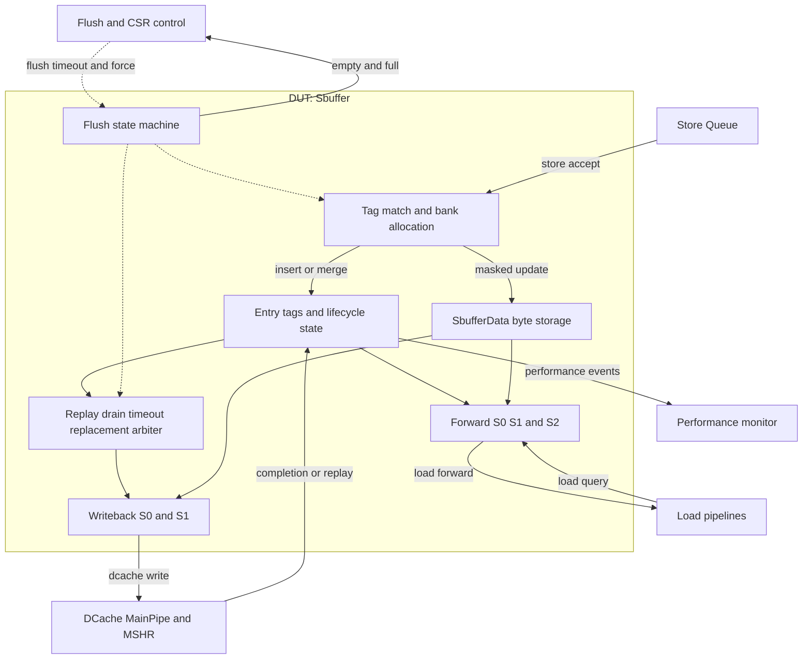
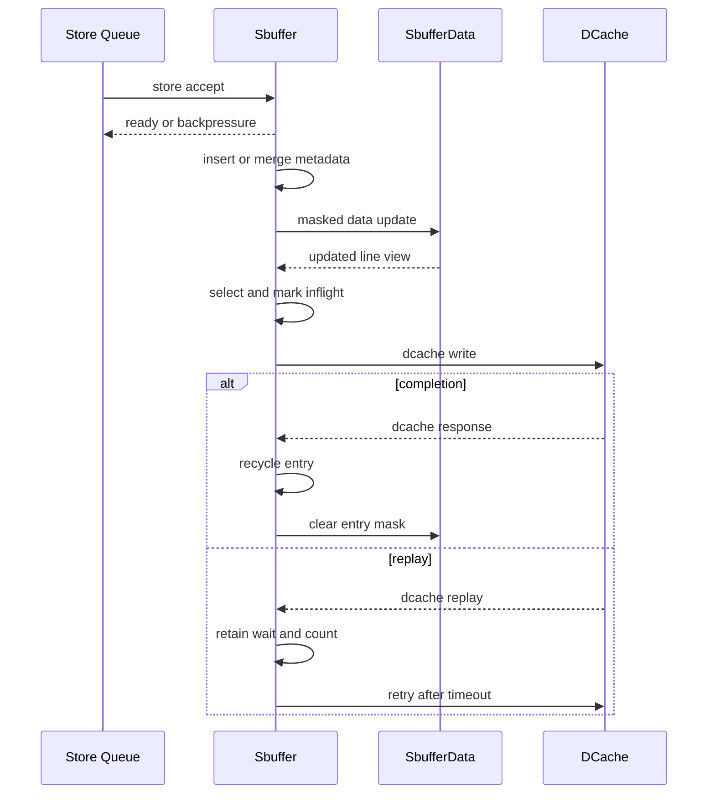
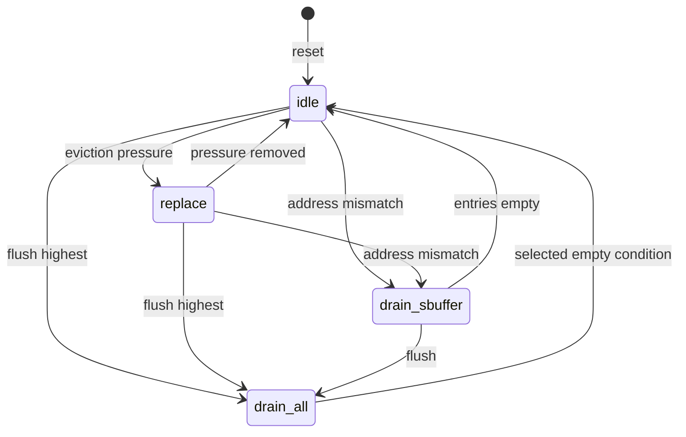

# Sbuffer 设计与功能检测点文档

> 模板结构版本：v3.1.1
>
> 文档版本：v3.0.0
>
> 本文分为正文、验证计划和附录。正文用于连续理解设计，验证计划用于安排检查，附录用于审计和签核。FG、FC、CK 标签使用反引号包裹；无法证实的内容登记为 `OPEN-*`。

## 第一部分：正文

### 文档摘要

> 本节在一页内建立 Sbuffer 的整体模型；精确接口、配置和证据分别见附录 B、C、D。

**模块职责**

Sbuffer 位于 Store Queue 与 DCache/Load pipeline 之间，聚合已提交 store 的字节效果，按 cache line 向 DCache 写回，并向 Load pipeline 提供 store-to-load forwarding。Store Queue 是数据生产者，DCache 和 Load pipeline 是数据消费者；flush controller 与 CSR/Constantin 是控制方。Sbuffer 不负责 DCache refill、MSHR 后续生命周期或架构级 store retirement。[E-TOP-01] [E-DCACHE-01]

**输入与生产者**

- `store.accept[i]`：Store Queue 提供两路已提交 store；握手后进入 insert 或 merge。
- `dcache.response`：DCache MainPipe 提供完成通知；`dcache.replay` 提供保留并重试通知。
- `load.query[k]`：三条 Load pipeline 提供分阶段虚拟/物理地址查询。
- `control.flush`、`control.csr_timeout`、`control.force_write`：flush/CSR 控制方触发排空、老化阈值或写回压力。

**输出与消费者**

- `dcache.write`：DCache 消费一条 cache-line write 请求。
- `load.forward[k]`：Load pipeline 消费三路 16-byte byte-mask/data 响应。
- `status.empty`、`status.full`：flush controller、Store Queue 和性能观察者消费排空与容量状态。

**关键概念**

- **active / inflight**：active 是 valid 且尚未选送 DCache 的可 merge 条目；inflight 是已由写回 S0 选中、等待完成或 replay/retry 的条目。两者都可参与 forward，但只有 active 可被 merge。
- **ptag / vtag**：ptag 来自物理地址，用于 insert/merge、同块约束和写回；vtag 来自虚拟地址，用于 load query 匹配。两类匹配集合不一致会触发保守排空。
- **insert / merge**：insert 在无 active ptag 命中时分配 invalid entry 并写 tags；merge 命中已有 active entry，只叠加 data/mask，不更新 tag。
- **completion / replay**：completion 回收 entry 并清 mask；replay 保留 inflight entry，启动固定计数后重试，不表示事务完成。

**关键延迟与容量**

- 16 entries；每周期最多 enqueue 2 路、forward 3 路、DCache line write 1 路。每 entry 保存 64-byte data 和 64-bit byte mask。
- enqueue metadata 在接受边沿更新，SbufferData 在其后一个寄存边界更新；forward 从 S0 query 到 S2 valid 固定跨两个边沿；empty/full 输出相对资格条件延迟一个边沿；DCache 完成延迟由外部决定。[E-DATA-01] [E-FWD-01]

**验证范围**

本版本保持 v2.0.1 的 10 FG、22 FC、75 CK，并将场景扩展为 5 个，覆盖 reset、双路接收、insert/merge、数据写/清、驱逐与响应、timeout/retry、forward、flush/FSM/empty 以及 feature gating。DefaultConfig 的 166 个 elaborated 叶端口全部映射；属性尚未编译或证明。

**开放项**

- `OPEN-BEHAV-001`：merge 的 coherence counter 清零可能被后置 active 自增覆盖。
- `OPEN-BEHAV-002`：drain/coherence 首选项不可写回时不会退选下一 candidate。
- `OPEN-VERIFY-001`：UCAgent、SVA compile、formal bind/prove/cover 与 regression 未运行。

### 设计概览

#### 上下游与逻辑接口

Store Queue 产生 store 数据，DCache 与 Load pipeline 分别消费写回和前递结果；flush controller 与 CSR 在资源生命周期外侧施加排空和阈值控制。正文稳定使用以下逻辑名，精确映射仅见附录 B。

| 逻辑名 | 角色与含义 | 方向 | 事务阶段 |
| --- | --- | --- | --- |
| `store.accept[i]` | 两路已提交 store 与 ready/valid 握手 | Store Queue -> DUT | 接收 |
| `dcache.write` | 单路整行写请求 | DUT -> DCache | 消费 |
| `dcache.response` | MainPipe completion 与 entry ID | DCache -> DUT | 完成 |
| `dcache.replay` | replay 与 entry ID | DCache -> DUT | 恢复 |
| `load.query[k]` | 三路 S0/S1 地址与 kill | Load pipeline -> DUT | 查询 |
| `load.forward[k]` | 三路 S2 byte data/mask 与 mismatch | DUT -> Load pipeline | 响应 |
| `control.flush` | flush、CMO 模式与全局空状态 | flush controller <-> DUT | 排空 |
| `control.csr_timeout` | coherence timeout 阈值 | CSR -> DUT | 控制 |
| `control.force_write` | 降低 replacement threshold | control -> DUT | 控制 |
| `status.empty` | Sbuffer/全局排空状态 | DUT -> control | 状态 |
| `status.full` | 16 entries 全 valid 的寄存状态 | DUT -> Store Queue/PMU | 状态 |
| `status.mshr_empty` | store MSHR 空状态 | DCache -> DUT | 状态 |
| `status.perf[p]` | 16 路性能事件 | DUT -> PMU | 观察 |

#### 微架构与数据流



正常路径先在 CAM 上决定 insert/merge，再分别更新 metadata 与 SbufferData；驱逐仲裁读出整行并经 S0/S1 送给 DCache。Load query 独立经过 S0/S1/S2，并按 byte 从 active/inflight 候选取得数据。[E-ENQ-01] [E-EVICT-01] [E-FWD-01]

背压可发生在无可分配 bank、`x_drain_sbuffer` 或 DCache 未 ready；flush 与 tag mismatch 进入排空状态。replay 不回收数据，而是经 timeout source 回到最高优先级写回路径。[E-FSM-01] [E-RESP-01]

#### 事务模型

1. **产生**：Store Queue 令 `store.accept[i]` 有效并保持 payload；Load pipeline 可并行产生 `load.query[k]`。
2. **接收**：ready/valid 同时为真时 store 被接受；不能分配或处于禁止接收状态时由 ready 背压。
3. **处理**：store 执行 insert 或 merge，字节效果进入 SbufferData；entry 经压力或排空选择后变为 inflight。
4. **消费**：DCache 接收 `dcache.write`，Load pipeline 在 S2 接收 `load.forward[k]`；completion 回收 entry。
5. **恢复**：replay 保留 entry 并延迟 retry；flush 或 tag mismatch 驱动 FSM drain，不虚构错误中断。



#### 实例能力矩阵

> 模块级统一规则不在本表重复；具体对象和 RTL 端口组见附录 C。

| 实例类别 | 数量 / 索引 | 输入类别 | 输出类别 | 可选能力 | 默认配置状态 | 差异对应规则 |
| --- | --- | --- | --- | --- | --- | --- |
| Enqueue 通道 | 2 / 0..1 | `store.accept[i]` | ready | Insert / Merge / dual write | Enabled | `P-ENQUEUE`、`P-MERGE-DUAL-WRITE` |
| Forward 通道 | 3 / 0..2 | `load.query[k]` | `load.forward[k]` | S0/S1/S2 / byte priority | Enabled | `P-FORWARD` |
| DCache 写回通道 | 1 | ready、response、replay | `dcache.write` | Completion / Replay / Retry | Enabled | `P-DCACHE-REQUEST`、`P-COMPLETION-REPLAY` |
| Store prefetch | 2 / 0..1 | enqueue / pattern | prefetch request | SPB / commit trigger | Elided | `P-FEATURE-GATING` |
| Difftest instrumentation | 配置生成 | diff metadata | trace events | line/store event | Elided | `P-FEATURE-GATING` |
| PMU event | 16 / 0..15 | 内部事件 | `status.perf[p]` | Counter observation | Enabled | `P-FEATURE-GATING` |

### 功能行为

#### `P-RESET`：显式复位状态

复位初始化 entry lifecycle state、coherence/replay counters、顶层 FSM、S1 valid 和 SbufferData mask；plain `Reg` 的 data、ptag、vtag、wait mask 不作零值承诺。[E-RESET-01]

**输入**：`clock`、同步 `reset`。

**输出**：所有 entry invalid，FSM 为 idle，mask 为零，写回 S1 无效。

**延迟**：复位有效边沿更新；复位释放后的状态输出仍遵循各自寄存延迟。

```text
if reset:
    lifecycle = invalid
    counters = 0
    fsm = idle
    masks = 0
    write_stage_valid = false
```

**适用实例**：全部 entry、DCache 写回通道和状态输出。

**边界与限制**

- 不断言 data/tag/plain register 的复位值。
- `status.empty` 是资格条件的寄存结果，不承诺 reset 当拍为 1。

**证据**：[E-RESET-01]。完整源码与 RTL 定位见附录 D。

#### `P-ENQUEUE`：ready、接收与新条目分配

ready 由可分配 bank、active merge 命中和 FSM 接收许可组合产生。无 active ptag 命中时，从偶/奇 invalid bank 分配 one-hot entry，写入 ptag/vtag 与 same-block wait 信息。[E-ENQ-01]

**输入**：`store.accept[i]`、当前 active/invalid/inflight 集合与 FSM 状态。

**输出**：ready；接受时更新目标 lifecycle/tags 并产生内部 data write。

**延迟**：ready 与分配选择为组合；metadata 在接受边沿更新。

```text
ready0 = (bank0_available or active_hit0) and enqueue_allowed
ready1 = (bank1_available or active_hit1) and ready0
if fire and not active_hit:
    target = first_invalid_from_selected_even_or_odd_bank
    target.valid = true
    target.tags = request.tags
```

**适用实例**：实例能力矩阵中的两路 Enqueue 通道。

**边界与限制**

- `x_drain_sbuffer` 禁止接收；`x_drain_all` 不禁止 Store Queue 继续排入。
- valid store 但语义字段无效时可握手，但不更新功能 entry。
- 非目标 entry 的 lifecycle 与 tags 保持。

**证据**：[E-ENQ-01]。完整源码与 RTL 定位见附录 D。

#### `P-MERGE-DUAL-WRITE`：active merge 与双路写优先级

merge 只匹配 active entry，不匹配 inflight entry。两路同 tag 且都需写入时共享目标；SbufferData 对同 entry 同 byte 的连接顺序使后置 enqueue 通道覆盖前一通道。[E-ENQ-01] [E-DATA-01]

**输入**：已接受的 `store.accept[i]`、active ptag/vtag 与两路 byte mask/data。

**输出**：one-hot merge/write target；vtag mismatch 产生延迟 drain 事件。

**延迟**：merge 判定为组合；metadata 在当前边沿更新；data 在下一个寄存边界更新；merge mismatch 两级延迟后进入 drain 请求。

```text
merge = physical_tag_match and active
if both_requests_same_tag and no_merge:
    target1 = target0
for each target_byte:
    next_byte = channel0_write ? data0 : old_byte
    next_byte = channel1_write ? data1 : next_byte
```

**适用实例**：两路 Enqueue 通道与 SbufferData 的两路内部 write channel。

**边界与限制**

- 同类别多个 active ptag 命中不定义年龄仲裁，并由实现 assertion 约束。
- merge 不更新 tags；vtag 不同触发保守 drain。
- coherence counter 的实际 last-connect 行为见 `OPEN-BEHAV-001`。

**证据**：[E-ENQ-01] [E-DATA-01]。完整源码与 RTL 定位见附录 D。

#### `P-DATA-UPDATE-FLUSH`：SbufferData 更新与 mask 清理

普通写只更新选中 16-byte word 中 mask 为 1 的 byte；wline 将同一 128-bit 输入复制到四个 word 并将整行 mask 置位。completion 产生 one-hot mask flush，清 mask 而不改 data。[E-DATA-01]

**输入**：内部 one-hot write request 与 completion-derived mask flush request。

**输出**：16 x 64-byte data/mask 当前视图。

**延迟**：write 与 mask flush 均通过一个 `GatedValidRegNext` 边界后更新存储。

```text
if delayed_flush(entry):
    mask[entry] = 0
for channel in enqueue_order:
    for each selected_byte:
        data[entry][byte] = channel.data[byte]
        mask[entry][byte] = 1
```

**适用实例**：16 entries、2 路内部写和 1 路内部 mask flush。

**边界与限制**

- data 不复位，只有 mask 为 1 的 byte 具功能意义。
- 同边沿 flush 与 write 命中同 byte 时，后置 write 胜出。
- 未选 entry 和未写 byte 保持。

**证据**：[E-DATA-01]。完整源码与 RTL 定位见附录 D。

#### `P-EVICTION-ARBITRATION`：驱逐源优先级与候选资格

驱逐索引优先级为 replay timeout、drain、coherence timeout、replacement。除 replay retry 外，选中 entry 必须 valid、非 inflight 且无 same-block wait。[E-EVICT-01]

**输入**：retry source、FSM drain、coherence timeout mask、PLRU candidate 与 S1 可接收状态。

**输出**：唯一 S0 entry index 与 valid/fire。

**延迟**：source/index 为组合；部分 timeout/pressure source 预先寄存一拍。

```text
index = priority(replay_retry, drain_lowest, coherence_lowest, replacement)
normal_eligible = selected.valid and not selected.inflight and not selected.sameblock_wait
s0_valid = replay_retry or (normal_eligible and any_normal_source)
s0_fire = s0_valid and write_stage_ready
```

**适用实例**：单路 DCache 写回通道与全部 16 entries。

**边界与限制**

- same-block inflight 条件阻止普通候选并行写回。
- 首选 drain/coherence entry 不合法时不退选，见 `OPEN-BEHAV-002`。
- PLRU 只在 replacement source 下更新访问。

**证据**：[E-EVICT-01]。完整源码与 RTL 定位见附录 D。

#### `P-DCACHE-REQUEST`：写回请求与背压保持

S0 fire 立即把目标标为 inflight，并捕获 ID/ptag/vtag；S1 从当前 SbufferData 视图形成 512-bit data、64-bit mask 的 line write。数据更新 hazard 临时抑制 valid。[E-EVICT-01]

**输入**：S0 选择、entry tags/data/mask 与 DCache ready。

**输出**：`dcache.write` 与目标 lifecycle 更新。

**延迟**：S0 到 S1 一个寄存边界；DCache backpressure 延迟无 DUT 内部上界。

```text
if s0_fire:
    selected.inflight = true
    selected.timeout_wait = false
    write_stage.capture(selected)
dcache.write.valid = write_stage.valid and not data_hazard
if valid and not ready:
    hold write_stage
```

**适用实例**：单路 DCache 写回通道。

**边界与限制**

- request command 语义恒为 line write，常量字段可在 elaboration 后消失。
- 与目标 data write 相邻时延迟发出，不能读取未完成合并。
- 外部必须最终接受并响应，界限属于 harness。

**证据**：[E-EVICT-01] [E-RTL-01]。完整源码与 RTL 定位见附录 D。

#### `P-COMPLETION-REPLAY`：完成、回收与 replay 保留

completion 和 replay 以 entry ID 关联 inflight 事务。completion 清 valid/inflight 并请求清 mask；replay 保留 inflight，置 timeout-wait 并清 replay counter。[E-RESP-01]

**输入**：`dcache.response` 或 `dcache.replay` 及合法 ID。

**输出**：目标 lifecycle/counter 更新、same-block waiter 释放或 mask flush。

**延迟**：目标 lifecycle 在响应边沿更新；waiter 释放和 mask flush 再跨一个寄存边界。

```text
if completion(id):
    entry[id].valid = false
    entry[id].inflight = false
    schedule_mask_clear(id)
if replay(id):
    entry[id].inflight = true
    entry[id].timeout_wait = true
    replay_counter[id] = 0
```

**适用实例**：单路 completion、单路 replay 与 16 entries。

**边界与限制**

- completion 可代表 DCache hit 或已被 MSHR 接受的 miss；二者对 Sbuffer 都是回收。
- replay 不清 data/mask，不是 completion。
- 非响应 ID 的 entry 不因该响应改变。

**证据**：[E-RESP-01] [E-DCACHE-01]。完整源码与 RTL 定位见附录 D。

#### `P-TIMEOUT-RETRY`：coherence 老化与 replay 重试

active entry 的 coherence counter 与运行时 CSR 阈值比较，比较结果寄存后形成驱逐源；replay entry 使用 5-bit counter，MSB 与 timeout-wait 共同形成最高优先级 retry source。[E-TIMEOUT-01]

**输入**：entry lifecycle、`control.csr_timeout` 与 replay 事件。

**输出**：coherence timeout mask、retry source/index 与 counter 更新。

**延迟**：coherence compare 结果寄存一拍；replay counter 从 0 计数至 MSB 后，source/index 还有实现寄存边界。

```text
coherence_source_next = active and coherence_counter >= csr_timeout
if active and not previous_coherence_source:
    coherence_counter += 1
if inflight and timeout_wait and not replay_counter.msb:
    replay_counter += 1
retry = timeout_wait and replay_counter.msb
```

**适用实例**：全部 16 entries 与单路驱逐仲裁。

**边界与限制**

- coherence timeout 使用 CSR 比较，不使用 counter MSB。
- retry fire 清 timeout-wait，但 entry 保持 inflight。
- merge counter 清零的连接优先级见 `OPEN-BEHAV-001`。

**证据**：[E-TIMEOUT-01]。完整源码与 RTL 定位见附录 D。

#### `P-FORWARD`：分级查询、逐字节优先级与 mismatch

S0 捕获 vaddr，S1 同 query 提供 paddr/kill 并捕获 tag/data/mask 候选，S2 输出 16-byte 结果。每个 byte 先取 inflight 候选，再由 active 候选覆盖。[E-FWD-01]

**输入**：`load.query[k]`、entry vtag/ptag/lifecycle 与 SbufferData。

**输出**：`load.forward[k]` 的 valid、byte mask/data 和 match-invalid。

**延迟**：S0 valid 到 S2 valid 固定两个寄存边沿；输出端无 backpressure。

```text
capture_virtual_query_at_s0()
capture_physical_match_and_data_at_s1()
for byte in query_word:
    result = inflight_match_with_mask(byte)
    if active_match_with_mask(byte): result = active_byte
match_invalid = participating_virtual_set != physical_set and not kill
```

**适用实例**：三路 Forward 通道，规则对每路相同。

**边界与限制**

- active 优先于 inflight；同类别多命中不提供年龄仲裁。
- kill 仅抑制 mismatch，不取消已捕获 data response。
- mismatch 后触发 uarch drain，避免继续依赖不一致映射。

**证据**：[E-FWD-01]。完整源码与 RTL 定位见附录 D。

#### `P-FLUSH-STATUS`：FSM、排空与 empty/full

四态 FSM 在 normal replacement、全局 drain 和仅 Sbuffer drain 间切换。empty 按 Sbuffer entries、store MSHR、当前 enqueue valid、Store Queue empty 分层资格化，并以寄存输出对外报告。[E-FSM-01]

**输入**：`control.flush`、内部 mismatch/pressure、`status.mshr_empty`、Store Queue empty 与当前 entry/input 状态。

**输出**：FSM 状态、`status.empty` 与 `status.full`。

**延迟**：FSM 每边沿最多迁移一次；empty/full 相对组合资格条件延迟一个边沿。

```text
sbuffer_empty = all_entries_invalid
cmo_empty = sbuffer_empty and mshr_empty and no_store_input_valid
all_empty = cmo_empty and store_queue_empty
status.empty.sbuffer = delay1(cmo_empty)
status.empty.flush = delay1(all_empty)
```

**适用实例**：顶层唯一 FSM、两路 Enqueue 与状态接口。

**边界与限制**

- idle/replace 的事件优先级为 flush、uarch drain、replacement/exit。
- CMO drain 可在 cmo_empty 返回 idle；普通 flush 还需 Store Queue empty。
- DUT 不锁存 CMO 类型；环境必须从 flush 被接受到 drain_all 退出期间保持 `control.flush.is_cmo` 稳定。
- drain_sbuffer 唯一禁止 enqueue，收到 flush 时升级为 drain_all。

**证据**：[E-FSM-01]。完整源码与 RTL 定位见附录 D。

#### `P-FEATURE-GATING`：prefetch、Difftest 与 PMU 配置

Store prefetch 与 Difftest 为 elaboration-time 可选路径；DefaultConfig 关闭二者，相关 Chisel 字段被优化出 Sbuffer RTL。16 路 PMU event 保留为输出。[E-FEATURE-01] [E-RTL-01]

**输入**：elaboration flags、store 事件与内部性能事件。

**输出**：可选 prefetch/difftest 路径或 `status.perf[p]`。

**延迟**：配置在 elaboration 时生效；启用路径的事件延迟由各自实现定义。

```text
if store_prefetch_enabled: generate prefetch path
else: elide prefetch leaves
if difftest_enabled: generate trace events
else: elide difftest leaves
always: generate sixteen performance event values
```

**适用实例**：能力矩阵中的 Store prefetch、Difftest 与 PMU event 类别。

**边界与限制**

- DefaultConfig 只能检查 disabled/elided 结果；enabled 行为需另行 elaboration。
- Difftest 只用于观察，不改变主数据路径。
- CSR 未使用字段同样可被 dead-port elimination。

**证据**：[E-FEATURE-01] [E-RTL-01]。完整源码与 RTL 定位见附录 D。

### 关键结构与状态

#### 资源生命周期

16 个 entry 各有 lifecycle state、ptag/vtag、coherence/replay counter、same-block wait mask 和 64-byte data/mask。insert 使 invalid entry 成为 active；merge 只更新 active entry；写回 S0 将 active 变为 inflight；completion 使其 invalid，replay 则保持 inflight 并进入等待。新 active entry 若与既有 inflight entry 同块，会记录 wait mask，待旧 completion 后释放。[E-RES-01]

#### 顶层状态机

顶层 `sbuffer_state` 是四态 FSM。它只控制接收许可、replacement 与 drain，不把 entry 的 active/inflight 组合提升为顶层状态。[E-FSM-01]



**状态语义**

- `idle`：正常接受、merge 和按压力驱逐，遵循 `P-ENQUEUE`、`P-EVICTION-ARBITRATION`。
- `replace`：保持 replacement 驱逐；flush 和 mismatch 优先，遵循 `P-FLUSH-STATUS`。
- `drain_all`：排空 Sbuffer/MSHR/input；普通 flush 还等待 Store Queue empty。
- `drain_sbuffer`：只排空 Sbuffer 且禁止新 enqueue；flush 可升级为 drain_all。

**边界与限制**

reset 进入 idle；源码 enum 没有显式非法状态恢复分支。同拍事件优先级和 CMO 退出资格以 `P-FLUSH-STATUS` 为准。[E-FSM-01]

## 第二部分：验证计划

### 验证策略

主要风险是 byte 合并/清理优先级、符号 entry 的非目标稳定性、写回与 response/replay 生命周期、forward 地址关联以及 flush 进展。组合优先级用 `Comb` assertion，跨周期更新用 `Seq`，存储帧条件使用 `Seq, Symbolic`；外部协议只用 `Assume`，路径可达性只用 `Cover`。scoreboard 跟踪每 entry 的 tag/lifecycle/data/mask，formal harness 需要显式响应公平界限。

**优先级原则**

- `P0`：数据错误、entry 生命周期错误、顺序错误、死锁或恢复失败。
- `P1`：容量边界、优先级、配置门控或性能契约错误。
- `P2`：可观测性和非关键覆盖缺口。

### 功能分组

#### 本 DUT 标签树

```text
Sbuffer
|- FG-API
|  |- FC-RESET-ASSUME
|  `- FC-INPUT-ASSUME
|- FG-RESET
|  `- FC-RESET-STATE
|- FG-ENQUEUE
|  |- FC-READY
|  |- FC-INSERT
|  |- FC-MERGE
|  `- FC-DUAL-ENQUEUE
|- FG-DATA
|  |- FC-DATA-WRITE
|  `- FC-MASK-FLUSH
|- FG-EVICTION
|  |- FC-ARBITRATION
|  |- FC-WRITE-REQ
|  `- FC-RESPONSE
|- FG-TIMEOUT
|  |- FC-COH-TIMEOUT
|  `- FC-REPLAY-TIMEOUT
|- FG-FORWARD
|  |- FC-FORWARD-PIPELINE
|  |- FC-FORWARD-SELECT
|  `- FC-MISMATCH-DETECT
|- FG-FLUSH
|  |- FC-FSM-PRIORITY
|  `- FC-EMPTY-STATUS
|- FG-FEATURE
|  |- FC-PREFETCH-GATING
|  `- FC-DIFFTEST-GATING
`- FG-COVERAGE
   `- FC-SBUFFER-REACHABILITY
```

`<FG-API>`

约束 reset、Decoupled 稳定性、valid-prefix、wline、response 合法性和响应公平性，不假设 DUT 输出正确。

`<FG-RESET>`

检查所有显式初始化资源，不对 plain `Reg` 添加虚假复位契约。

`<FG-ENQUEUE>`

检查两路 ready、偶奇分配、active merge、same-tag 聚合与非目标稳定性。

`<FG-DATA>`

检查 masked/wline 更新、mask flush、同 byte 优先级与符号 entry frame condition。

`<FG-EVICTION>`

检查 source 仲裁、S0/S1 请求、data hazard、completion/replay 和生命周期回收。

`<FG-TIMEOUT>`

区分 CSR coherence timeout 与固定 replay wait，并检查各自 counter 和 source。

`<FG-FORWARD>`

检查 S0/S1/S2 关联、active-over-inflight byte priority 以及 mismatch drain。

`<FG-FLUSH>`

检查四态 FSM 优先级与 Sbuffer/MSHR/input/SQ 分层 empty 资格。

`<FG-FEATURE>`

检查 enabled 配置语义和 DefaultConfig 的 prefetch/Difftest elision，不把配置差异当作 runtime 行为。

`<FG-COVERAGE>`

覆盖正常、双路、满载、forward、replay、flush 和 mismatch 路径；本组 CK 全部为 Cover。

### Test Plan

> 每行绑定一个 CK；详细独立性质和证据见附录 F。所有项目状态为 Planned，关闭标准不代表已经执行。

| 优先级 | FC | CK | Style | 关联规则 | 检查机制 | 激励 / 前置条件 | 可观察结果 | Coverage / 场景 | 关闭标准 |
| --- | --- | --- | --- | --- | --- | --- | --- | --- | --- |
| P0 | `FC-RESET-ASSUME` | `CK-API-RESET-LEGAL` | Assume | `P-RESET` | Formal constraint | 初始 reset 合法并释放 | reset/history-valid | `COV-RESET` | harness review |
| P0 | `FC-INPUT-ASSUME` | `CK-API-INPUT-KNOWN` | Assume | `P-ENQUEUE` | Formal constraint | 有效输入 | 输入非 X | `COV-NORMAL` | harness review |
| P0 | `FC-INPUT-ASSUME` | `CK-API-ENQUEUE-STABLE` | Assume | `P-ENQUEUE` | Protocol assertion | valid 且未 ready | store payload 稳定 | `CASE-BOUNDARY` | compile |
| P0 | `FC-INPUT-ASSUME` | `CK-API-ENQUEUE-PREFIX` | Assume | `P-ENQUEUE` | Protocol assertion | 通道 1 valid | 通道 0 valid | `CASE-DUAL` | compile |
| P0 | `FC-INPUT-ASSUME` | `CK-API-CMO-MODE-STABLE` | Assume | `P-FLUSH-STATUS` | Protocol assertion | flush 进入 drain_all | is_cmo 保持到退出 | `CASE-FLUSH` | compile |
| P0 | `FC-INPUT-ASSUME` | `CK-API-RESPONSE-LEGAL` | Assume | `P-COMPLETION-REPLAY` | Transaction tracker | response 有效 | ID 对应 inflight | `CASE-REPLAY` | compile |
| P0 | `FC-INPUT-ASSUME` | `CK-API-RESPONSE-FAIR` | Assume | `P-DCACHE-REQUEST` | Bounded fairness | write fire | 有界 response/replay | `COV-RECOVERY` | bound approved |
| P0 | `FC-RESET-STATE` | `CK-RESET-INITIALIZED-STATE` | Seq | `P-RESET` | Assertion | reset | lifecycle/FSM/counters | `COV-RESET` | prove |
| P0 | `FC-RESET-STATE` | `CK-RESET-MASK-ZERO` | Seq, Symbolic | `P-RESET` | Symbolic assertion | reset 与任意 entry | mask 为零 | `COV-RESET` | prove |
| P0 | `FC-READY` | `CK-READY-CHANNEL0` | Comb | `P-ENQUEUE` | Assertion | 任意容量/merge | ready0 公式 | `CASE-BOUNDARY` | prove |
| P0 | `FC-READY` | `CK-READY-CHANNEL1-ORDER` | Comb | `P-ENQUEUE` | Assertion | 双路输入 | ready1 顺序 | `CASE-DUAL` | prove |
| P0 | `FC-READY` | `CK-READY-DRAIN-SBUFFER-BLOCK` | Comb | `P-ENQUEUE` | Assertion | drain_sbuffer | 两路 ready 低 | `CASE-FLUSH` | prove |
| P0 | `FC-INSERT` | `CK-INSERT-ONE-HOT` | Seq | `P-ENQUEUE` | Assertion | 无 merge 的 fire | one-hot target | `CASE-NORMAL` | prove |
| P0 | `FC-INSERT` | `CK-INSERT-META` | Seq, Symbolic | `P-ENQUEUE` | Scoreboard/assertion | 任意目标 insert | lifecycle/tags | `CASE-NORMAL` | prove/regress |
| P0 | `FC-INSERT` | `CK-INSERT-SAMEBLOCK-WAIT` | Seq, Symbolic | `P-ENQUEUE` | Assertion | 同块 inflight | wait state | `COV-BOUNDARY` | prove |
| P0 | `FC-INSERT` | `CK-INSERT-NON-TARGET-STABLE` | Seq, Symbolic | `P-ENQUEUE` | Frame assertion | insert 非目标 | state/tags 稳定 | `COV-NORMAL` | prove |
| P0 | `FC-MERGE` | `CK-MERGE-ACTIVE-ONLY` | Comb | `P-MERGE-DUAL-WRITE` | Assertion | ptag matches | merge mask | `CASE-NORMAL` | prove |
| P0 | `FC-MERGE` | `CK-MERGE-DATA-TARGET` | Seq, Symbolic | `P-MERGE-DUAL-WRITE` | Scoreboard | merge fire | byte data/mask | `CASE-NORMAL` | prove/regress |
| P0 | `FC-MERGE` | `CK-MERGE-VTAG-DRAIN` | Seq | `P-MERGE-DUAL-WRITE` | Assertion | vtag mismatch | delayed drain | `CASE-FLUSH` | prove |
| P0 | `FC-MERGE` | `CK-MERGE-NON-TARGET-STABLE` | Seq, Symbolic | `P-MERGE-DUAL-WRITE` | Frame assertion | merge 非目标 | storage/tags 稳定 | `COV-NORMAL` | prove |
| P0 | `FC-DUAL-ENQUEUE` | `CK-DUAL-SAMETAG-SHARED` | Seq | `P-MERGE-DUAL-WRITE` | Assertion | 双路同 tag | 共享 target | `CASE-DUAL` | prove |
| P0 | `FC-DUAL-ENQUEUE` | `CK-DUAL-DIFFERENT-TARGET` | Seq | `P-MERGE-DUAL-WRITE` | Assertion | 双路不同 tag insert | 不同 target | `CASE-DUAL` | prove |
| P0 | `FC-DUAL-ENQUEUE` | `CK-DUAL-OVERLAP-PORT1-WINS` | Seq, Symbolic | `P-MERGE-DUAL-WRITE` | Scoreboard | 双路同 byte | 通道 1 data | `CASE-DUAL` | prove/regress |
| P0 | `FC-DATA-WRITE` | `CK-DATA-MASKED-WRITE` | Seq, Symbolic | `P-DATA-UPDATE-FLUSH` | Scoreboard | masked write | 目标 byte 更新 | `CASE-NORMAL` | prove/regress |
| P0 | `FC-DATA-WRITE` | `CK-DATA-WLINE-REPLICATE` | Seq, Symbolic | `P-DATA-UPDATE-FLUSH` | Scoreboard | wline write | 四 word 复制 | `COV-WLINE` | prove/regress |
| P0 | `FC-DATA-WRITE` | `CK-DATA-NON-TARGET-STABLE` | Seq, Symbolic | `P-DATA-UPDATE-FLUSH` | Frame assertion | 非目标 entry | data/mask 稳定 | `COV-NORMAL` | prove |
| P0 | `FC-MASK-FLUSH` | `CK-MASK-FLUSH-ONE-HOT` | Comb | `P-DATA-UPDATE-FLUSH` | Assertion | completion | flush one-hot | `CASE-NORMAL` | prove |
| P0 | `FC-MASK-FLUSH` | `CK-MASK-FLUSH-CLEAR` | Seq, Symbolic | `P-DATA-UPDATE-FLUSH` | Scoreboard | completion 无冲突 | mask 清零/data 保持 | `CASE-NORMAL` | prove/regress |
| P0 | `FC-MASK-FLUSH` | `CK-MASK-FLUSH-WRITE-PRIORITY` | Seq, Symbolic | `P-DATA-UPDATE-FLUSH` | Scoreboard | flush/write 同 byte | write 胜出 | `COV-BOUNDARY` | prove |
| P0 | `FC-ARBITRATION` | `CK-ARB-REPLAY-OVER-DRAIN` | Comb | `P-EVICTION-ARBITRATION` | Assertion | retry 与 drain | retry index | `CASE-REPLAY` | prove |
| P0 | `FC-ARBITRATION` | `CK-ARB-DRAIN-OVER-COH` | Comb | `P-EVICTION-ARBITRATION` | Assertion | drain 与 coherence | drain index | `CASE-FLUSH` | prove |
| P0 | `FC-ARBITRATION` | `CK-ARB-COH-OVER-PLRU` | Comb | `P-EVICTION-ARBITRATION` | Assertion | coherence 与 replacement | coherence index | `COV-BOUNDARY` | prove |
| P0 | `FC-ARBITRATION` | `CK-ARB-CANDIDATE-LEGAL` | Comb | `P-EVICTION-ARBITRATION` | Assertion | 普通 S0 valid | candidate 合法 | `COV-NORMAL` | prove |
| P0 | `FC-WRITE-REQ` | `CK-WRITE-S0-INFLIGHT` | Seq, Symbolic | `P-DCACHE-REQUEST` | Assertion | S0 fire | inflight/timeout | `CASE-NORMAL` | prove |
| P0 | `FC-WRITE-REQ` | `CK-WRITE-REQ-PAYLOAD` | Comb | `P-DCACHE-REQUEST` | Scoreboard | write valid | line payload/ID | `CASE-NORMAL` | prove/regress |
| P0 | `FC-WRITE-REQ` | `CK-WRITE-DATA-HAZARD-BLOCK` | Seq | `P-DCACHE-REQUEST` | Assertion | target data hazard | valid 屏蔽 | `CASE-NORMAL` | prove |
| P0 | `FC-WRITE-REQ` | `CK-WRITE-BACKPRESSURE-STABLE` | Seq | `P-DCACHE-REQUEST` | Protocol assertion | valid 且未 ready | payload 保持 | `CASE-BOUNDARY` | prove |
| P0 | `FC-RESPONSE` | `CK-RESP-COMPLETE-INVALIDATE` | Seq, Symbolic | `P-COMPLETION-REPLAY` | Assertion | completion ID | entry invalid | `CASE-NORMAL` | prove |
| P0 | `FC-RESPONSE` | `CK-RESP-REPLAY-RETAIN` | Seq, Symbolic | `P-COMPLETION-REPLAY` | Assertion | replay ID | inflight 保留 | `CASE-REPLAY` | prove |
| P0 | `FC-RESPONSE` | `CK-RESP-SAMEBLOCK-RELEASE` | Seq, Symbolic | `P-COMPLETION-REPLAY` | Assertion | 被等待 ID 完成 | waiter 释放 | `COV-BOUNDARY` | prove |
| P0 | `FC-RESPONSE` | `CK-RESP-NON-TARGET-STABLE` | Seq, Symbolic | `P-COMPLETION-REPLAY` | Frame assertion | response 非目标 | lifecycle 稳定 | `COV-NORMAL` | prove |
| P1 | `FC-COH-TIMEOUT` | `CK-COH-COMPARE-CSR` | Seq, Symbolic | `P-TIMEOUT-RETRY` | Assertion | active/counter/CSR | timeout mask | `COV-BOUNDARY` | prove |
| P1 | `FC-COH-TIMEOUT` | `CK-COH-ACTIVE-INCREMENT` | Seq, Symbolic | `P-TIMEOUT-RETRY` | Assertion | active 未 timeout | counter +1 | `COV-NORMAL` | prove |
| P1 | `FC-COH-TIMEOUT` | `CK-COH-INACTIVE-FRAME` | Seq, Symbolic | `P-TIMEOUT-RETRY` | Frame assertion | inactive 无更新 | counter 稳定 | `COV-NORMAL` | prove |
| P0 | `FC-REPLAY-TIMEOUT` | `CK-REPLAY-COUNTER-UP` | Seq, Symbolic | `P-TIMEOUT-RETRY` | Assertion | replay wait | counter +1 | `CASE-REPLAY` | prove |
| P0 | `FC-REPLAY-TIMEOUT` | `CK-REPLAY-TIMEOUT-SOURCE` | Seq, Symbolic | `P-TIMEOUT-RETRY` | Assertion | counter MSB | retry source/index | `CASE-REPLAY` | prove |
| P0 | `FC-REPLAY-TIMEOUT` | `CK-REPLAY-RETRY-CLEARS-TIMEOUT` | Seq, Symbolic | `P-TIMEOUT-RETRY` | Assertion | retry S0 fire | timeout 清除 | `CASE-REPLAY` | prove |
| P0 | `FC-FORWARD-PIPELINE` | `CK-FORWARD-VALID-LATENCY` | Seq | `P-FORWARD` | Assertion | query valid | S2 valid 两边沿 | `COV-FORWARD` | prove |
| P0 | `FC-FORWARD-PIPELINE` | `CK-FORWARD-QUERY-ASSOCIATION` | Seq | `P-FORWARD` | Scoreboard | S0/S1 query | 对应 word result | `COV-FORWARD` | prove/regress |
| P0 | `FC-FORWARD-SELECT` | `CK-FORWARD-ACTIVE-DATA` | Comb | `P-FORWARD` | Scoreboard | 唯一 active hit | byte data/mask | `COV-FORWARD` | prove/regress |
| P0 | `FC-FORWARD-SELECT` | `CK-FORWARD-ACTIVE-OVER-INFLIGHT` | Comb | `P-FORWARD` | Assertion | 双类别同 byte hit | active 胜出 | `COV-FORWARD` | prove |
| P0 | `FC-FORWARD-SELECT` | `CK-FORWARD-NO-MATCH` | Comb | `P-FORWARD` | Assertion | 无 byte hit | mask 为零 | `COV-FORWARD` | prove |
| P0 | `FC-MISMATCH-DETECT` | `CK-MISMATCH-ASSERT` | Seq | `P-FORWARD` | Assertion | 虚实集合不一致 | match-invalid | `CASE-FLUSH` | prove |
| P0 | `FC-MISMATCH-DETECT` | `CK-MISMATCH-KILL-SUPPRESS` | Seq | `P-FORWARD` | Assertion | mismatch 且 kill | 不报告 mismatch | `COV-RECOVERY` | prove |
| P0 | `FC-MISMATCH-DETECT` | `CK-MISMATCH-DRAIN` | Seq | `P-FORWARD` | Assertion | match-invalid | drain_sbuffer | `CASE-FLUSH` | prove |
| P0 | `FC-FSM-PRIORITY` | `CK-FSM-IDLE-PRIORITY` | Seq | `P-FLUSH-STATUS` | Assertion | idle 竞争事件 | flush/uarch/evict 顺序 | `CASE-FLUSH` | prove |
| P0 | `FC-FSM-PRIORITY` | `CK-FSM-REPLACE-PRIORITY` | Seq | `P-FLUSH-STATUS` | Assertion | replace 竞争事件 | 规定 next state | `CASE-FLUSH` | prove |
| P0 | `FC-FSM-PRIORITY` | `CK-FSM-CMO-EXIT` | Seq | `P-FLUSH-STATUS` | Assertion | CMO drain/cmo_empty | 返回 idle | `CASE-FLUSH` | prove |
| P0 | `FC-FSM-PRIORITY` | `CK-FSM-NONCMO-EXIT` | Seq | `P-FLUSH-STATUS` | Assertion | 普通 drain | 等待 all_empty | `CASE-FLUSH` | prove |
| P0 | `FC-EMPTY-STATUS` | `CK-EMPTY-SBEMPTY` | Seq | `P-FLUSH-STATUS` | Assertion | cmo_empty | delayed sbempty | `CASE-FLUSH` | prove |
| P0 | `FC-EMPTY-STATUS` | `CK-EMPTY-FLUSH-EMPTY` | Seq | `P-FLUSH-STATUS` | Assertion | all_empty | delayed flush empty | `CASE-FLUSH` | prove |
| P1 | `FC-EMPTY-STATUS` | `CK-EMPTY-SBFULL` | Seq | `P-FLUSH-STATUS` | Assertion | 16 valid | delayed full | `CASE-BOUNDARY` | prove |
| P1 | `FC-PREFETCH-GATING` | `CK-PREFETCH-SPB-ENABLE` | Seq | `P-FEATURE-GATING` | Config regression | SPB enabled | training event | `COV-FEATURE` | enabled build pass |
| P1 | `FC-PREFETCH-GATING` | `CK-PREFETCH-COMMIT-ENABLE` | Comb | `P-FEATURE-GATING` | Config regression | commit prefetch enabled | request composition | `COV-FEATURE` | enabled build pass |
| P1 | `FC-PREFETCH-GATING` | `CK-PREFETCH-DEFAULT-ELIDED` | Comb | `P-FEATURE-GATING` | RTL schema check | DefaultConfig | leaves absent | `COV-FEATURE` | elaboration check |
| P1 | `FC-DIFFTEST-GATING` | `CK-DIFF-HIT-EVENT` | Seq | `P-FEATURE-GATING` | Config regression | Difftest enabled completion | line event | `COV-FEATURE` | enabled build pass |
| P1 | `FC-DIFFTEST-GATING` | `CK-DIFF-STORE-METADATA` | Seq | `P-FEATURE-GATING` | Reference monitor | Difftest enabled store | metadata event | `COV-FEATURE` | enabled build pass |
| P1 | `FC-DIFFTEST-GATING` | `CK-DIFF-DEFAULT-ELIDED` | Comb | `P-FEATURE-GATING` | RTL schema check | DefaultConfig | leaves absent | `COV-FEATURE` | elaboration check |
| P1 | `FC-SBUFFER-REACHABILITY` | `CK-COVER-INSERT-MERGE` | Cover | `P-MERGE-DUAL-WRITE` | Cover | insert 后 merge | 路径命中 | `CASE-NORMAL` | cover hit |
| P1 | `FC-SBUFFER-REACHABILITY` | `CK-COVER-DUAL-SAMETAG` | Cover | `P-MERGE-DUAL-WRITE` | Cover | 双路同 tag | 共享 entry | `CASE-DUAL` | cover hit |
| P1 | `FC-SBUFFER-REACHABILITY` | `CK-COVER-FULL-BACKPRESSURE` | Cover | `P-ENQUEUE` | Cover | 16 valid 无 merge | ready low/full high | `CASE-BOUNDARY` | cover hit |
| P1 | `FC-SBUFFER-REACHABILITY` | `CK-COVER-FORWARD` | Cover | `P-FORWARD` | Cover | active query hit | 非零 mask | `COV-FORWARD` | cover hit |
| P1 | `FC-SBUFFER-REACHABILITY` | `CK-COVER-REPLAY-RETRY` | Cover | `P-TIMEOUT-RETRY` | Cover | request/replay/wait | retry fire | `CASE-REPLAY` | cover hit |
| P1 | `FC-SBUFFER-REACHABILITY` | `CK-COVER-FLUSH-DRAIN` | Cover | `P-FLUSH-STATUS` | Cover | 非空 flush | drain exit/empty | `CASE-FLUSH` | cover hit |
| P1 | `FC-SBUFFER-REACHABILITY` | `CK-COVER-MISMATCH-DRAIN` | Cover | `P-FORWARD` | Cover | 受控 mismatch | drain_sbuffer | `CASE-FLUSH` | cover hit |

### Coverage Summary

| Coverage ID | 风险与目标 | 关联 P / FC / CK | 采样或交叉条件 | 关闭标准 | 状态 |
| --- | --- | --- | --- | --- | --- |
| `COV-RESET` | 复位后显式资源正确 | `P-RESET` / `FC-RESET-STATE` | reset 释放 x entry index | 两条 reset CK prove | Planned |
| `COV-NORMAL` | insert/merge/write/completion 端到端 | `P-ENQUEUE` / `FC-INSERT` / `CK-COVER-INSERT-MERGE` | insert x merge x completion | 场景通过且 cover hit | Planned |
| `COV-BOUNDARY` | full、same-block、冲突与仲裁边界 | `P-EVICTION-ARBITRATION` / `FC-ARBITRATION` / `CK-COVER-FULL-BACKPRESSURE` | occupancy x source priority | 目标交叉全部命中 | Planned |
| `COV-FORWARD` | 三路 byte forwarding | `P-FORWARD` / `FC-FORWARD-SELECT` / `CK-COVER-FORWARD` | channel x active/inflight x byte mask | 每通道关键类别命中 | Planned |
| `COV-RECOVERY` | replay、flush、mismatch 恢复 | `P-TIMEOUT-RETRY`、`P-FLUSH-STATUS`、`P-FORWARD` / `FC-REPLAY-TIMEOUT`、`FC-FSM-PRIORITY`、`FC-MISMATCH-DETECT` / `CK-COVER-REPLAY-RETRY`、`CK-COVER-FLUSH-DRAIN`、`CK-COVER-MISMATCH-DRAIN` | response kind x FSM state | 三类恢复 cover hit | Planned |
| `COV-WLINE` | 整行零写复制 | `P-DATA-UPDATE-FLUSH` / `FC-DATA-WRITE` / `CK-DATA-WLINE-REPLICATE` | wline x target entry | 合法 wline regression 通过 | Planned |
| `COV-FEATURE` | enabled 与 disabled 配置均无遗漏 | `P-FEATURE-GATING` / `FC-PREFETCH-GATING`、`FC-DIFFTEST-GATING` / `CK-PREFETCH-SPB-ENABLE`、`CK-PREFETCH-COMMIT-ENABLE`、`CK-PREFETCH-DEFAULT-ELIDED`、`CK-DIFF-HIT-EVENT`、`CK-DIFF-STORE-METADATA`、`CK-DIFF-DEFAULT-ELIDED` | config x feature | Default 与 enabled builds 检查 | Planned |

### 形式化属性契约

> 以下是逻辑级契约，不是已编译 SVA。精确 bind 尚未建立，因此 `OPEN-VERIFY-001` 保持 Open。

**建模约定**

- 时钟与复位：所有属性在 `clock` 上采样，reset 有效时禁用非 reset 性质；reset 为同步语义。
- History-valid：reset 释放后置 `history_valid`，只有该位为真才使用 `$past`。
- X 处理：有效外部输入由 API Assume 约束；DUT 输出和内部状态只由 Assert 检查。
- 公平性与界限：`DCACHE_RESPONSE_BOUND` 和据此推导的 `DRAIN_BOUND` 必须经 DV 审批；DUT 本身不承诺 DCache latency。
- 符号化观测：`fv_idx` 限于 0..15；每项目标更新同时检查非目标 entry frame condition。

#### Assume

```systemverilog
// CK-API-RESET-LEGAL and CK-API-INPUT-KNOWN
assume(initial_reset_is_finite_then_released);
assume(store_valid -> known(store_payload));
assume(store_valid && !store_ready -> stable(store_payload));
assume(store_channel1_valid -> store_channel0_valid);
assume(dcache_response_or_replay -> id_is_outstanding_inflight);
assume(dcache_write_fire -> response_or_replay_within(DCACHE_RESPONSE_BOUND));
assume(in_drain_all -> stable(control_flush_is_cmo));
```

#### Assert

```systemverilog
// Representative formulas only; Appendix F defines the complete CK inventory.
assert(reset_edge -> next(initialized_state_and_zero_masks));
assert(insert_fire -> next(onehot_target_and_matching_tags));
assert(merge_fire -> next(masked_target_update_and_nontarget_stable));
assert(two_writes_same_byte -> next(byte_equals_channel1_data));
assert(s0_fire -> next(target_inflight_and_request_payload_matches));
assert(completion(id) -> next(entry_invalid(id)));
assert(replay(id) -> next(entry_inflight_waiting(id)));
assert(forward_s0_valid -> delay2(forward_s2_valid));
assert(active_and_inflight_supply_byte -> forwarded_byte_is_active);
assert(flush_or_mismatch_event -> next_state_follows_priority_table);
```

#### Cover

```systemverilog
cover(insert ##[1:$] merge_same_line ##[1:$] dcache_write ##[1:DCACHE_RESPONSE_BOUND] completion);
cover(two_store_channels_same_tag ##1 shared_entry);
cover(all_entries_valid && no_merge && !store_ready);
cover(active_entry ##1 load_query ##2 forward_mask_nonzero);
cover(dcache_write ##[1:DCACHE_RESPONSE_BOUND] replay ##[1:$] retry_write);
cover(nonempty && flush ##[1:DRAIN_BOUND] flush_empty);
cover(injected_tag_mismatch ##[1:$] drain_sbuffer);
```

### 测试场景

> 场景只组织跨规则协作，不重复规则算法。

#### CASE-NORMAL：insert、merge 与写回完成

**目标**：验证连续同 cache line store 聚合为正确整行写回。

**参与者与前置条件**：Store Queue、Sbuffer、DCache；FSM idle，存在 invalid entry，DCache 可最终响应。

1. Store Queue 在 `store.accept[i]` 提交首次 store。
2. 后续同 ptag store 被接受并合并。
3. 驱逐条件形成，DCache 接受 `dcache.write`。
4. DCache 返回 `dcache.response`，entry 被回收。

**预期行为**：遵循 `P-ENQUEUE`、`P-MERGE-DUAL-WRITE`、`P-DCACHE-REQUEST`、`P-COMPLETION-REPLAY`；检查 `CK-INSERT-META`、`CK-MERGE-DATA-TARGET`、`CK-WRITE-REQ-PAYLOAD`、`CK-RESP-COMPLETE-INVALIDATE`；关联 Coverage：`COV-NORMAL`。

**异常分支**：目标 data update 尚未完成时写回 valid 被 hazard 延迟。

**验收标准**：line data/mask 等于 scoreboard 聚合结果，response ID 对应并回收唯一目标 entry，相关 assertions 通过且 `CK-COVER-INSERT-MERGE` 命中。

#### CASE-DUAL：双路同 tag 与重叠 byte

**目标**：验证双路边界只分配一个 entry 且 byte 冲突结果确定。

**参与者与前置条件**：Store Queue 两通道、SbufferData；valid-prefix 合法、同 ptag、均 ready。

1. 两路在同拍 fire 并指向同 cache line。
2. 非重叠 byte 均进入共享 entry。
3. 重叠 byte 由通道 1 的数据决定。

**预期行为**：遵循 `P-MERGE-DUAL-WRITE`；检查 `CK-DUAL-SAMETAG-SHARED`、`CK-DUAL-OVERLAP-PORT1-WINS`；关联 Coverage：`COV-NORMAL`。

**异常分支**：通道 1 valid 而通道 0 无效属于 API 违约，不作为 DUT failure。

**验收标准**：valid entry 只增加一个，data/mask 与端口优先级一致，`CK-COVER-DUAL-SAMETAG` 命中。

#### CASE-BOUNDARY：full 与 enqueue backpressure

**目标**：验证无 invalid entry 且不能 merge 时稳定背压。

**参与者与前置条件**：Store Queue、Sbuffer；16 entries 均 valid，输入 ptag 无 active 命中。

1. Store Queue 保持合法请求有效。
2. Sbuffer 输出 ready 低并保持 payload 未被接受。
3. 寄存状态 `status.full` 反映满载资格。

**预期行为**：遵循 `P-ENQUEUE`、`P-FLUSH-STATUS`；检查 `CK-READY-CHANNEL0`、`CK-EMPTY-SBFULL`、`CK-COVER-FULL-BACKPRESSURE`；关联 Coverage：`COV-BOUNDARY`。

**异常分支**：若请求可 merge，则即使无 invalid entry 仍可能 ready，不属于 full-backpressure 条件。

**验收标准**：无错误分配、请求 payload 稳定、full cover 命中。

#### CASE-REPLAY：DCache replay 后重试

**目标**：验证 replay 不丢数据并经 timeout 最高优先级重试。

**参与者与前置条件**：Sbuffer、DCache；entry 已 inflight 且 write 已接受。

1. DCache 以同一 ID 返回 `dcache.replay`。
2. entry 保持 inflight 并启动 replay counter。
3. timeout source 到达后重新选择该 entry。
4. retry 写回 payload 与原 entry 当前 line 一致。

**预期行为**：遵循 `P-COMPLETION-REPLAY`、`P-TIMEOUT-RETRY`、`P-EVICTION-ARBITRATION`；检查 `CK-RESP-REPLAY-RETAIN`、`CK-REPLAY-COUNTER-UP`、`CK-ARB-REPLAY-OVER-DRAIN`、`CK-REPLAY-RETRY-CLEARS-TIMEOUT`；关联 Coverage：`COV-RECOVERY`。

**异常分支**：flush 同时存在时 retry source 仍具有驱逐索引最高优先级。

**验收标准**：replay 至 retry 期间 entry/data/mask/ID 不丢失，`CK-COVER-REPLAY-RETRY` 命中。

#### CASE-FLUSH：CMO 与普通 flush 排空

**目标**：验证 drain 状态与 CMO/普通 flush 的不同退出资格。

**参与者与前置条件**：flush controller、Store Queue、Sbuffer、DCache MSHR；至少一个相关资源非空。

1. controller 发出 `control.flush`，FSM 进入 drain_all，并保持 `control.flush.is_cmo` 到该状态退出。
2. entries、MSHR 和当前 input 排空形成 cmo_empty。
3. CMO 可返回 idle；普通 flush 继续等待 Store Queue empty。
4. `status.empty` 按寄存延迟报告全局 empty。

**预期行为**：遵循 `P-FLUSH-STATUS`；检查 `CK-API-CMO-MODE-STABLE`、`CK-FSM-IDLE-PRIORITY`、`CK-FSM-CMO-EXIT`、`CK-FSM-NONCMO-EXIT`、`CK-EMPTY-FLUSH-EMPTY`；关联 Coverage：`COV-RECOVERY`。

**异常分支**：drain_sbuffer 中收到 flush 会升级为 drain_all；受控 mismatch 用 `CK-MISMATCH-DRAIN` 检查。

**验收标准**：CMO/非 CMO 不提前退出或丢弃 entry，`CK-COVER-FLUSH-DRAIN` 命中。

### 签核与开放项

**当前状态**：Review。

**规格偏差**：`OPEN-BEHAV-001`、`OPEN-BEHAV-002` 保留；输入规格中“组合 forward”“coherence timeout 看 MSB”“reset 后 empty 立即为 1”等说法已按当前实现纠正。

**当前阻塞**：`OPEN-VERIFY-001`；UCAgent checker、SVA compile、formal bind/prove/cover 和 simulation regression 未运行。

**关闭条件**：`OPEN-BEHAV-001` 需设计 owner 确认 last-connect 意图或提供修复 RTL/回归；`OPEN-BEHAV-002` 需设计 owner 确认无退选的进展契约或提供修复；`OPEN-VERIFY-001` 需属性生成、bind、编译及全部 planned prove/cover/regression 通过并归档日志。

## 第三部分：附录

### 附录 A：文档控制与范围裁定

| 项目 | 内容 |
| --- | --- |
| 文档版本 | v3.0.0 |
| 使用模板版本 | v3.1.1 |
| 前一版本 | [v2.0.1](./Sbuffer_design_document_zh_v2.0.1.md) |
| 版本变更类型 | Major：从 v2 schema 迁移到不兼容的 v3.1.1 三层人类可读结构；RTL、配置与行为契约不变 |
| DUT / Chisel 顶层 | `Sbuffer` / [E-TOP-01] |
| Elaborated Verilog 顶层 | `Sbuffer` / [E-RTL-01] |
| 文档状态 | Review |
| XiangShan RTL 基线 | `aee742c92250058644c3166fae54c489161347cc`，submodule clean |
| 适用配置 | `DefaultConfig`；1 core；SystemVerilog split；FPGA/reset-gen；store prefetch 与 Difftest disabled |
| 生成环境 | Darwin arm64；OpenJDK 17.0.20.1；Mill 0.12.17；firtool 1.149.0；native arm64 Espresso |
| RTL 生成状态 | Success；cache key `91e19f7fa5fb610379e3`；exit status 0 |
| RTL 证据 | [manifest.json](../../evidence/Sbuffer/v3.0.0/manifest.json)、[ports.csv](../../evidence/Sbuffer/v3.0.0/ports.csv)；SHA-256 `1e1fe1c1fcea11b0e016dfce391dd771c62eff310cdb4702e712d5a9407e027e`；166 个叶端口：37 input、129 output |
| 图形渲染证据 | [diagrams/manifest.json](../../evidence/Sbuffer/v3.0.0/diagrams/manifest.json)；Mermaid CLI 11.16.0；3 张图 |
| 作者 / 评审人 | AI 生成 / 待设计与 DV 评审 |
| 生成日期 | 2026-09-03 |

| 条件项目 | 已应用 / 不适用 | 理由或对应章节 |
| --- | --- | --- |
| 顶层状态机 | 已应用 | 四态顶层 FSM，见“关键结构与状态” |
| 多模块事务 / 时序图 | 已应用 | Store Queue、SbufferData、DCache 跨模块 completion/replay |
| 符号化存储检查 | 已应用 | 16 entries 的 data/mask、state/tags/counters |
| 缓存查找 / 缺失 / 重填 | 不适用 | DUT 仅发 line write；accepted miss 后续由 MSHR 管理 |
| 异常 / 恢复 / flush | 已应用 | replay、mismatch drain、CMO/普通 flush |
| 特性门控 | 已应用 | prefetch 与 Difftest 在 DefaultConfig 被裁剪 |

### 附录 B：逻辑接口与 RTL 映射

> 数组规则以 `i=0..1`、`k=0..2`、`b=0..15`、`p=0..15` 展开，合计覆盖 DefaultConfig 的全部 166 个叶端口。Generated token 均存在于本版本 ports.csv；Elided 行保留 Chisel 字段和原因。

| IO-ID | 正文逻辑名 | Bundle class / Chisel 字段 | 定义位置 | 方向 / 位宽 | 配置状态 | 精确 Verilog I/O | 协议 / 对端 | 证据 |
| --- | --- | --- | --- | --- | --- | --- | --- | --- |
| `IO-CLOCK` | `clock` | module implicit / clock | [E-TOP-01] | I / 1 | Generated | `clock` | 主时钟 | [E-RTL-01] |
| `IO-RESET` | `reset` | module implicit / reset | [E-TOP-01] | I / 1 | Generated | `reset` | 同步 reset | [E-RTL-01] |
| `IO-ENQ-READY` | `store.accept[i].ready` | `SbufferWriteIO` / `io.in.req[i].ready` | [E-IO-ENQ-01] | O / 1，i=0..1 | Generated | `io_in_req_[i]_ready` | Decoupled / Store Queue | [E-RTL-01] |
| `IO-ENQ-VALID` | `store.accept[i].valid` | 同上 / `.valid` | [E-IO-ENQ-01] | I / 1，i=0..1 | Generated | `io_in_req_[i]_valid` | Decoupled / Store Queue | [E-RTL-01] |
| `IO-ENQ-VADDR` | `store.accept[i].vaddr` | `DCacheWordReqWithVaddrAndPfFlag` / `.bits.vaddr` | [E-IO-ENQ-01] | I / 50，i=0..1 | Generated | `io_in_req_[i]_bits_vaddr` | payload / Store Queue | [E-RTL-01] |
| `IO-ENQ-DATA` | `store.accept[i].data` | 同上 / `.bits.data` | [E-IO-ENQ-01] | I / 128，i=0..1 | Generated | `io_in_req_[i]_bits_data` | payload / Store Queue | [E-RTL-01] |
| `IO-ENQ-MASK` | `store.accept[i].mask` | 同上 / `.bits.mask` | [E-IO-ENQ-01] | I / 16，i=0..1 | Generated | `io_in_req_[i]_bits_mask` | payload / Store Queue | [E-RTL-01] |
| `IO-ENQ-PADDR` | `store.accept[i].paddr` | 同上 / `.bits.addr` | [E-IO-ENQ-01] | I / 48，i=0..1 | Generated | `io_in_req_[i]_bits_addr` | payload / Store Queue | [E-RTL-01] |
| `IO-ENQ-WLINE` | `store.accept[i].wline` | 同上 / `.bits.wline` | [E-IO-ENQ-01] | I / 1，i=0..1 | Generated | `io_in_req_[i]_bits_wline` | payload / Store Queue | [E-RTL-01] |
| `IO-ENQ-ELIDED` | `store.accept[i].metadata` | 同上 / `.bits.{cmd,vaddr_dup,id,instrtype,isFirstIssue,replayCarry,lqIdx,debug_robIdx,prefetch,vecValid,sqNeedDeq}` | [E-IO-ENQ-01] | I / aggregate | Elided | 未生成 | 未被保留的 payload；常量传播/dead-port elimination | [E-CONFIG-01] |
| `IO-DC-WREADY` | `dcache.write.ready` | `DCacheToSbufferIO` / `io.dcache.req.ready` | [E-IO-DCACHE-01] | I / 1 | Generated | `io_dcache_req_ready` | Decoupled / DCache | [E-RTL-01] |
| `IO-DC-WVALID` | `dcache.write.valid` | 同上 / `.valid` | [E-IO-DCACHE-01] | O / 1 | Generated | `io_dcache_req_valid` | Decoupled / DCache | [E-RTL-01] |
| `IO-DC-WVADDR` | `dcache.write.vaddr` | `DCacheLineReq` / `.bits.vaddr` | [E-IO-DCACHE-01] | O / 50 | Generated | `io_dcache_req_bits_vaddr` | line payload / DCache | [E-RTL-01] |
| `IO-DC-WADDR` | `dcache.write.paddr` | 同上 / `.bits.addr` | [E-IO-DCACHE-01] | O / 48 | Generated | `io_dcache_req_bits_addr` | line payload / DCache | [E-RTL-01] |
| `IO-DC-WDATA` | `dcache.write.data` | 同上 / `.bits.data` | [E-IO-DCACHE-01] | O / 512 | Generated | `io_dcache_req_bits_data` | line payload / DCache | [E-RTL-01] |
| `IO-DC-WMASK` | `dcache.write.mask` | 同上 / `.bits.mask` | [E-IO-DCACHE-01] | O / 64 | Generated | `io_dcache_req_bits_mask` | line payload / DCache | [E-RTL-01] |
| `IO-DC-WID` | `dcache.write.id` | 同上 / `.bits.id` | [E-IO-DCACHE-01] | O / 6 | Generated | `io_dcache_req_bits_id` | request association / DCache | [E-RTL-01] |
| `IO-DC-WCMD` | `dcache.write.command` | 同上 / `.bits.cmd` | [E-IO-DCACHE-01] | O / 5 | Elided | 未生成 | 恒为 M_XWR，constant-folded | [E-EVICT-01] |
| `IO-DC-CVALID` | `dcache.response.valid` | `DCacheLineResp` / `io.dcache.main_pipe_hit_resp.valid` | [E-IO-DCACHE-01] | I / 1 | Generated | `io_dcache_main_pipe_hit_resp_valid` | Valid / DCache MainPipe | [E-RTL-01] |
| `IO-DC-CID` | `dcache.response.id` | 同上 / `.bits.id` | [E-IO-DCACHE-01] | I / 6 | Generated | `io_dcache_main_pipe_hit_resp_bits_id` | completion association | [E-RTL-01] |
| `IO-DC-RVALID` | `dcache.replay.valid` | `DCacheLineResp` / `io.dcache.replay_resp.valid` | [E-IO-DCACHE-01] | I / 1 | Generated | `io_dcache_replay_resp_valid` | Valid / DCache MainPipe | [E-RTL-01] |
| `IO-DC-RID` | `dcache.replay.id` | 同上 / `.bits.id` | [E-IO-DCACHE-01] | I / 6 | Generated | `io_dcache_replay_resp_bits_id` | replay association | [E-RTL-01] |
| `IO-DC-RESP-ELIDED` | `dcache.response.payload` | 两响应 / `.bits.{data,miss,replay}` | [E-IO-DCACHE-01] | I / 512+1+1 | Elided | 未生成 | 功能路径只保留 ID；assert/Difftest disabled 后消除 | [E-CONFIG-01] |
| `IO-FWD-S0V` | `load.query[k].valid` | `SbufferForward` / `io.forward[k].s0Req.valid` | [E-IO-FWD-01] | I / 1，k=0..2 | Generated | `io_forward_[k]_s0Req_valid` | Valid / Load S0 | [E-RTL-01] |
| `IO-FWD-S0VA` | `load.query[k].vaddr` | 同上 / `.s0Req.bits.vaddr` | [E-IO-FWD-01] | I / 50，k=0..2 | Generated | `io_forward_[k]_s0Req_bits_vaddr` | query / Load S0 | [E-RTL-01] |
| `IO-FWD-S1PA` | `load.query[k].paddr` | 同上 / `.s1Req.paddr` | [E-IO-FWD-01] | I / 48，k=0..2 | Generated | `io_forward_[k]_s1Req_paddr` | query / Load S1 | [E-RTL-01] |
| `IO-FWD-KILL` | `load.query[k].kill` | 同上 / `.s1Kill` | [E-IO-FWD-01] | I / 1，k=0..2 | Generated | `io_forward_[k]_s1Kill` | cancel / Load S1 | [E-RTL-01] |
| `IO-FWD-S2V` | `load.forward[k].valid` | 同上 / `.s2Resp.valid` | [E-IO-FWD-01] | O / 1，k=0..2 | Generated | `io_forward_[k]_s2Resp_valid` | Valid / Load S2 | [E-RTL-01] |
| `IO-FWD-MASK` | `load.forward[k].mask[b]` | `SbufferForwardResp` / `.forwardMask[b]` | [E-IO-FWD-01] | O / 1，k=0..2，b=0..15 | Generated | `io_forward_[k]_s2Resp_bits_forwardMask_[b]` | byte response / Load S2 | [E-RTL-01] |
| `IO-FWD-DATA` | `load.forward[k].data[b]` | 同上 / `.forwardData[b]` | [E-IO-FWD-01] | O / 8，k=0..2，b=0..15 | Generated | `io_forward_[k]_s2Resp_bits_forwardData_[b]` | byte response / Load S2 | [E-RTL-01] |
| `IO-FWD-MISMATCH` | `load.forward[k].match_invalid` | 同上 / `.matchInvalid` | [E-IO-FWD-01] | O / 1，k=0..2 | Generated | `io_forward_[k]_s2Resp_bits_matchInvalid` | recovery / Load S2 | [E-RTL-01] |
| `IO-SQEMPTY` | `control.flush.sq_empty` | anonymous top / `io.sqempty` | [E-TOP-01] | I / 1 | Generated | `io_sqempty` | Store Queue status | [E-RTL-01] |
| `IO-SBEMPTY` | `status.empty.sbuffer` | anonymous top / `io.sbempty` | [E-TOP-01] | O / 1 | Generated | `io_sbempty` | status | [E-RTL-01] |
| `IO-SBFULL` | `status.full` | anonymous top / `io.sbFull` | [E-TOP-01] | O / 1 | Generated | `io_sbFull` | status | [E-RTL-01] |
| `IO-MSHREMPTY` | `status.mshr_empty` | anonymous top / `io.mshr_store_empty` | [E-TOP-01] | I / 1 | Generated | `io_mshr_store_empty` | DCache MSHR status | [E-RTL-01] |
| `IO-FLUSH-VALID` | `control.flush.valid` | `SbufferFlushBundle` / `io.flush.valid` | [E-TOP-01] | I / 1 | Generated | `io_flush_valid` | flush controller | [E-RTL-01] |
| `IO-FLUSH-CMO` | `control.flush.is_cmo` | 同上 / `.isCmo` | [E-TOP-01] | I / 1 | Generated | `io_flush_isCmo` | flush controller | [E-RTL-01] |
| `IO-FLUSH-EMPTY` | `status.empty.flush` | 同上 / `.empty` | [E-TOP-01] | O / 1 | Generated | `io_flush_empty` | flush controller | [E-RTL-01] |
| `IO-CSR-TIMEOUT` | `control.csr_timeout` | `CustomCSRCtrlIO` / `io.csrCtrl.sbuffer_timeout` | [E-IO-CTRL-01] | I / 22 | Generated | `io_csrCtrl_sbuffer_timeout` | CSR control | [E-RTL-01] |
| `IO-FORCE` | `control.force_write` | anonymous top / `io.force_write` | [E-TOP-01] | I / 1 | Generated | `io_force_write` | threshold control | [E-RTL-01] |
| `IO-TOP-ELIDED` | `feature.debug_inputs` | anonymous top / `io.{hartId,physicalStoreQueueFull}` | [E-TOP-01] | I / 6+1 | Elided | 未生成 | Difftest disabled；perf-only input optimized | [E-CONFIG-01] |
| `IO-PREFETCH-ELIDED` | `feature.prefetch` | anonymous top / `io.memSetPattenDetected`、`io.store_prefetch[0..1]` | [E-FEATURE-01] | mixed / aggregate | Elided | 未生成 | SPB 与 commit-prefetch disabled | [E-CONFIG-01] |
| `IO-DIFF-ELIDED` | `feature.difftest` | `DiffStoreIO` / `io.diffStore` | [E-FEATURE-01] | I / aggregate | Elided | 未生成 | EnableDifftest=false | [E-CONFIG-01] |
| `IO-CSR-ELIDED` | `control.csr_unused` | `CustomCSRCtrlIO` / 除 sbuffer_timeout 外字段 | [E-IO-CTRL-01] | I / aggregate | Elided | 未生成 | DUT 未读取，dead-port elimination | [E-CONFIG-01] |
| `IO-PERF` | `status.perf[p]` | `PerfEvent` / `io_perf[p].value` | [E-PERF-01] | O / 6，p=0..15 | Generated | `io_perf_[p]_value` | PMU event | [E-RTL-01] |

叶端口计数复算：clock/reset 2 + enqueue 14 + DCache 11 + forward 114 + scalar control/status 9 + perf 16 = 166。

### 附录 C：参数、实例与配置裁剪

| 参数 / 特性 | 类型与范围 | 当前值 | 定义 / 覆盖位置 | 功能影响 | 生成 / 裁剪结果 | 关联规则 |
| --- | --- | --- | --- | --- | --- | --- |
| `StoreBufferSize` | Int | 16 | [E-PARAM-01] | entry、索引、PLRU 和 mask 深度 | 16 entries | `P-ENQUEUE` |
| `StoreBufferThreshold` | Int | 9；要求 threshold+1 <= size | [E-PARAM-01] | replacement pressure 基准 | Constantin 初值 9 | `P-EVICTION-ARBITRATION` |
| `EnsbufferWidth` | Int | 2 | [E-PARAM-01] | enqueue/write 通道数 | 2 路，算法显式支持两路 | `P-ENQUEUE` |
| `LoadPipelineWidth` | Int | 3 | [E-PARAM-01] | forward 通道数 | 3 路 | `P-FORWARD` |
| `StorePipelineWidth` | Int | 2，>= EnsbufferWidth | [E-PARAM-01] | prefetch 输出数 | Chisel 2 路，DefaultConfig Elided | `P-FEATURE-GATING` |
| `EnableStorePrefetchAtCommit` | Boolean | false | [E-PARAM-01] | commit prefetch | Elided | `P-FEATURE-GATING` |
| `EnableAtCommitMissTrigger` | Boolean | true | [E-PARAM-01] | enabled 时是否要求 prefetch flag | 上游依赖随主 feature Elided | `P-FEATURE-GATING` |
| `EnableStorePrefetchSPB` | Boolean | false | [E-PARAM-01] | SPB training/request | Elided | `P-FEATURE-GATING` |
| `EnableDifftest` | Boolean | false | [E-PARAM-01] | trace instrumentation | Elided | `P-FEATURE-GATING` |
| `EvictCycles` / `EvictCountBits` | derived Int | 1048576 / 21 | [E-PARAM-01] | coherence counter 宽度 | 21-bit internal | `P-TIMEOUT-RETRY` |
| `SbufferReplayDelayCycles` / `MissqReplayCountBits` | derived Int | 16 / 5 | [E-PARAM-01] | replay wait counter | 5-bit internal | `P-TIMEOUT-RETRY` |
| `NumDcacheWriteResp` | derived Int | 1 | [E-PARAM-01] | mask flush 通道数 | 1 | `P-COMPLETION-REPLAY` |
| `CacheLineBytes` / `CacheLineVWords` / `VDataBytes` | derived Int | 64 / 4 / 16 | [E-PARAM-01] | data/mask 几何 | 512-bit line、64-bit mask | `P-DATA-UPDATE-FLUSH` |
| `StoreBufferThreshold_<hart>` / `StoreBufferBase_<hart>` | Constantin UInt(5) | 9 / 1 | [E-FSM-01] | force_write 时阈值从 9 降为 8 | runtime constant control | `P-EVICTION-ARBITRATION` |
| `control.csr_timeout` | runtime UInt | 22 bits | [E-IO-CTRL-01] | coherence compare threshold | Generated input | `P-TIMEOUT-RETRY` |
| `DCACHE_RESPONSE_BOUND` | harness positive Int | 待 DV 审批 | `OPEN-VERIFY-001` | response fairness | 未建立 | `P-DCACHE-REQUEST` |
| `DRAIN_BOUND` | harness derived Int | 待 DV 审批 | `OPEN-VERIFY-001` | drain cover bound | 未建立 | `P-FLUSH-STATUS` |

| 实例 / 通道 | 类别 | 当前配置能力 | 被裁剪能力 | Chisel 对象 | RTL 端口组 | 证据 |
| --- | --- | --- | --- | --- | --- | --- |
| enqueue 0..1 | Enqueue 通道 | ready/valid、vaddr/paddr/data/mask/wline | 其余 request metadata leaves | `io.in.req[0..1]` | `io_in_req_[i]_*` | [E-IO-ENQ-01] [E-RTL-01] |
| forward 0..2 | Forward 通道 | S0 vaddr、S1 paddr/kill、S2 valid/mask/data/mismatch | Bundle 其他字段不存在于本接口 | `io.forward[0..2]` | `io_forward_[k]_*` | [E-IO-FWD-01] [E-RTL-01] |
| DCache write/response | DCache 通道 | 1 request、1 completion、1 replay | cmd 常量和 response payload leaves | `io.dcache` | `io_dcache_*` | [E-IO-DCACHE-01] [E-RTL-01] |
| prefetch 0..1 | Store prefetch | 无 | SPB/commit prefetch 全路径 | `io.store_prefetch[0..1]` | 未生成 | [E-FEATURE-01] [E-CONFIG-01] |
| Difftest | instrumentation | 无 | diffStore 与 trace generation | `io.diffStore` | 未生成 | [E-FEATURE-01] [E-CONFIG-01] |
| SbufferData entries 0..15 | 内部 storage | 64-byte data/mask、2 write、1 flush | 不适用 | `dataModule` | 内联/内部，不是顶层端口 | [E-DATA-01] |
| perf 0..15 | PMU event | 16 路 6-bit event | physicalStoreQueueFull 相关死输入被优化 | `perfEvents` | `io_perf_[p]_value` | [E-PERF-01] [E-RTL-01] |

### 附录 D：证据索引

> 所有路径从新输出文档可解析；每个 E-ID 唯一。commit/config 均为 `aee742c92250058644c3166fae54c489161347cc` / `DefaultConfig`，除非另注。

| Evidence ID | 类型 | 路径 / 定位 | Commit / 配置 | 支持内容 |
| --- | --- | --- | --- | --- |
| E-TOP-01 | Scala | [`Sbuffer.scala:191`](../../third_party/XiangShan/src/main/scala/xiangshan/mem/sbuffer/Sbuffer.scala#L191) | commit / DefaultConfig | DUT 顶层、匿名 Bundle、top scalar |
| E-IO-ENQ-01 | Scala Bundle | [`LSQBundle.scala:181`](../../third_party/XiangShan/src/main/scala/xiangshan/mem/lsqueue/LSQBundle.scala#L181)、[`DCacheWrapper.scala:421`](../../third_party/XiangShan/src/main/scala/xiangshan/cache/dcache/DCacheWrapper.scala#L421) | commit / DefaultConfig | enqueue Chisel 字段 |
| E-IO-DCACHE-01 | Scala Bundle | [`DCacheWrapper.scala:446`](../../third_party/XiangShan/src/main/scala/xiangshan/cache/dcache/DCacheWrapper.scala#L446)、[`DCacheWrapper.scala:539`](../../third_party/XiangShan/src/main/scala/xiangshan/cache/dcache/DCacheWrapper.scala#L539)、[`DCacheWrapper.scala:718`](../../third_party/XiangShan/src/main/scala/xiangshan/cache/dcache/DCacheWrapper.scala#L718) | commit / DefaultConfig | DCache request/completion/replay |
| E-IO-FWD-01 | Scala Bundle | [`Bundles.scala:88`](../../third_party/XiangShan/src/main/scala/xiangshan/mem/Bundles.scala#L88)、[`Bundles.scala:151`](../../third_party/XiangShan/src/main/scala/xiangshan/mem/Bundles.scala#L151) | commit / DefaultConfig | forward Bundle 与三阶段字段 |
| E-IO-CTRL-01 | Scala Bundle | [`Bundle.scala:647`](../../third_party/XiangShan/src/main/scala/xiangshan/Bundle.scala#L647) | commit / DefaultConfig | CSR 字段与 timeout leaf |
| E-RESET-01 | Scala | [`Sbuffer.scala:97`](../../third_party/XiangShan/src/main/scala/xiangshan/mem/sbuffer/Sbuffer.scala#L97)、[`Sbuffer.scala:218`](../../third_party/XiangShan/src/main/scala/xiangshan/mem/sbuffer/Sbuffer.scala#L218) | commit / DefaultConfig | reset 与未初始化资源边界 |
| E-ENQ-01 | Scala | [`Sbuffer.scala:301`](../../third_party/XiangShan/src/main/scala/xiangshan/mem/sbuffer/Sbuffer.scala#L301)、[`Sbuffer.scala:427`](../../third_party/XiangShan/src/main/scala/xiangshan/mem/sbuffer/Sbuffer.scala#L427) | commit / DefaultConfig | ready、insert、merge、dual target |
| E-DATA-01 | Scala | [`Sbuffer.scala:97`](../../third_party/XiangShan/src/main/scala/xiangshan/mem/sbuffer/Sbuffer.scala#L97) | commit / DefaultConfig | SbufferData write/flush/priority/latency |
| E-EVICT-01 | Scala | [`Sbuffer.scala:608`](../../third_party/XiangShan/src/main/scala/xiangshan/mem/sbuffer/Sbuffer.scala#L608) | commit / DefaultConfig | arbitration、S0/S1、request payload |
| E-RESP-01 | Scala | [`Sbuffer.scala:711`](../../third_party/XiangShan/src/main/scala/xiangshan/mem/sbuffer/Sbuffer.scala#L711) | commit / DefaultConfig | completion、same-block release、replay |
| E-TIMEOUT-01 | Scala | [`Sbuffer.scala:287`](../../third_party/XiangShan/src/main/scala/xiangshan/mem/sbuffer/Sbuffer.scala#L287)、[`Sbuffer.scala:750`](../../third_party/XiangShan/src/main/scala/xiangshan/mem/sbuffer/Sbuffer.scala#L750) | commit / DefaultConfig | CSR compare 与 replay counter |
| E-FWD-01 | Scala | [`Sbuffer.scala:784`](../../third_party/XiangShan/src/main/scala/xiangshan/mem/sbuffer/Sbuffer.scala#L784) | commit / DefaultConfig | forward latency、byte priority、mismatch |
| E-FSM-01 | Scala | [`Sbuffer.scala:535`](../../third_party/XiangShan/src/main/scala/xiangshan/mem/sbuffer/Sbuffer.scala#L535) | commit / DefaultConfig | threshold、empty、四态 FSM |
| E-RES-01 | Scala | [`Sbuffer.scala:218`](../../third_party/XiangShan/src/main/scala/xiangshan/mem/sbuffer/Sbuffer.scala#L218)、[`Sbuffer.scala:593`](../../third_party/XiangShan/src/main/scala/xiangshan/mem/sbuffer/Sbuffer.scala#L593) | commit / DefaultConfig | entry 资源与 same-block 生命周期 |
| E-FEATURE-01 | Scala / Config | [`Sbuffer.scala:394`](../../third_party/XiangShan/src/main/scala/xiangshan/mem/sbuffer/Sbuffer.scala#L394)、[`Sbuffer.scala:770`](../../third_party/XiangShan/src/main/scala/xiangshan/mem/sbuffer/Sbuffer.scala#L770)、[`Parameters.scala:198`](../../third_party/XiangShan/src/main/scala/xiangshan/Parameters.scala#L198) | commit / DefaultConfig | prefetch/Difftest feature gating |
| E-PARAM-01 | Scala / Config | [`Parameters.scala:166`](../../third_party/XiangShan/src/main/scala/xiangshan/Parameters.scala#L166)、[`Sbuffer.scala:39`](../../third_party/XiangShan/src/main/scala/xiangshan/mem/sbuffer/Sbuffer.scala#L39) | commit / DefaultConfig | 参数、派生常量、容量 |
| E-PERF-01 | Scala | [`Sbuffer.scala:983`](../../third_party/XiangShan/src/main/scala/xiangshan/mem/sbuffer/Sbuffer.scala#L983) | commit / DefaultConfig | 16 个 performance events |
| E-DCACHE-01 | Scala integration | [`DCacheWrapper.scala:839`](../../third_party/XiangShan/src/main/scala/xiangshan/cache/dcache/DCacheWrapper.scala#L839) | commit / DefaultConfig | Sbuffer/DCache/MSHR 边界与 accepted miss 说明 |
| E-CONFIG-01 | Config / RTL | [`manifest.json`](../../evidence/Sbuffer/v3.0.0/manifest.json)、[`ports.csv`](../../evidence/Sbuffer/v3.0.0/ports.csv) | commit / DefaultConfig | Generated/Elided 裁剪结论 |
| E-RTL-01 | RTL evidence | [`manifest.json`](../../evidence/Sbuffer/v3.0.0/manifest.json)、[`ports.csv`](../../evidence/Sbuffer/v3.0.0/ports.csv) | commit / DefaultConfig | 166 个精确 Verilog leaves 与 hash |

### 附录 E：FACT、OPEN 与偏差

| ID | 类型 | 摘要 | 关联规则 | 证据 / 缺口 | 状态与关闭条件 |
| --- | --- | --- | --- | --- | --- |
| FACT-001 | 实现事实 | 顶层是 `Sbuffer` 内匿名 Bundle，enqueue 对象来自 `SbufferWriteIO`。 | `P-ENQUEUE` | [E-TOP-01] [E-IO-ENQ-01] | Closed |
| FACT-002 | 实现事实 | DefaultConfig 为 16 entries、2 enqueue、3 forward、1 DCache write。 | `P-ENQUEUE`、`P-FORWARD` | [E-PARAM-01] [E-RTL-01] | Closed |
| FACT-003 | 实现事实 | data 不复位、mask 复位为零，write/flush 均经寄存边界更新。 | `P-RESET`、`P-DATA-UPDATE-FLUSH` | [E-DATA-01] | Closed |
| FACT-004 | 实现事实 | 驱逐源优先级与 forward 两边沿延迟均由当前源码确认。 | `P-EVICTION-ARBITRATION`、`P-FORWARD` | [E-EVICT-01] [E-FWD-01] | Closed |
| FACT-005 | 实现事实 | v3 evidence 有 166 leaves，hash 与 v2.0.1 相同，行为基线未变。 | `P-FEATURE-GATING` | [E-RTL-01] | Closed |
| OPEN-BEHAV-001 | 规格冲突 / 意图待确认 | merge 的 counter 清零赋值可能被后置 active 自增覆盖；文档按 RTL last-connect 描述。 | `P-MERGE-DUAL-WRITE`、`P-TIMEOUT-RETRY` | [E-ENQ-01] [E-TIMEOUT-01] | Open；设计 owner 确认现状为意图，或修复 RTL 并提供针对 merge counter 的 regression |
| OPEN-BEHAV-002 | 进展意图待确认 | drain/coherence PriorityEncoder 首选 entry 非 candidate 时，本拍不退选后续 candidate。 | `P-EVICTION-ARBITRATION` | [E-EVICT-01] | Open；设计 owner 明确允许停顿，或修复选择并证明 drain 进展 |
| OPEN-VERIFY-001 | 验证缺口 | 属性节仅给出代表性逻辑公式，完整 75 CK 仍需生成 SVA；尚未执行 UCAgent、compile、bind、prove、cover 或 regression。 | 全部 `P-*` | 缺少逐 CK 公式、harness、批准界限与工具日志 | Open；所有 75 CK 生成并编译，planned prove/cover/regression 通过且日志归档 |

### 附录 F：FC / CK 完整追溯

> 本附录是 FC/CK 唯一注册表；标签树、Test Plan 与本表集合完全一致。

| FC 标签 | 所属 FG | 验证目标 | 关联规则 | Test Plan 行 |
| --- | --- | --- | --- | --- |
| `<FC-RESET-ASSUME>` | `FG-API` | reset 环境合法 | `P-RESET` | P0 / CK-API-RESET-LEGAL |
| `<FC-INPUT-ASSUME>` | `FG-API` | 输入协议与公平性 | `P-ENQUEUE`、`P-DCACHE-REQUEST` | P0 / 6 CK |
| `<FC-RESET-STATE>` | `FG-RESET` | 显式初始化资源 | `P-RESET` | P0 / 2 CK |
| `<FC-READY>` | `FG-ENQUEUE` | ready 和 drain 限制 | `P-ENQUEUE` | P0 / 3 CK |
| `<FC-INSERT>` | `FG-ENQUEUE` | one-hot 分配与 metadata | `P-ENQUEUE` | P0 / 4 CK |
| `<FC-MERGE>` | `FG-ENQUEUE` | active merge 与 mismatch | `P-MERGE-DUAL-WRITE` | P0 / 4 CK |
| `<FC-DUAL-ENQUEUE>` | `FG-ENQUEUE` | 双路 target 和 byte priority | `P-MERGE-DUAL-WRITE` | P0 / 3 CK |
| `<FC-DATA-WRITE>` | `FG-DATA` | masked/wline storage 更新 | `P-DATA-UPDATE-FLUSH` | P0 / 3 CK |
| `<FC-MASK-FLUSH>` | `FG-DATA` | completion mask 清理 | `P-DATA-UPDATE-FLUSH` | P0 / 3 CK |
| `<FC-ARBITRATION>` | `FG-EVICTION` | source priority 与资格 | `P-EVICTION-ARBITRATION` | P0 / 4 CK |
| `<FC-WRITE-REQ>` | `FG-EVICTION` | S0/S1 request 与背压 | `P-DCACHE-REQUEST` | P0 / 4 CK |
| `<FC-RESPONSE>` | `FG-EVICTION` | completion/replay lifecycle | `P-COMPLETION-REPLAY` | P0 / 4 CK |
| `<FC-COH-TIMEOUT>` | `FG-TIMEOUT` | CSR 老化 source | `P-TIMEOUT-RETRY` | P1 / 3 CK |
| `<FC-REPLAY-TIMEOUT>` | `FG-TIMEOUT` | replay wait/retry | `P-TIMEOUT-RETRY` | P0 / 3 CK |
| `<FC-FORWARD-PIPELINE>` | `FG-FORWARD` | S0/S1/S2 关联 | `P-FORWARD` | P0 / 2 CK |
| `<FC-FORWARD-SELECT>` | `FG-FORWARD` | byte priority | `P-FORWARD` | P0 / 3 CK |
| `<FC-MISMATCH-DETECT>` | `FG-FORWARD` | 虚实 tag mismatch 恢复 | `P-FORWARD` | P0 / 3 CK |
| `<FC-FSM-PRIORITY>` | `FG-FLUSH` | 四态迁移优先级 | `P-FLUSH-STATUS` | P0 / 4 CK |
| `<FC-EMPTY-STATUS>` | `FG-FLUSH` | empty/full 资格和延迟 | `P-FLUSH-STATUS` | P0/P1 / 3 CK |
| `<FC-PREFETCH-GATING>` | `FG-FEATURE` | prefetch enable/disable | `P-FEATURE-GATING` | P1 / 3 CK |
| `<FC-DIFFTEST-GATING>` | `FG-FEATURE` | Difftest enable/disable | `P-FEATURE-GATING` | P1 / 3 CK |
| `<FC-SBUFFER-REACHABILITY>` | `FG-COVERAGE` | 正常、边界与恢复可达 | `P-ENQUEUE`、`P-FORWARD`、`P-FLUSH-STATUS` | P1 / 7 CK |

| CK 标签 | Style | 所属 FC | 独立性质 | 逻辑观测点 | RTL / bind 对应 | 状态 |
| --- | --- | --- | --- | --- | --- | --- |
| `<CK-API-RESET-LEGAL>` | Assume | `FC-RESET-ASSUME` | 初始 reset 有效且最终释放 | `reset` | [E-RESET-01] / harness | Planned |
| `<CK-API-INPUT-KNOWN>` | Assume | `FC-INPUT-ASSUME` | 有效输入控制/payload/ID 非 X | 所有逻辑输入 | 附录 B / harness | Planned |
| `<CK-API-ENQUEUE-STABLE>` | Assume | `FC-INPUT-ASSUME` | valid 且未 ready 时 payload 稳定 | `store.accept[i]` | IO-ENQ-* / harness | Planned |
| `<CK-API-ENQUEUE-PREFIX>` | Assume | `FC-INPUT-ASSUME` | 通道 1 valid 蕴含通道 0 valid | `store.accept[i]` | [E-IO-ENQ-01] / harness | Planned |
| `<CK-API-CMO-MODE-STABLE>` | Assume | `FC-INPUT-ASSUME` | drain_all 期间 CMO 类型保持不变 | `control.flush.is_cmo` | [E-FSM-01] / harness | Planned |
| `<CK-API-RESPONSE-LEGAL>` | Assume | `FC-INPUT-ASSUME` | response ID 指向 outstanding inflight 且两类不冲突 | `dcache.response/replay` | IO-DC-* / tracker | Planned |
| `<CK-API-RESPONSE-FAIR>` | Assume | `FC-INPUT-ASSUME` | write fire 后在批准界限内响应 | `dcache.write/response/replay` | harness bound | Planned |
| `<CK-RESET-INITIALIZED-STATE>` | Seq | `FC-RESET-STATE` | reset 后 lifecycle/counters/FSM/S1 valid 初值正确 | internal state | [E-RESET-01] / bind | Planned |
| `<CK-RESET-MASK-ZERO>` | Seq, Symbolic | `FC-RESET-STATE` | reset 后任意 entry mask 为零且不检查 data | symbolic storage | [E-DATA-01] / bind | Planned |
| `<CK-READY-CHANNEL0>` | Comb | `FC-READY` | ready0 等于容量或 merge 且允许接收 | `store.accept[0].ready` | [E-ENQ-01] / bind | Planned |
| `<CK-READY-CHANNEL1-ORDER>` | Comb | `FC-READY` | ready1 额外依赖 ready0 | `store.accept[1].ready` | [E-ENQ-01] / bind | Planned |
| `<CK-READY-DRAIN-SBUFFER-BLOCK>` | Comb | `FC-READY` | drain_sbuffer 强制两路 ready 低 | ready/FSM | [E-ENQ-01] / bind | Planned |
| `<CK-INSERT-ONE-HOT>` | Seq | `FC-INSERT` | insert target one-hot 且 index 一致 | allocation | [E-ENQ-01] / bind | Planned |
| `<CK-INSERT-META>` | Seq, Symbolic | `FC-INSERT` | 目标 valid/ptag/vtag 与请求一致 | symbolic state/tags | [E-ENQ-01] / bind | Planned |
| `<CK-INSERT-SAMEBLOCK-WAIT>` | Seq, Symbolic | `FC-INSERT` | 同块 inflight 使新 entry 记录 wait | symbolic wait state | [E-RES-01] / bind | Planned |
| `<CK-INSERT-NON-TARGET-STABLE>` | Seq, Symbolic | `FC-INSERT` | 非目标 state/tags 不因 insert 改变 | symbolic non-target | [E-ENQ-01] / bind | Planned |
| `<CK-MERGE-ACTIVE-ONLY>` | Comb | `FC-MERGE` | merge mask 等于 ptag match 与 active 交集 | merge candidates | [E-ENQ-01] / bind | Planned |
| `<CK-MERGE-DATA-TARGET>` | Seq, Symbolic | `FC-MERGE` | merge 目标按 byte 更新 | symbolic storage | [E-DATA-01] / bind | Planned |
| `<CK-MERGE-VTAG-DRAIN>` | Seq | `FC-MERGE` | vtag mismatch 经两级形成 drain | mismatch/FSM | [E-ENQ-01] / bind | Planned |
| `<CK-MERGE-NON-TARGET-STABLE>` | Seq, Symbolic | `FC-MERGE` | 非目标 storage/tags 保持 | symbolic non-target | [E-ENQ-01] / bind | Planned |
| `<CK-DUAL-SAMETAG-SHARED>` | Seq | `FC-DUAL-ENQUEUE` | 同 tag 无 hit 时共享新 entry | dual targets | [E-ENQ-01] / bind | Planned |
| `<CK-DUAL-DIFFERENT-TARGET>` | Seq | `FC-DUAL-ENQUEUE` | 不同 tag 两个 insert 不共享目标 | dual targets | [E-ENQ-01] / bind | Planned |
| `<CK-DUAL-OVERLAP-PORT1-WINS>` | Seq, Symbolic | `FC-DUAL-ENQUEUE` | 同 byte 双写最终取通道 1 | symbolic byte | [E-DATA-01] / bind | Planned |
| `<CK-DATA-MASKED-WRITE>` | Seq, Symbolic | `FC-DATA-WRITE` | 仅目标 word 的 masked bytes 更新 | symbolic storage | [E-DATA-01] / bind | Planned |
| `<CK-DATA-WLINE-REPLICATE>` | Seq, Symbolic | `FC-DATA-WRITE` | wline 四个 word 复制且 mask 全一 | symbolic storage | [E-DATA-01] / bind | Planned |
| `<CK-DATA-NON-TARGET-STABLE>` | Seq, Symbolic | `FC-DATA-WRITE` | 无 target write/flush 时 storage 稳定 | symbolic non-target | [E-DATA-01] / bind | Planned |
| `<CK-MASK-FLUSH-ONE-HOT>` | Comb | `FC-MASK-FLUSH` | flush vector 等于 completion ID one-hot | internal flush | [E-RESP-01] / bind | Planned |
| `<CK-MASK-FLUSH-CLEAR>` | Seq, Symbolic | `FC-MASK-FLUSH` | 无同 byte write 时目标 mask 清零且 data 稳定 | symbolic storage | [E-DATA-01] / bind | Planned |
| `<CK-MASK-FLUSH-WRITE-PRIORITY>` | Seq, Symbolic | `FC-MASK-FLUSH` | flush/write 同 byte 时 write 胜出 | symbolic byte | [E-DATA-01] / bind | Planned |
| `<CK-ARB-REPLAY-OVER-DRAIN>` | Comb | `FC-ARBITRATION` | retry source 高于 drain | arbiter source/index | [E-EVICT-01] / bind | Planned |
| `<CK-ARB-DRAIN-OVER-COH>` | Comb | `FC-ARBITRATION` | drain 高于 coherence | arbiter source/index | [E-EVICT-01] / bind | Planned |
| `<CK-ARB-COH-OVER-PLRU>` | Comb | `FC-ARBITRATION` | coherence 高于 replacement | arbiter source/index | [E-EVICT-01] / bind | Planned |
| `<CK-ARB-CANDIDATE-LEGAL>` | Comb | `FC-ARBITRATION` | 普通 S0 valid 只选合法 candidate | selected lifecycle | [E-EVICT-01] / bind | Planned |
| `<CK-WRITE-S0-INFLIGHT>` | Seq, Symbolic | `FC-WRITE-REQ` | S0 fire 后目标 inflight 且 timeout 清除 | symbolic lifecycle | [E-EVICT-01] / bind | Planned |
| `<CK-WRITE-REQ-PAYLOAD>` | Comb | `FC-WRITE-REQ` | valid 时 line payload/ID 来自捕获 entry | `dcache.write` | IO-DC-* / scoreboard | Planned |
| `<CK-WRITE-DATA-HAZARD-BLOCK>` | Seq | `FC-WRITE-REQ` | 目标 data hazard 屏蔽 write valid | write pipeline | [E-EVICT-01] / bind | Planned |
| `<CK-WRITE-BACKPRESSURE-STABLE>` | Seq | `FC-WRITE-REQ` | DCache 未 ready 时 request 保持 | `dcache.write` | IO-DC-* / assertion | Planned |
| `<CK-RESP-COMPLETE-INVALIDATE>` | Seq, Symbolic | `FC-RESPONSE` | completion 清目标 valid/inflight | symbolic lifecycle | [E-RESP-01] / bind | Planned |
| `<CK-RESP-REPLAY-RETAIN>` | Seq, Symbolic | `FC-RESPONSE` | replay 保留 inflight、置 wait、counter 清零 | symbolic lifecycle | [E-RESP-01] / bind | Planned |
| `<CK-RESP-SAMEBLOCK-RELEASE>` | Seq, Symbolic | `FC-RESPONSE` | 被等待 ID completion 后释放 waiter | symbolic wait state | [E-RESP-01] / bind | Planned |
| `<CK-RESP-NON-TARGET-STABLE>` | Seq, Symbolic | `FC-RESPONSE` | 非 ID entry 不因响应回收 | symbolic non-target | [E-RESP-01] / bind | Planned |
| `<CK-COH-COMPARE-CSR>` | Seq, Symbolic | `FC-COH-TIMEOUT` | active 且 counter>=CSR 的结果进入 mask | counter/timeout mask | [E-TIMEOUT-01] / bind | Planned |
| `<CK-COH-ACTIVE-INCREMENT>` | Seq, Symbolic | `FC-COH-TIMEOUT` | active 且旧 mask 未置位时 counter 自增 | symbolic counter | [E-TIMEOUT-01] / bind | Planned |
| `<CK-COH-INACTIVE-FRAME>` | Seq, Symbolic | `FC-COH-TIMEOUT` | inactive 且无目标更新时 counter 稳定 | symbolic counter | [E-TIMEOUT-01] / bind | Planned |
| `<CK-REPLAY-COUNTER-UP>` | Seq, Symbolic | `FC-REPLAY-TIMEOUT` | wait+inflight 且未 MSB 时 counter 加一 | symbolic replay counter | [E-TIMEOUT-01] / bind | Planned |
| `<CK-REPLAY-TIMEOUT-SOURCE>` | Seq, Symbolic | `FC-REPLAY-TIMEOUT` | MSB 与 wait 形成寄存 retry source/index | retry source | [E-TIMEOUT-01] / bind | Planned |
| `<CK-REPLAY-RETRY-CLEARS-TIMEOUT>` | Seq, Symbolic | `FC-REPLAY-TIMEOUT` | retry S0 fire 清 timeout-wait | symbolic lifecycle | [E-EVICT-01] / bind | Planned |
| `<CK-FORWARD-VALID-LATENCY>` | Seq | `FC-FORWARD-PIPELINE` | S2 valid 等于 S0 valid 延迟两边沿 | forward valid pipeline | [E-FWD-01] / bind | Planned |
| `<CK-FORWARD-QUERY-ASSOCIATION>` | Seq | `FC-FORWARD-PIPELINE` | S2 使用对应 S0 vaddr/S1 paddr 的 word | query pipeline | [E-FWD-01] / scoreboard | Planned |
| `<CK-FORWARD-ACTIVE-DATA>` | Comb | `FC-FORWARD-SELECT` | 唯一 active hit byte 来自目标 entry | forward byte result | [E-FWD-01] / scoreboard | Planned |
| `<CK-FORWARD-ACTIVE-OVER-INFLIGHT>` | Comb | `FC-FORWARD-SELECT` | active 与 inflight 同 byte 时 active 胜出 | forward byte result | [E-FWD-01] / bind | Planned |
| `<CK-FORWARD-NO-MATCH>` | Comb | `FC-FORWARD-SELECT` | 无有效 byte hit 时 mask 为零 | `load.forward[k]` | IO-FWD-* / assertion | Planned |
| `<CK-MISMATCH-ASSERT>` | Seq | `FC-MISMATCH-DETECT` | 未 kill 的虚实集合不一致报告 mismatch | match-invalid | [E-FWD-01] / bind | Planned |
| `<CK-MISMATCH-KILL-SUPPRESS>` | Seq | `FC-MISMATCH-DETECT` | kill 抑制对应 mismatch | query kill/mismatch | [E-FWD-01] / bind | Planned |
| `<CK-MISMATCH-DRAIN>` | Seq | `FC-MISMATCH-DETECT` | forward mismatch 延迟后驱动 drain | mismatch/FSM | [E-FWD-01] / bind | Planned |
| `<CK-FSM-IDLE-PRIORITY>` | Seq | `FC-FSM-PRIORITY` | idle 同拍 flush>uarch>eviction | FSM/events | [E-FSM-01] / bind | Planned |
| `<CK-FSM-REPLACE-PRIORITY>` | Seq | `FC-FSM-PRIORITY` | replace 同拍 flush>uarch>exit | FSM/events | [E-FSM-01] / bind | Planned |
| `<CK-FSM-CMO-EXIT>` | Seq | `FC-FSM-PRIORITY` | CMO 在 cmo_empty 退出 | FSM/empty sources | [E-FSM-01] / bind | Planned |
| `<CK-FSM-NONCMO-EXIT>` | Seq | `FC-FSM-PRIORITY` | 普通 drain 仅在 all_empty 退出 | FSM/empty sources | [E-FSM-01] / bind | Planned |
| `<CK-EMPTY-SBEMPTY>` | Seq | `FC-EMPTY-STATUS` | sbempty 等于上一边沿 cmo_empty | `status.empty.sbuffer` | [E-FSM-01] / bind | Planned |
| `<CK-EMPTY-FLUSH-EMPTY>` | Seq | `FC-EMPTY-STATUS` | flush empty 等于上一边沿 all_empty | `status.empty.flush` | [E-FSM-01] / bind | Planned |
| `<CK-EMPTY-SBFULL>` | Seq | `FC-EMPTY-STATUS` | full 等于上一边沿 valid count 为 16 | `status.full` | [E-FSM-01] / bind | Planned |
| `<CK-PREFETCH-SPB-ENABLE>` | Seq | `FC-PREFETCH-GATING` | enabled 时 fire+semantic-valid 训练 vaddr | feature variant | [E-FEATURE-01] / alt build | Planned |
| `<CK-PREFETCH-COMMIT-ENABLE>` | Comb | `FC-PREFETCH-GATING` | enabled 时 commit trigger 与 prefetch request 合成 | feature variant | [E-FEATURE-01] / alt build | Planned |
| `<CK-PREFETCH-DEFAULT-ELIDED>` | Comb | `FC-PREFETCH-GATING` | DefaultConfig 不生成 prefetch leaves | elaborated schema | [E-RTL-01] | Planned |
| `<CK-DIFF-HIT-EVENT>` | Seq | `FC-DIFFTEST-GATING` | enabled 时真 hit completion 产生延迟 line event | feature variant | [E-FEATURE-01] / alt build | Planned |
| `<CK-DIFF-STORE-METADATA>` | Seq | `FC-DIFFTEST-GATING` | enabled 时每路 store event 带原 payload/split metadata | feature variant | [E-FEATURE-01] / alt build | Planned |
| `<CK-DIFF-DEFAULT-ELIDED>` | Comb | `FC-DIFFTEST-GATING` | DefaultConfig 不生成 hartId/diffStore leaves | elaborated schema | [E-RTL-01] | Planned |
| `<CK-COVER-INSERT-MERGE>` | Cover | `FC-SBUFFER-REACHABILITY` | insert 后同 ptag merge 可达 | enqueue/state/data | [E-ENQ-01] / cover | Planned |
| `<CK-COVER-DUAL-SAMETAG>` | Cover | `FC-SBUFFER-REACHABILITY` | 双路同拍同 tag 共享 entry 可达 | dual enqueue/storage | [E-ENQ-01] / cover | Planned |
| `<CK-COVER-FULL-BACKPRESSURE>` | Cover | `FC-SBUFFER-REACHABILITY` | 16 valid 无 merge 的 backpressure 可达 | ready/full | [E-FSM-01] / cover | Planned |
| `<CK-COVER-FORWARD>` | Cover | `FC-SBUFFER-REACHABILITY` | active query 返回非零 mask 可达 | forward pipeline | [E-FWD-01] / cover | Planned |
| `<CK-COVER-REPLAY-RETRY>` | Cover | `FC-SBUFFER-REACHABILITY` | request/replay/timeout/retry 全链可达 | DCache/lifecycle | [E-TIMEOUT-01] / cover | Planned |
| `<CK-COVER-FLUSH-DRAIN>` | Cover | `FC-SBUFFER-REACHABILITY` | 非空 flush 最终 drain exit 可达 | FSM/empty | [E-FSM-01] / cover | Planned |
| `<CK-COVER-MISMATCH-DRAIN>` | Cover | `FC-SBUFFER-REACHABILITY` | 受控 mismatch 到 drain_sbuffer 可达 | forward/FSM | [E-FWD-01] / cover | Planned |

### 附录 G：签核清单

- [x] 摘要在细节前说明职责、输入输出、关键概念、延迟、验证范围和三个 OPEN。
- [x] 每项功能按输入、输出、延迟、伪代码、适用实例、边界与限制、证据组织。
- [x] 模块级规则未混入逐通道端口枚举；实例差异集中在能力矩阵和附录 C。
- [x] 正文仅以 `[E-*]` 引用证据，完整路径集中在附录 D。
- [x] Test Plan 覆盖全部 FC/CK，唯一注册集中在附录 F。
- [x] API 只包含 Assume，Coverage 只包含 Cover。
- [x] 166 个 elaborated Verilog 叶端口按规则数组完整映射，配置裁剪有依据。
- [x] Mermaid 三图已实际渲染并保存 SVG 与 source hash。
- [x] 正常、资源边界和恢复场景有可判定验收标准。
- [ ] UCAgent checker、属性编译、formal prove/cover 与 regression 通过。
