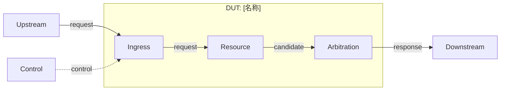

# [DUT 名称] 模块规格与验证计划

<!-- 模板结构版本描述当前字段和章节协议。当前生成流程始终使用本文件，不根据历史模板版本分支。 -->
> 模板结构版本：v3.0.0
>
> 文档版本：[vMAJOR.MINOR.PATCH]

<!-- 生成正式文档时删除所有模板提示和占位符；正文不得出现生成过程、阅读建议或排版说明。 -->

## 1. 文档摘要

### 1.1 DUT 职责

[说明 DUT 在系统中的位置、输入输出、核心功能和明确非目标。]

### 1.2 能力、接口与时序摘要

[用逻辑接口和 transaction 描述带宽、并发度、握手、响应、顺序和典型/边界时延。]

### 1.3 验证范围与状态

[说明本次验证覆盖、配置范围、文档状态和阻塞 sign-off 的 OPEN 项。]

## 2. 设计概览

### 2.1 DUT 职责、边界与性能基线

[系统边界、关键资源、性能基线和不在 DUT 责任范围内的行为。]

### 2.2 接口事务模型与验证采样点

[driver/monitor 看到的 transaction、接受条件、payload、ID 配对、背压、完成/取消和观察点。]

### 2.3 微架构与时序

#### 2.3.1 微架构图



#### 2.3.2 事务时序

[描述正常事务、背压以及 flush/replay/cancel/错误分支；精确端口名引用附录 A。]

#### 2.3.3 关键资源

| 资源 | 类型/规模 | 写入条件 | 读取/消费条件 | 冲突与优先级 | 观测点 |
| --- | --- | --- | --- | --- | --- |
| [资源] | [Queue/SRAM/entry] | [条件] | [条件] | [规则] | [信号或端口] |

## 3. 功能行为

<!-- 按真实数据通路或控制流程拆分。每段说明激励、处理、结果、时延/顺序和边界。 -->

### 3.1 [功能行为名称]

[输入与接受条件。]

[DUT 处理、状态更新、输出和响应配对。]

[背压、flush、错误、配置裁剪或非目标稳定性边界。]

### 3.2 [功能行为名称]

[按需增加功能行为小节；数量由 DUT 行为决定。]

## 4. 验证策略与 Testplan

### 4.1 验证架构

[说明 stimulus、driver、monitor、checker、scoreboard、reference model、assertion、coverage、formal harness 和 regression 的职责及连接。]

### 4.2 Testplan 标签树

```text
DUT
|- FG-API
|  `- FC-[API]
|- FG-CORE
|  `- FC-[CORE]
`- FG-COVERAGE
   `- FC-[COVER]
```

### 4.3 FG-API：验证环境约束

`<FG-API>`

[只描述环境合法性，不约束 DUT 输出正确性。]

#### [API 功能名称] `<FC-API-NAME>`

[目标、激励、环境约束和边界。]

| FC 标签 | 验证目标 | 触发/前置条件 | 检查机制 | 边界 |
| --- | --- | --- | --- | --- |
| `<FC-API-NAME>` | [目标] | [条件] | Assume | [边界] |

| CK 标签 | Style | 独立属性/检查内容 | 观察点 | 依据 |
| --- | --- | --- | --- | --- |
| `<CK-API-NAME>` | Assume | [环境输入约束] | [输入] | [`path:line` 或 OPEN] |

### 4.4 FG-CORE：核心功能检查

`<FG-CORE>`

#### [核心功能名称] `<FC-CORE-NAME>`

[目标、触发、DUT 处理、可观察结果、时延和边界。]

| FC 标签 | 验证目标 | 触发/前置条件 | 检查机制 | 结果/边界 |
| --- | --- | --- | --- | --- |
| `<FC-CORE-NAME>` | [目标] | [事件] | assertion/scoreboard/reference model | [结果] |

| CK 标签 | Style | 独立属性/检查内容 | 观察点 | 依据 |
| --- | --- | --- | --- | --- |
| `<CK-CORE-NAME>` | Seq | [单一 DUT 性质] | [端口/状态/bind] | [`path:line` 或 OPEN] |

### 4.5 FG-COVERAGE：覆盖目标

`<FG-COVERAGE>`

#### [覆盖场景名称] `<FC-COVER-NAME>`

[说明可达性目标以及避免过强 Assume 的方法。]

| FC 标签 | 覆盖目标 | 激励/前置条件 | Cover 观察点 | 边界 |
| --- | --- | --- | --- | --- |
| `<FC-COVER-NAME>` | [场景] | [条件] | [状态/事务] | [例外] |

| CK 标签 | Style | 覆盖内容 | 观察点 | 依据 |
| --- | --- | --- | --- | --- |
| `<CK-COVER-NAME>` | Cover | [正常/边界/恢复路径] | [信号] | [章节或 OPEN] |

## 5. 形式化属性契约

[说明默认时钟、复位、观测点、X 态策略、公平性/无界等待和 harness 边界。]

| 属性/FC | 触发事件 | 预期结果 | 帧条件 | 延迟/界限来源 | 观测点 |
| --- | --- | --- | --- | --- | --- |
| `<CK-NAME>` | [事件] | [DUT 结果] | [未触发时稳定项] | [参数/协议/OPEN] | [信号] |

## 6. Sign-off 与开放项

### 6.1 开放项

| ID | 问题 | 影响 | 关闭所需证据 | 状态 |
| --- | --- | --- | --- | --- |
| `OPEN-[TYPE]-[N]` | [缺失证据/冲突/疑似缺陷] | [I/O/行为/验证] | [具体证据] | Open |

### 6.2 签核状态

| 项目 | 状态 | 依据 |
| --- | --- | --- |
| I/O mapping | [Pass/Blocked] | [evidence 或 OPEN] |
| Testplan | [Pass/Review] | [FC/CK 追溯] |
| Formal/assertion | [Pass/Unrun/Blocked] | [运行结果] |
| Regression/coverage | [Pass/Unrun/Blocked] | [运行结果] |

## 附录 A：I/O 定义与接口约束

### A.1 顶层 Bundle 与逻辑接口

| 层级 | Bundle class | Chisel 对象 | Scala 定义位置 | 逻辑用途 |
| --- | --- | --- | --- | --- |
| 顶层 | [Bundle/anonymous Bundle] | `io.[name]` | [`path:line`] | [用途] |

### A.2 Chisel/Verilog 逐项映射

| Bundle class | Chisel 字段 | 存在 | 方向 | Chisel 类型/位宽 | 配置状态 | 精确 Verilog I/O | 位宽 | 生成/裁剪依据 | 协议/对端 |
| --- | --- | --- | --- | --- | --- | --- | --- | --- | --- |
| [Bundle] | `io.[field]` | 是 | I/O | [类型] | Generated/Elided/OPEN | [RTL port 或 OPEN-IO] | [N] | [manifest/RTL] | [协议] |

### A.3 接口字段与响应关联

| 逻辑接口 | 端口组 | 关键字段/ID | 请求响应关联 | payload 稳定性 | 延迟/顺序 |
| --- | --- | --- | --- | --- | --- |
| [接口] | [端口组] | [字段] | [关联] | [规则] | [规则] |

## 附录 B：参数、编码、状态与复位

### B.1 实现参数与派生常量

| 参数 | Scala 类型 | 默认值/范围 | 定义位置 | 使用位置 | 生效时机 | 功能影响 |
| --- | --- | --- | --- | --- | --- | --- |
| [Param] | [类型] | [值/OPEN] | [`path:line`] | [`path:line`] | elaboration/runtime | [影响] |

### B.2 Harness 参数

| 参数 | 范围 | 来源/OPEN | 用途 |
| --- | --- | --- | --- |
| [BOUND] | [N] | [依据] | [公平性/延迟/深度] |

### B.3 顶层状态与复位

| 状态 | 编码/定义 | 进入条件 | 退出条件 | 输出限制 |
| --- | --- | --- | --- | --- |
| [状态或“无显式 FSM”] | [`path:line`] | [条件] | [条件] | [行为] |

## 附录 C：范围、文档控制、证据与版本变更

### C.1 范围裁定

| 条件项目 | 已应用/不适用 | 理由或章节 |
| --- | --- | --- |
| [flush/多 lane/特性门控等] | [状态] | [依据] |

### C.2 文档控制与依据

| 项目 | 内容 |
| --- | --- |
| 文档版本 | [vMAJOR.MINOR.PATCH] |
| 使用模板版本 | v3.0.0 |
| 前一版本 | [版本及链接/None（首次版本）] |
| 版本变更类型 | [Major/Minor/Patch：原因] |
| DUT/Chisel 顶层 | [名称/`path:line`] |
| 文档状态 | Draft/Review/Frozen |
| RTL 基线 | [完整 commit] |
| 适用配置 | [Config/feature switches] |
| RTL 证据 | [`evidence/.../manifest.json`] |
| 图形证据 | [`evidence/.../diagrams/manifest.json`] |
| 生成日期 | [YYYY-MM-DD] |

### C.3 依据文件与事实状态

| ID | 事实或待确认项 | 依据 | 状态 |
| --- | --- | --- | --- |
| `FACT-[N]` | [事实] | [`path:line`] | Closed |
| `OPEN-[N]` | [问题] | [缺失/冲突] | Open |

### C.4 版本变更

[仅记录版本间实际新增、变更、修复、合并/拆分、移除和仍开放项。]

## 附录 D：CK 追溯矩阵

| CK | 设计行为/章节 | 目标类型 | DUT 观察点 | 实现/回归状态 |
| --- | --- | --- | --- | --- |
| `<CK-NAME>` | [章节] | assume/assert/cover | [信号] | Planned/Pass/Blocked |

## 附录 E：场景视角 Test Case

<!-- Case 数量由 DUT 可识别事务和风险决定；不适用的场景不强行凑数。 -->

### CASE-[N]：[场景名称]

**User story**：作为[模块/验证工程师]，我希望[目标]，从而[可观察结果]。

| 项目 | 内容 |
| --- | --- |
| 参与者 | [模块] |
| 前置条件 | [状态/资源/参数] |
| 输入 | [逻辑接口/端口组] |
| 预期输出 | [接口/状态] |
| 关联 FC/CK | [`FC-*`, `<CK-*>`] |

| 步骤 | 参与者动作 | DUT 行为 | 可观察结果/检查点 |
| --- | --- | --- | --- |
| 1 | [动作] | [行为] | [结果] |

**异常分支**：[背压、冲突、flush、错误或恢复。]

**验收标准**：[可观察、可判定的完成条件。]
