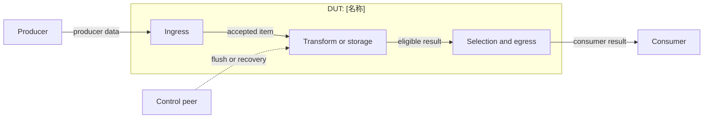
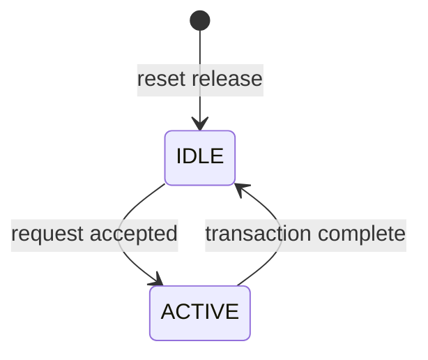

# [DUT 名称] 设计与功能检测点文档

<!-- MAINTAINER: 模板结构版本描述字段和章节协议，不是 DUT 文档版本。注释/措辞增强递增 PATCH；新增兼容字段递增 MINOR；破坏解析器或章节协议递增 MAJOR。 -->
> 模板结构版本：v3.3.0
>
> 文档版本：[vMAJOR.MINOR.PATCH]
>
> 本文分为正文、验证计划和附录。正文用于连续理解设计，验证计划用于安排检查，附录用于审计和签核。FG、FC、CK 标签必须使用反引号包裹，例如 `` `<FG-API>` ``。无法证实的内容登记为 `OPEN-*`。

## 第一部分：正文

<!-- GENERATOR: 方括号占位内容必须替换或删除，不得原样进入交付文档。正文以短段落、小图和伪代码为主；仅在需要横向比较时使用表格。正文证据统一引用 [E-*]，不得铺开 path:line 或扁平 RTL 端口。 -->

### 文档摘要

<!-- GENERATOR: 摘要应可独立阅读且控制在约一页。保留以下七个粗体字段；每项只写结论，不复制正文、端口表或证据索引。无 OPEN 时明确写“无”。 -->
> 本节目标是一页内建立阅读者的整体模型。每项先给结论，不展开实现细节或证据路径。

**模块职责**

[用一段话说明 DUT 在系统中的位置、完成的核心变换以及明确不负责的事情。]

**输入与生产者**

- `[逻辑输入]`：由[生产者]提供，用于[目的]。
- `[控制事件]`：由[控制模块]产生，用于[目的]。

**输出与消费者**

- `[逻辑输出]`：由[消费者]接收，用于[目的]。
- `[完成 / 状态]`：由[观察者]消费，用于[目的]。

**关键概念**

- **[概念 A]**：[一句话定义]。它与 **[概念 B]** 的区别是[关键区别]。
- **[结构 A]**：[一句话定义]。它位于数据流的[阶段]。

**关键延迟与容量**

- 典型延迟：[N cycle / 组合路径 / 可变延迟及来源]。
- 吞吐与容量：[每周期带宽、entry 数、最大在途数]。

**验证范围**

[说明本版本验证哪些功能、边界与恢复路径，以及明确不覆盖的内容。]

**开放项**

[列出阻塞理解或签核的 `OPEN-*`；若没有，写“无”。详情见附录 E。]

### 设计概览

#### 上下游与逻辑接口

<!-- GENERATOR: 逻辑名是正文稳定词汇，不是 Chisel 路径缩写。每个逻辑名必须在附录 B 映射；同一对象不得在不同章节使用不同逻辑名。 -->
[先用短段落说明谁产生数据、谁消费数据以及控制事件从哪里介入。正文只使用下列逻辑名；精确映射见附录 B。]

| 逻辑名 | 角色与含义 | 方向 | 事务阶段 |
| --- | --- | --- | --- |
| `producer.data` | [生产者提供的数据] | 生产者 -> DUT | [输入 / 查询 / 写入] |
| `consumer.result` | [消费者接收的结果] | DUT -> 消费者 | [响应 / 输出 / 完成] |
| `control.flush` | [控制事件] | 控制模块 -> DUT | [取消 / 恢复] |

#### 微架构与数据流

<!-- GENERATOR: 必须保留 DUT subgraph。跨边界边使用逻辑名，内部节点使用功能名；不得在图中放置精确数组下标、通配符或端口清单。 -->


[用一段话沿图说明正常数据流，再用一段话指出背压、冲刷、重放或错误恢复从哪个阶段介入。]

#### 事务模型

<!-- CONDITIONAL: 五阶段文字模型必选。仅当事务跨模块、有多周期响应，或存在 replay/flush/cancel 竞争时增加 sequenceDiagram；不适用时保留一句理由。 -->
1. **产生**：[生产者准备什么，事务何时有效。]
2. **接收**：[DUT 何时接受，不能接受时发生什么。]
3. **处理**：[数据经过哪些抽象阶段，不展开通道实例。]
4. **消费**：[消费者如何确认结果或完成。]
5. **恢复**：[取消、flush、replay 或错误如何终止或重启事务。]

[事务跨模块或存在竞争时，补充使用逻辑名的 Mermaid `sequenceDiagram`；否则说明不适用。]

#### 实例能力矩阵

<!-- GENERATOR: 行表示“行为相同的一类实例”，不是每个叶端口。列只描述模块特有的能力维度；删除不适用的示例能力。实例对象和 RTL 端口只放附录 C。 -->
> 模块级统一规则不在本表重复。本表只回答各通道、端口组、bank、pipe 或 entry 类别具备哪些能力，以及默认配置下是否存在。

| 实例类别 | 数量 / 索引 | 输入类别 | 输出类别 | 可选能力 | 默认配置状态 | 差异对应规则 |
| --- | --- | --- | --- | --- | --- | --- |
| [通用类别] | [范围] | [逻辑输入] | [逻辑输出] | Forward / Bypass / Cache / Immediate / Recovery / N/A | Enabled / Elided | [`P-*`] |

### 功能行为

> 按数据路径顺序组织。每节先定义模块级统一机制，再引用实例能力矩阵说明适用范围。每节只回答：做什么、输入是什么、输出是什么、延迟多少、边界是什么。

<!-- GENERATOR: 为每项独立行为复制以下 P-* 小节，并删除本示例。P-* 标题是该行为唯一权威定义位置；ID 在同一 DUT 的后续版本中保持稳定。规则优先用公式或伪代码表达，正文证据只引用已在附录 D 定义的 [E-*]。 -->

#### `P-[NAME]`：[统一行为名称]

[用一至两段解释该机制解决什么问题，以及它在整体数据流中的位置。不要混入具体实例清单、完整端口名或配置裁剪细节。] [E-BEH-01]

**输入**：[`logical.input`，以及有效条件。]

**输出**：[`logical.output`，以及对资源或状态的影响。]

**延迟**：[组合 / 固定 N 周期 / 可变延迟及界限来源。]

```text
# 伪代码表达可执行语义，不照抄 Chisel；名称使用逻辑名。
eligible = input.valid && resource.available
result   = select_by_priority(candidates)
next     = eligible ? update(current, input) : current
```

**适用实例**：[引用“实例能力矩阵”的类别，不逐个复述实例特例。]

**边界与限制**

- [背压、优先级、同时事件、非目标稳定性。]
- [参数或特性关闭时的行为。]
- [异常、冲刷、重放或错误恢复。]

**证据**：[E-BEH-01]。完整源码与 RTL 定位见附录 D。

### 关键结构与状态

#### 资源生命周期

<!-- GENERATOR: 只写影响功能理解的资源及其分配、更新、消费、释放过程。容量和逐实例配置放附录 C；子模块内部状态不得冒充 DUT 顶层状态。 -->
[用短段落描述关键队列、阵列、表项或缓存从分配到释放的生命周期。复杂生命周期使用小图；规模和配置详情引用附录 C。] [E-RES-01]

#### 顶层状态机

<!-- CONDITIONAL: DUT 无顶层 FSM 时删除示例状态图和状态语义，但必须保留“不适用”结论及 [E-*] 依据。多个独立顶层 FSM 分图描述，不得强行合并。 -->
> 仅描述 DUT 顶层控制状态机。entry 生命周期和子模块 FSM 不提升为顶层状态。

[先用一段话解释为何需要这些状态以及状态如何影响事务。若无顶层 FSM，明确写“不适用”并引用证据。]



**状态语义**

- `IDLE`：[进入、退出和输出限制，遵循 `P-*`。]
- `ACTIVE`：[进入、退出和同时事件优先级，遵循 `P-*`。]

**边界与限制**

[说明 reset 入口、非法状态、同时事件优先级和外部可见限制。] [E-FSM-01]

## 第二部分：验证计划

### 验证策略

<!-- GENERATOR: 按风险解释“为什么这样验证”，不列 CK 明细，也不重复 P-* 机制。验证机制必须与 Test Plan 中实际计划一致。 -->
[用短段落说明主要风险、检查机制及为何采用 assertion、scoreboard、reference model、symbolic 或 simulation。不要重复功能原理。]

**优先级原则**

- `P0`：可能导致数据错误、顺序错误、死锁或错误恢复失败。
- `P1`：边界、竞争、配置或性能契约错误。
- `P2`：可观测性、统计或非关键覆盖缺口。

### 功能分组

<!-- GENERATOR: 标签树中的每个 FC 必须在附录 F 唯一定义，并至少对应一条 Test Plan。FG 标签保持独立行和反引号格式，以兼容解析器。 -->
```text
DUT
|- FG-API
|  `- FC-INPUT-CONTRACT
|- FG-CORE
|  `- FC-BEHAVIOR
`- FG-COVERAGE
   `- FC-REACHABILITY
```

`<FG-API>`

[验证环境边界；只约束 DUT 输入，不假设 DUT 输出正确。]

`<FG-CORE>`

[核心行为、边界、优先级和恢复风险。]

`<FG-COVERAGE>`

[正常、边界和恢复路径的可达性；本组 CK 只使用 Cover。]

### Test Plan

<!-- GENERATOR: 每行只绑定一个 CK；同一 CK 的 FC、Style 必须与附录 F 一致。触发与结果使用逻辑名，行为机制引用 P-*，源码依据引用附录 D，不在单元格中重写设计原理。 -->
> 这是验证执行的统一入口。每行连接一个 FC、一个独立 CK、验证机制、Coverage 和场景。功能原理只引用 `P-*`，完整 CK 元数据见附录 F。

| 优先级 | FC | CK | Style | 关联规则 | 检查机制 | 激励 / 前置条件 | 可观察结果 | Coverage / 场景 | 关闭标准 |
| --- | --- | --- | --- | --- | --- | --- | --- | --- | --- |
| P0 | `FC-INPUT-CONTRACT` | `CK-API-INPUT-KNOWN` | Assume | `P-[NAME]` | Assertion | [合法输入条件] | [逻辑观测点] | `COV-NORMAL` / `CASE-NORMAL` | [编译且 prove 通过] |
| P0 | `FC-BEHAVIOR` | `CK-EVENT-RESULT` | Seq | `P-[NAME]` | Assertion + Scoreboard | [事务触发] | [结果与帧条件] | `COV-NORMAL` / `CASE-NORMAL` | [prove / regression 通过] |
| P1 | `FC-REACHABILITY` | `CK-COVER-BOUNDARY` | Cover | `P-[NAME]` | Cover | [边界激励] | [目标状态可达] | `COV-BOUNDARY` / `CASE-BOUNDARY` | [cover hit] |

### Coverage Summary

<!-- GENERATOR: Coverage 是风险闭环，不是 CK 的重复清单。每行同时说明观察事件、重要取值、依赖/交叉、非法/忽略条件和有效性保护；未实际运行时状态不得写 Closed。 -->
| Coverage ID | 风险与目标 | 关联 P / FC / CK | 观察事件 | 重要取值 / 分箱 | 依赖 / 交叉 | 非法 / 忽略条件 | 有效性保护 | 关闭标准 | 状态 |
| --- | --- | --- | --- | --- | --- | --- | --- | --- | --- |
| `COV-NORMAL` | [正常数据流可达] | [`P-*`, `FC-*`, `CK-*`] | [已通过检查的完成事件] | [代表性值或范围] | [必要交叉] | [不可发生值] | [结果有效且 checker 通过后采样] | [命中要求] | Planned |
| `COV-BOUNDARY` | [资源边界或竞争可达] | [`P-*`, `FC-*`, `CK-*`] | [边界完成事件] | [满/空/最大并发等] | [边界 x 操作类型] | [不适用组合] | [有效结果] | [命中要求] | Planned |
| `COV-RECOVERY` | [异常或恢复路径可达] | [`P-*`, `FC-*`, `CK-*`] | [恢复完成事件] | [错误/重放/冲刷类别] | [恢复类型 x 起始状态] | [非法激励单独统计] | [恢复 checker 通过] | [命中要求] | Planned |

### Coverage Design Contract

<!-- GENERATOR: 每个 COV-* 都要回答目标行为、观察事件、有效/无效条件、重要取值、依赖交叉、非法/忽略组合和闭合对象。不要对宽总线或大数组无理由展开全部 2^N 组合。 -->

对每个 `COV-*`，按以下顺序写一小段说明：

1. **目标行为**：要证明哪个 `P-*` 已被一次成功的 Test Plan 场景观察到。
2. **观察事件**：采样发生在哪个 DUT 输出、完成、状态转换或 scoreboard-confirmed transaction 上，不能只写“输入已驱动”。
3. **有效性与无效性**：什么时候数据有效、什么时候禁止采样；失败测试和负向测试单独统计。
4. **重要取值**：列出有意义的离散值、边界值或有限范围；连续/宽域使用有理由的分箱。
5. **依赖与交叉**：只交叉有功能关系且可闭合的维度，并估算组合规模。
6. **非法与忽略**：非法条件用于暴露环境或设计错误；已知不适用组合明确标记 `ignore`。
7. **闭合对象**：关联 assertion、cover property、covergroup、scoreboard、directed test 或 regression。

Coverage、实例、分箱和交叉名称必须直接说明其来源和含义，例如 `forward_active_over_inflight`、`replay_to_retry`、`entry_full`；禁止使用无法分析的自动编号作为唯一解释。

### 形式化属性契约

<!-- GENERATOR: 以下代码是结构示例，不是可直接交付的 SVA。生成文档必须替换逻辑占位符；若尚无 harness 映射，写伪代码并登记 OPEN-VERIFY，禁止伪称已编译。 -->
> 本节集中定义时钟、复位、history-valid、X 处理、Assume、Assert 和 Cover。属性公式引用逻辑名及 `P-*`；精确 RTL/bind 映射见附录 B、D、F。

#### 属性实现状态

<!-- GENERATOR: 每个 CK 在附录 F 维护唯一状态。Illustrative 只说明建模方向；只有 Generated、Compiled、Proved 或 Covered 才能支持相应签核。属性状态和签核状态必须分开记录。 -->

| 状态 | 含义 | 允许的签核结论 |
| --- | --- | --- |
| Illustrative | 代表性公式或伪代码，仅解释建模方法 | 不得宣称属性已生成或可编译 |
| Planned | CK 已定义，但逐 CK 公式尚未完成 | 只能计入验证计划 |
| Generated | 每个 CK 已有独立公式，但尚未编译 | 不得宣称编译、证明或覆盖通过 |
| Compiled | 逐 CK 属性已通过语法/绑定编译 | 不代表 prove/cover 通过 |
| Proved | Assert/Assume 已完成目标证明 | 记录工具和日志 |
| Covered | Cover 已命中并保存日志 | 记录场景和日志 |

**建模约定**

- 时钟与复位：[时钟、复位极性、复位期间屏蔽策略]。
- History-valid：[何时允许使用 `$past`，首个有效历史周期如何处理]。
- X 处理：[哪些输入由 Assume 约束，哪些 DUT 输出由 Assert 检查]。
- 公平性与界限：[liveness、公平性、可变延迟及审批来源]。
- 符号化观测：[索引范围、目标 entry 与非目标稳定性。]

#### Assume

```systemverilog
// <CK-API-INPUT-KNOWN>, references P-[NAME]
assume property (@(posedge clock) disable iff (reset) logical_input_valid |-> !$isunknown(logical_input));
```

#### Assert

```systemverilog
// <CK-EVENT-RESULT>, references P-[NAME]
assert property (@(posedge clock) disable iff (reset) history_valid && trigger |=> expected_result);
```

#### Cover

```systemverilog
// <CK-COVER-BOUNDARY>, references P-[NAME]
cover property (@(posedge clock) disable iff (reset) boundary_precondition ##1 boundary_result);
```

### 测试场景

<!-- GENERATOR: 正常、资源边界、异常/恢复至少各一例。每例只描述动作、阶段结果和验收标准；不复制 P-* 算法。DUT 无异常入口时以合法恢复或不适用裁定替代，不虚构故障。 -->
> 至少覆盖正常、资源边界和异常/恢复。场景只描述参与者动作、阶段结果和验收标准，不重复 `P-*` 的算法。

#### CASE-NORMAL：[正常场景]

**目标**：[端到端正常事务。]

**参与者与前置条件**：[生产者、DUT、消费者；初始状态。]

1. [生产者执行动作。]
2. [DUT 到达某阶段。]
3. [消费者完成事务。]

**预期行为**：遵循 `P-[NAME]`、`CK-EVENT-RESULT`；关联 Coverage：`COV-NORMAL`。

**验收标准**：[可判定结果及 Coverage 状态。]

#### CASE-BOUNDARY：[资源边界场景]

[使用相同结构，覆盖满/空、背压、同周期竞争或最大并发。]

**预期行为**：遵循 `P-[NAME]`、`CK-COVER-BOUNDARY`；关联 Coverage：`COV-BOUNDARY`。

**验收标准**：[可判定结果。]

#### CASE-RECOVERY：[异常或恢复场景]

[使用相同结构，覆盖 flush、replay、cancel、error 或明确说明 DUT 不支持的恢复类型。]

**预期行为**：遵循 `P-[NAME]`、`CK-[RECOVERY]`；关联 Coverage：`COV-RECOVERY`。

**验收标准**：[可判定结果。]

### 签核与开放项

<!-- GENERATOR: 本节只给决策所需的当前状态。详细证据和历史放附录；只有 evidence、checker、属性编译和对应回归真实通过后才能关闭相应项。 -->
**当前状态**：[Draft / Review / Frozen。]

**规格偏差**：[列出 spec 与实现差异的 `OPEN-*`，不在此重述证据。]

**当前阻塞**：[未完成的 elaboration、UCAgent、属性编译、prove、cover 或 regression。]

**关闭条件**：[逐项写出可执行且可判定的关闭条件。]

## 第三部分：附录

### 附录 A：文档控制与范围裁定

<!-- GENERATOR: commit、配置、工具版本、RTL evidence 和图形 evidence 必须来自同一生成版本。条件项不可静默删除，必须写“已应用”或“不适用”及理由。 -->
| 项目 | 内容 |
| --- | --- |
| 文档版本 | [vMAJOR.MINOR.PATCH] |
| 使用模板版本 | v3.3.0 |
| 前一版本 | [版本及相对链接 / None（首次版本）] |
| 版本变更类型 | [Major / Minor / Patch：原因] |
| DUT / Chisel 顶层 | [名称] / [E-TOP-01] |
| Elaborated Verilog 顶层 | [module 名] / [E-RTL-01] |
| 文档状态 | Draft / Review / Frozen |
| XiangShan RTL 基线 | [完整 `commit`] |
| 适用配置 | [参数集、特性开关] |
| 生成环境 | [OS / architecture / Java / Mill / firtool / Espresso] |
| RTL 生成状态 | [Success / Partial / Failed；exit code 与原因] |
| RTL 证据 | [`evidence/<Module>/<version>/manifest.json`；RTL SHA-256；端口数量] |
| 图形渲染证据 | [`evidence/<Module>/<version>/diagrams/manifest.json`；Mermaid CLI 版本；图数量] |
| 作者 / 评审人 | [团队 / 角色] |
| 生成日期 | [YYYY-MM-DD] |

| 条件项目 | 已应用 / 不适用 | 理由或对应章节 |
| --- | --- | --- |
| 顶层状态机 | [裁定] | [理由 / 章节] |
| 多模块事务 / 时序图 | [裁定] | [理由 / 章节] |
| 符号化存储检查 | [裁定] | [理由 / 章节] |
| 缓存查找 / 缺失 / 重填 | [裁定] | [理由 / 章节] |
| 异常 / 恢复 / flush | [裁定] | [理由 / 章节] |
| 特性门控 | [裁定] | [理由 / 章节] |

<!-- CONDITIONAL: 条件主题不可静默删除。每一行必须填写“已应用”或“不适用”；不适用时必须说明源码、配置或模块边界理由，并引用 [E-*]。 -->
适用性裁定格式：`适用性：[已应用 / 不适用]；理由：[基于源码、配置或边界的理由]；证据：[E-*]`。

### 附录 B：逻辑接口与 RTL 映射

<!-- GENERATOR: Generated 端口必须存在于同版本 ports.csv；Elided 必须保留 Chisel 定义并说明裁剪依据；无 matching elaboration 时填写 OPEN-IO-*，禁止按命名惯例猜测。规则数组必须注明实际索引范围。 -->
> 本附录是逻辑名、Chisel 字段和精确 elaborated Verilog 端口的唯一映射位置。

| IO-ID | 正文逻辑名 | Bundle class / Chisel 字段 | 定义位置 | 方向 / 位宽 | 配置状态 | 精确 Verilog I/O | 协议 / 对端 | 证据 |
| --- | --- | --- | --- | --- | --- | --- | --- | --- |
| `IO-INPUT-VALID` | `producer.data.valid` | `[Bundle]` / `io.input.valid` | [E-IO-01] | I / 1 | Generated | `io_input_valid` | valid-ready / [模块] | [E-RTL-01] |
| `IO-INPUT-BITS` | `producer.data.bits` | `[Bundle]` / `io.input.bits` | [E-IO-02] | I / [N] | Elided / OPEN | [未生成 / `OPEN-IO-*`] | [协议] | [E-CONFIG-01] |

规则数组可使用 `[i]`，但必须给出实际连续索引范围。没有 matching elaboration 时必须使用 `OPEN-IO-*`，不得猜测 RTL 名称。

### 附录 C：参数、实例与配置裁剪

<!-- GENERATOR: 参数表只收录 elaboration/runtime 参数和派生常量，不收录队列、寄存器或状态值。实例表负责具体对象和配置差异，不在此重新定义 P-*。 -->
| 参数 / 特性 | 类型与范围 | 当前值 | 定义 / 覆盖位置 | 功能影响 | 生成 / 裁剪结果 | 关联规则 |
| --- | --- | --- | --- | --- | --- | --- |
| `[Param]` | `[Int/Boolean/...]` | [值 / OPEN] | [E-PARAM-01] | [影响] | [结构或端口] | [`P-*`] |

| 实例 / 通道 | 类别 | 当前配置能力 | 被裁剪能力 | Chisel 对象 | RTL 端口组 | 证据 |
| --- | --- | --- | --- | --- | --- | --- |
| [实例范围] | [实例能力矩阵类别] | [能力] | [能力] | [对象] | [端口模式] | [E-CONFIG-02] |

### 附录 D：证据索引

<!-- GENERATOR: 每个 E-ID 唯一且可定位；记录完整 repository-relative path:line、commit/config 和支持对象。证据发生变化时更新索引，不在正文复制路径。 -->
> 正文只出现 `[E-*]`。源码路径、行号、commit、配置和 RTL 定位在此展开。

| Evidence ID | 类型 | 路径 / 定位 | Commit / 配置 | 支持内容 |
| --- | --- | --- | --- | --- |
| E-BEH-01 | Scala | [`path:line`] | [commit / config] | [`P-*`] |
| E-RES-01 | Scala | [`path:line`] | [commit / config] | [资源生命周期] |
| E-FSM-01 | Scala / RTL | [`path:line`] | [commit / config] | [顶层状态机] |
| E-TOP-01 | Scala | [`path:line`] | [commit / config] | [DUT 顶层] |
| E-RTL-01 | RTL / manifest / ports.csv | [`path:line`] | [commit / config] | [`IO-*`, `P-*`] |
| E-IO-01 | Scala Bundle | [`path:line`] | [commit / config] | [`IO-INPUT-VALID`] |
| E-IO-02 | Scala Bundle | [`path:line`] | [commit / config] | [`IO-INPUT-BITS`] |
| E-PARAM-01 | Scala / Config | [`path:line`] | [commit / config] | [参数] |
| E-CONFIG-01 | Config / RTL | [`path:line`] | [commit / config] | [端口裁剪] |
| E-CONFIG-02 | Config / RTL | [`path:line`] | [commit / config] | [实例能力] |

### 附录 E：FACT、OPEN 与偏差

<!-- GENERATOR: FACT 说明证据支持关系，OPEN 说明缺口和关闭条件；两者都引用 P-* 和 E-*，不形成第二份行为定义。规格与 RTL 冲突必须保留双方结论。 -->
| ID | 类型 | 摘要 | 关联规则 | 证据 / 缺口 | 状态与关闭条件 |
| --- | --- | --- | --- | --- | --- |
| FACT-[000] | 实现事实 | [不重复算法，只说明证据支持关系] | `P-*` | [E-*] | Closed |
| OPEN-[000] | 缺失证据 / 规格冲突 / 疑似问题 | [摘要] | [`P-*`] | [需要的证据] | Open；[关闭条件] |

### 附录 F：FC / CK 完整追溯

<!-- GENERATOR: 这是机器解析和审计清单。每个 FC/CK 只出现一行；FC 定义风险目标，CK 定义单一性质。标签、归属和 Style 必须与标签树、Test Plan、属性契约一致。 -->
> 本附录服务于 UCAgent 和审计，不作为主要阅读入口。FC 定义验证目标，CK 定义单一可执行性质；二者不得重复功能原理。

| FC 标签 | 所属 FG | 验证目标 | 关联规则 | Test Plan 行 |
| --- | --- | --- | --- | --- |
| `<FC-INPUT-CONTRACT>` | `FG-API` | [环境输入契约] | `P-[NAME]` | [P0 / CK-API-INPUT-KNOWN] |
| `<FC-BEHAVIOR>` | `FG-CORE` | [核心行为风险] | `P-[NAME]` | [P0 / CK-EVENT-RESULT] |
| `<FC-REACHABILITY>` | `FG-COVERAGE` | [关键路径可达] | `P-[NAME]` | [P1 / CK-COVER-BOUNDARY] |

| CK 标签 | Style | 所属 FC | 独立性质 | 逻辑观测点 | RTL / bind 对应 | 属性实现状态 | 签核状态 |
| --- | --- | --- | --- | --- | --- | --- | --- |
| `<CK-API-INPUT-KNOWN>` | Assume | `FC-INPUT-CONTRACT` | [有效输入非 X] | `producer.data` | [附录 B / D] | Planned | Planned |
| `<CK-EVENT-RESULT>` | Seq | `FC-BEHAVIOR` | [触发后结果正确] | `consumer.result` | [附录 B / D] | Planned | Planned |
| `<CK-COVER-BOUNDARY>` | Cover | `FC-REACHABILITY` | [边界路径可达] | [逻辑状态] | [附录 D] | Planned | Planned |

### 附录 G：签核清单

<!-- GENERATOR: 仅对真实完成且有 evidence 的项目勾选。文档发布、AI 自检或 Planned 状态不等于工具签核。 -->
- [ ] 摘要在细节前说明职责、输入输出、关键概念、延迟、验证范围和 OPEN。
- [ ] 每项功能按输入、输出、延迟、统一规则、适用实例、边界与限制组织。
- [ ] 模块级规则未混入实例枚举；实例差异集中在能力矩阵和附录 C。
- [ ] 正文仅以 `[E-*]` 引用证据，完整路径集中在附录 D。
- [ ] Test Plan 是验证执行入口；FC/CK 完整登记集中在附录 F。
- [ ] API 只包含 Assume，Coverage 只包含 Cover。
- [ ] Chisel 与 elaborated Verilog 端口逐项核对，配置裁剪有依据。
- [ ] Mermaid 图已实际渲染并保存 SVG 与 source hash。
- [ ] 正常、资源边界和恢复场景有可判定验收标准。
- [ ] UCAgent checker、属性编译与回归通过后才关闭对应项。
