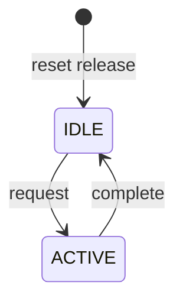
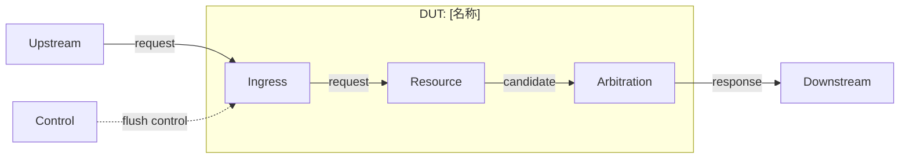

# [DUT 名称] 设计与功能检测点文档

<!-- MAINTAINER: 模板结构版本描述“字段和章节协议”，不是某个 DUT 文档的版本。兼容的注释、措辞或校验增强递增 PATCH；新增兼容字段递增 MINOR；破坏现有生成器/解析器的结构变化递增 MAJOR。 -->
> 模板结构版本：v2.1.1
>
> 文档版本：[vMAJOR.MINOR.PATCH]
>
> 本模板兼容 UCAgent 的功能点、检测点与 SVA 生成流程。文档中的 FG、FC、CK 标签必须使用反引号包裹，例如 `` `<FG-API>` ``，以保证 Markdown 可见；解析器读取时应去除反引号。未能由规格、Scala 源码、elaborated Verilog 或 RTL 证实的内容登记为 `OPEN-*`，不得猜测为已实现行为。

<!-- MAINTAINER: “文档范围裁定”是防止生成器静默删除条件章节的总开关。新增条件章节时，必须同时更新下面两张表、签核清单和 Skill 的静态检查规则。 -->
## 文档范围裁定

| 文档项 | 必选性 | 保留条件 | 最低要求 |
| --- | --- | --- | --- |
| 文档控制、FACT/OPEN | 必选 | 所有 DUT | 基线、配置、事实和待确认项。 |
| I/O 定义 | 必选 | 所有 DUT | Chisel 顶层 Bundle、对象路径、子 Bundle class、精确 elaborated Verilog 端口逐层映射。 |
| 参数定义 | 必选 | 所有 DUT | 独立章节；参数类型、默认值/范围、作用和 Scala 定义位置。 |
| 顶层状态机 | 条件必选 | DUT 有顶层 FSM | 独立章节；只列顶层 FSM，状态表和状态图同节。 |
| 微架构图 | 必选 | 所有 DUT | 使用 Mermaid `subgraph` 标识 DUT 边界，边界交互与 I/O 表对应。 |
| 形式化建模与属性契约 | 必选 | 所有 DUT | 时钟、复位、观测点、延迟来源和 frame condition。 |
| API / Coverage | 必选 | 所有 DUT | 合法环境假设以及正常、边界、恢复/错误路径 Cover。 |
| 多模块事务/异常/冲刷 | 条件必选 | 事务跨模块，或存在 redirect/flush/rollback | 发起、路径、完成/取消、优先级和同步状态。 |
| 符号化存储检查 | 条件必选 | 含队列、表、SRAM、Cache 或多 entry 状态 | 数据完整性和非目标稳定性检查。 |
| 缓存查找/缺失/重填 | 条件必选 | 管理 hit/miss、MSHR、refill 或 replacement | lookup、分配/合并、victim、refill/cancel 语义。 |
| 异常/恢复/flush | 条件必选 | 存在错误、replay、redirect、flush、取消或背压 | 优先级、恢复、frame condition 和 response race。 |
| 特性门控 | 条件必选 | 参数、CSR、宏或 generate 启停可观察功能 | enable 行为和 disable 无副作用。 |
| 场景案例附录 | 必选 | 所有 DUT | 以 user story 形式覆盖正常、边界和恢复场景。 |

| 条件项目 | 裁定：已应用 / 不适用 | 理由或对应章节 |
| --- | --- | --- |
| 多模块事务/异常/冲刷 | [裁定] | [理由 / 章节] |
| 符号化存储检查 | [裁定] | [理由 / 章节] |
| 缓存查找/缺失/重填 | [裁定] | [理由 / 章节] |
| 异常/恢复/flush | [裁定] | [理由 / 章节] |
| 特性门控 | [裁定] | [理由 / 章节] |
| 顶层状态机 | [裁定] | [理由 / 章节] |
| 事务时序图 | [裁定] | [理由 / 章节] |

<!-- GENERATOR: 本节是文档可复现性的根记录。commit、配置、工具版本、RTL/图形 evidence 必须彼此对应；不能混用其他 commit 或配置的生成产物。 -->
## 文档控制与依据

| 项目 | 内容 |
| --- | --- |
| 文档版本 | [vMAJOR.MINOR.PATCH] |
| 使用模板版本 | v2.1.1 |
| 前一版本 | [版本及相对链接 / None（首次版本）] |
| 版本变更类型 | [Major / Minor / Patch：原因] |
| 所属项目 / 子系统 | [SoC / Core / Cache] |
| DUT / Chisel 顶层 | [名称] / [`repo:path:line`] |
| Elaborated Verilog 顶层 | [module 名 / `repo:path`] |
| 文档状态 | Draft / Review / Frozen |
| XiangShan RTL 基线 | [完整 `commit`] |
| 适用配置 | [参数集、特性开关] |
| 生成环境 | [OS / architecture / Java / Mill / firtool / Espresso] |
| RTL 生成状态 | [Success / Partial / Failed；exit code 与原因] |
| RTL 证据 | [`evidence/<Module>/<version>/manifest.json`；RTL SHA-256；端口数量] |
| 图形渲染证据 | [`evidence/<Module>/<version>/diagrams/manifest.json`；Mermaid CLI 版本；图数量] |
| 作者 / 评审人 | [团队 / 角色] |
| 生成日期 | [YYYY-MM-DD] |

<!-- MAINTAINER: FACT 表示证据已闭合的实现事实；OPEN 表示缺失证据、规格冲突或疑似 RTL 问题。不要用较低优先级 spec 覆盖较高优先级的 elaborated RTL/Scala 事实。 -->
| ID | 结论或待确认项 | 依据 | 置信度 | 状态 |
| --- | --- | --- | --- | --- |
| FACT-[000] | [已确认事实] | [`path:line`] | 已确认 | Closed |
| OPEN-[000] | [待确认问题] | [缺失或冲突] | 待确认 | Open |

## DUT 整体功能描述

### 职责、边界与性能

[说明 DUT 的系统位置、核心变换、明确非目标、带宽、延迟和最大并发度。]

<!-- MAINTAINER: I/O 分成 Chisel 声明层和指定配置的 Verilog 实现层。Chisel 字段存在不代表该字段一定出现在最终 Verilog；配置关闭、常量传播或 dead-port elimination 都可能使其 Elided。 -->
## I/O 定义

> Verilog I/O 必须来自指定配置的 elaborated Verilog，不得根据 Chisel 对象名猜测。一个 Chisel object 展开为多个 Verilog 端口时，应逐项列全。若当前没有 elaborated Verilog，Verilog 列填写 `OPEN-IO-*`，并在文档控制表登记，不能填写“推测名称”。

### 顶层 IO Bundle

<!-- GENERATOR: 若顶层使用 IO(new Bundle { ... })，Bundle class 必须写成 anonymous Bundle in <Class>.io，禁止为方便阅读而虚构 <Class>IO。Flipped 后的最终方向应在逐项表中展开。 -->
| 层级 | Bundle class | Chisel 对象 | Scala 定义位置 | 说明 |
| --- | --- | --- | --- | --- |
| 顶层 | `[DutIO]` | `io: [DutIO]` | [`path:line`] | [顶层 IO Bundle] |
| 子 Bundle | `[EnqBundle]` | `io.enq[x]: [EnqBundle]` | [`path:line`] | [数组长度和用途] |

### Chisel / Verilog 逐项映射

<!-- GENERATOR: “Generated”必须能在同版本 ports.csv/RTL 中找到；“Elided”必须保留 Chisel 定义并解释裁剪原因；没有 matching elaboration 时使用 OPEN-IO-*，不得按命名惯例猜 Verilog 端口。规则数组可以用 [i] 表示，但必须注明实际连续索引范围。 -->
| Bundle class | Chisel 对象 / 字段 | Chisel 存在 | 方向 | Chisel 类型 / 位宽 | 当前配置生成状态 | 精确 Verilog I/O | Verilog 位宽 | 裁剪 / 生成依据 | 协议 / 对端 |
| --- | --- | --- | --- | --- | --- | --- | --- | --- | --- | --- |
| `[EnqBundle]` | `io.enq[x].valid` | 是 | I | `Bool` | Generated | `io_enq_[x]_valid` | 1 | [manifest / RTL line] | [valid/ready / 模块] |
| `[EnqBundle]` | `io.enq[x].bits.[field]` | 是 | I | `[UInt(...)]` | Elided / OPEN | [未生成 / `OPEN-IO-*`] | 0 / [N] | [feature disabled / constant-folded / artifact missing] | [采样条件 / 模块] |

### 接口字段与响应关联

<!-- MAINTAINER: 本表描述跨周期协议契约，而不是重复端口表。重点记录事务 ID、请求/响应配对、背压稳定性、顺序和延迟来源。 -->
| Chisel 接口 | Verilog 端口组 | 关键字段 / ID | 请求与响应关联 | payload 稳定性 | 延迟 / 顺序约束 |
| --- | --- | --- | --- | --- | --- |
| [`io.req/resp`] | [精确前缀及端口] | [字段] | [ID / FIFO / 无响应] | [规则] | [规则] |

## 参数定义

> 本节只列 elaboration/runtime 参数，不混入 entry 状态、队列或形式化 harness 参数。Scala 定义位置必须指向参数的声明或配置键；使用位置可另列。

<!-- GENERATOR: 默认值必须对应“文档控制与依据”中的适用配置。派生常量要保留表达式及来源；同名参数在不同 Config 中被覆盖时，记录最终生效值和覆盖位置。 -->
| 参数 | Scala 类型 | 默认值 / 合法范围 | Scala 定义位置 | 主要使用位置 | 生效时机 | 功能影响 |
| --- | --- | --- | --- | --- | --- | --- |
| `[Param]` | `[Int/Boolean/...]` | [值 / OPEN] | [`path:line`] | [`path:line`] | elaboration / runtime | [说明] |

### 形式化 Harness 参数

<!-- MAINTAINER: Harness 参数属于 DUT 外部的验证环境，不会改变硬件。它们用于公平性界限、liveness 深度、未知但受控的协议延迟或符号化观测。DUT 的 Scala 参数、CSR、寄存器和派生常量不得放入本表。 -->
<!-- GENERATOR: 每个 bound 必须给出协议/RTL/DV 批准的来源；来源未知时关联 OPEN-*。不得为了让属性通过而任意放宽或缩小界限。fv_idx、fv_mon_* 等无数值配置的对象应称为 harness 信号/观测点，而非参数。 -->
| 参数 | 范围 | 来源 / OPEN | 用途 |
| --- | --- | --- | --- |
| `[WRITE_LATENCY]` | [N] | [`OPEN-*`] | [请求到状态可观察更新的延迟] |

## 顶层状态机

> 仅描述 DUT 顶层控制状态机。entry 生命周期、子模块内部 FSM 和协议临时状态不得混入本表；它们应在资源或 FC 描述中说明。若无顶层 FSM，明确写“不适用”及依据。

<!-- GENERATOR: 状态表与紧随其后的状态图必须来自同一状态寄存器和编码定义，并覆盖 reset 入口、全部退出条件及同周期事件优先级。多个独立 FSM 不得强行合并成一个图。 -->
| 状态 | 编码 / Scala 定义 | 含义 | 进入条件 | 退出条件 | 输出 / 限制 |
| --- | --- | --- | --- | --- | --- |
| `[IDLE]` | [`path:line`] | [含义] | [条件] | [条件] | [行为] |



## 微架构与时序

### 微架构图

> 必须用 `subgraph DUT["DUT: 名称"]` 标出边界。所有跨越 subgraph 边界的箭头必须能映射到 I/O 定义中的 Chisel object 和 Verilog 端口组；箭头标签优先写 Chisel object，必要时附 Verilog 前缀。

<!-- MAINTAINER: 图用于表达模块边界和数据/控制关系，不承担精确端口清单职责。精确数组下标和通配模式留在 I/O 表，避免 Mermaid parser 将其解释为图语法。 -->



- 图中不要放置 `[i]`、`[x]`、通配符 `*`、分号等易被 Mermaid 解析为语法的精确端口模式；图使用人类可读接口名，精确 Chisel/Verilog 映射保留在 I/O 表。
- 不得把 `subgraph` ID 当作节点连线；边界输出必须从 subgraph 内的真实节点连接到外部节点。
- 生成后必须用固定版本 Mermaid CLI 实际渲染全部 fence，并保存 SVG 与 source hash manifest；仅检查代码 fence 配对不算通过。

### 事务时序图

<!-- GENERATOR: 对 request/response、replay、flush、cancel 等跨模块事务，至少给出正常分支和一个恢复/异常分支。消息文本保持简单；精确信号名可在图后文字或 I/O 表引用。 -->
[当事务跨模块或存在请求/响应、flush/取消竞争时，至少画一个正常分支和一个恢复分支。]

### 关键资源

<!-- MAINTAINER: 资源表承载 entry 生命周期、队列/阵列、计数器和子模块状态，避免这些内容污染“顶层状态机”章节。冲突和写优先级必须按实际 Chisel connect/RTL 行为记录。 -->
| 资源 | 类型 / 规模 | 写入条件 | 读取 / 消费条件 | 冲突与优先级 | 观测点 |
| --- | --- | --- | --- | --- | --- |
| [Queue / SRAM / entry] | [规模] | [条件] | [条件] | [规则] | [端口 / bind] |

## 形式化建模与属性契约

<!-- GENERATOR: 本节连接设计事实与可生成属性。Assume 只能约束环境输入；Assert/Seq 检查 DUT 行为；Cover 防止 Assume 过强。所有跨周期更新都要给出 frame condition。 -->
- 时钟与复位：[默认时钟、复位屏蔽策略]。
- 可观察状态：[端口、bind 信号、`fv_idx` / `fv_mon_*`]。
- 无界等待：[环境公平性或 liveness 表达]。
- X 态策略：[关键 valid/ready/grant/state 无 X]。

| 功能点 | 触发事件 | 预期结果 | 帧条件 | 延迟 / 界限来源 | 观测点 |
| --- | --- | --- | --- | --- | --- |
| `FC-[NAME]` | [握手 / 状态] | [状态或输出] | [未触发时稳定项] | [参数 / 常数] | [端口 / bind] |

## 功能分组与检测点

> 每个 FG、FC、CK 标签都必须在 Markdown 中可见。FG 使用标题后的独立可见标签；每个 FC 必须先有一段自然语言，解释目标、触发、结果和边界，再给出 FC 表及 CK 表。禁止只给标签或只给检查点。每个 CK 只验证一个性质。

<!-- MAINTAINER: UCAgent/检查器依赖标签文本和出现顺序建立树。反引号保证尖括号标签在 Markdown 中可见；修改格式时必须同步验证真实解析器，不能只凭页面外观判断。 -->
<!-- GENERATOR: 每个 FC 必须同时出现在标签树和一行 FC 表中，且至少拥有一个 CK。CK 应是一条独立可实现的属性；优先级链拆成相邻优先级检查，存储更新补目标正确性和非目标稳定性。 -->

### 本 DUT 标签树

```text
DUT
|- FG-API
|  `- FC-INPUT-ASSUME
|- FG-CORE
|  `- FC-BEHAVIOR
`- FG-COVERAGE
   `- FC-REACHABILITY
```

### 1. 验证环境约束

`<FG-API>`

<!-- MAINTAINER: FG-API 只允许 Assume。把 DUT 输出正确性写成 Assume 会造成 vacuous proof，是必须阻止的结构性错误。 -->
[自然语言描述此 FG 的边界；API 只能包含 Assume。]

#### 输入协议

[自然语言描述：外部角色、合法激励、稳定性要求以及不得约束的 DUT 输出。]

| FC 标签 | 功能描述 | 触发 / 前置条件 | 预期结果 / 约束 | 边界与例外 |
| --- | --- | --- | --- | --- |
| `<FC-INPUT-ASSUME>` | [功能描述] | [条件] | [结果] | [边界] |

| CK 标签 | Style | 检查说明 | 主要观测点 | 需求 / 依据 |
| --- | --- | --- | --- | --- |
| `<CK-API-INPUT-KNOWN>` | Assume | [关键输入控制信号非 X] | [输入] | [`path:line`] |
| `<CK-API-VALID-STABLE>` | Assume | [valid 未握手时 payload 稳定] | [接口] | [`path:line`] |

### 2. 核心功能

`<FG-CORE>`

[自然语言描述此 FG。]

#### [功能名称]

[必须存在的 FC 自然语言描述，至少说明触发条件、处理过程、可观察结果和主要边界。]

| FC 标签 | 功能描述 | 触发 / 前置条件 | 预期结果 | 帧条件 / 边界 |
| --- | --- | --- | --- | --- |
| `<FC-BEHAVIOR>` | [具体行为] | [事件] | [结果] | [未触发稳定项] |

| CK 标签 | Style | 检查说明 | 主要观测点 | 需求 / 依据 |
| --- | --- | --- | --- | --- |
| `<CK-EVENT-RESULT>` | Seq | [确定延迟内的状态/输出结果] | [信号] | [`path:line`] |
| `<CK-NO-TRIGGER-STABLE>` | Seq | [未触发时目标或非目标状态稳定] | [状态] | [`path:line`] |

### 3. 可达性覆盖

`<FG-COVERAGE>`

<!-- MAINTAINER: FG-COVERAGE 只允许 Cover，用于证明正常、边界和恢复路径未被环境约束排除。不可达错误场景应使用显式 fault injection，而不是把非法输入常态化。 -->
[说明正常、边界和恢复路径的可达性目标。]

#### 关键场景覆盖

[描述覆盖意图和防止约束过强的作用。]

| FC 标签 | 功能描述 | 触发 / 前置条件 | 预期结果 | 边界与例外 |
| --- | --- | --- | --- | --- |
| `<FC-REACHABILITY>` | [可达性] | [环境条件] | [目标状态] | [fault injection 条件] |

| CK 标签 | Style | 检查说明 | 主要观测点 | 需求 / 依据 |
| --- | --- | --- | --- | --- |
| `<CK-COVER-NORMAL>` | Cover | [正常路径] | [状态] | [章节] |
| `<CK-COVER-BOUNDARY>` | Cover | [边界路径] | [状态] | [章节] |
| `<CK-COVER-RECOVERY>` | Cover | [恢复路径] | [状态] | [章节] |

## 检测点追溯与签核

<!-- GENERATOR: 状态只能在 evidence、UCAgent checker、属性编译和对应回归真实通过后关闭。Planned 不表示属性已实现，Open 也不能因文档发布而自动变 Closed。 -->
| 检测点 | 设计需求 / 章节 | 目标 SVA 类型 | DUT 观测点 | 状态 |
| --- | --- | --- | --- | --- |
| `CK-[NAME]` | [章节] | assert / assume / cover | [端口 / 内部状态] | Planned |

- [ ] Chisel Bundle class、对象路径与 elaborated Verilog 端口逐项核对。
- [ ] 参数均有 Scala 定义位置，未知位置已登记 OPEN。
- [ ] 顶层状态表与状态图一致，且未混入 entry/子模块状态。
- [ ] 微架构图中所有跨 DUT 边界箭头均与 I/O 表一致。
- [ ] 所有 Mermaid 图已由固定 CLI 实际渲染，非空 SVG 与 source hash 已保存到版本 evidence。
- [ ] 每个 FC 有自然语言描述、FC 表和至少一个独立 CK。
- [ ] API 只包含 Assume，Coverage 只包含 Cover。
- [ ] UCAgent checker、属性编译与回归通过后才关闭对应项。

## 附录 A：场景视角 Case 示例

> Case 使用 user story 视角解释多个 FC 如何协作，不替代 CK。至少包含正常、资源边界和异常/恢复场景；每个步骤引用 I/O 对象、状态和相关 FC/CK。

<!-- MAINTAINER: Case 面向评审者解释端到端协作，CK 面向工具验证单一性质；二者不能互相替代。一个 Case 可以关联多个 FC/CK，但验收标准必须可观察、可判定。 -->

### CASE-[N]：[场景名称]

**User story**：作为[上游模块 / 验证工程师]，我希望[操作或目标]，从而[系统价值或可观察结果]。

| 项目 | 内容 |
| --- | --- |
| 参与者 | [模块] |
| 前置条件 | [状态、资源、参数] |
| 输入 | [Chisel object / Verilog 端口组] |
| 预期输出 | [接口或状态] |
| 关联 FC / CK | [`FC-*`, `CK-*`] |

| 步骤 | 参与者动作 | DUT 行为 | 可观察结果 / 检查点 |
| --- | --- | --- | --- |
| 1 | [动作] | [行为] | [结果] |
| 2 | [动作] | [行为] | [结果] |

**异常分支**：[同址冲突、背压、flush、响应竞争或错误恢复。]

**验收标准**：[场景完成的可验证判据。]
